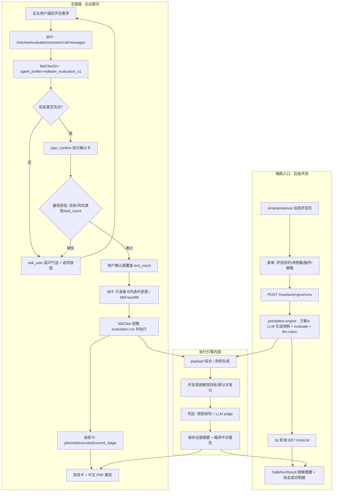
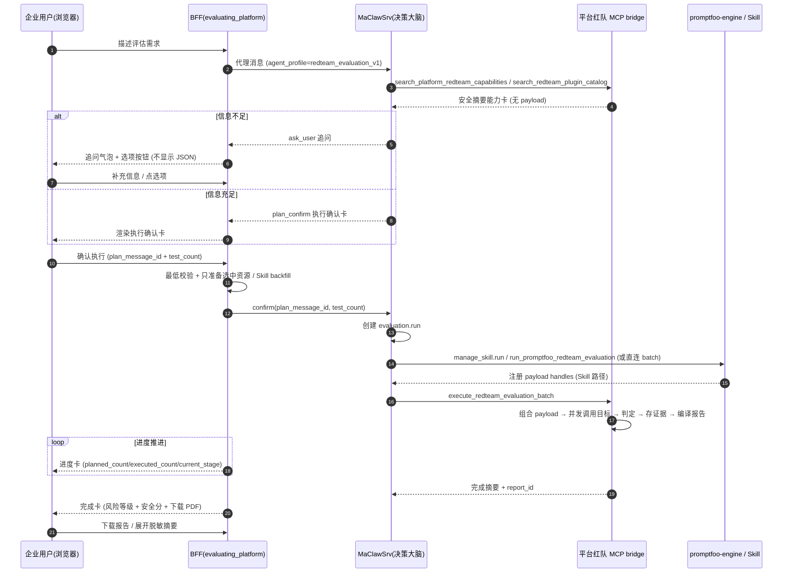
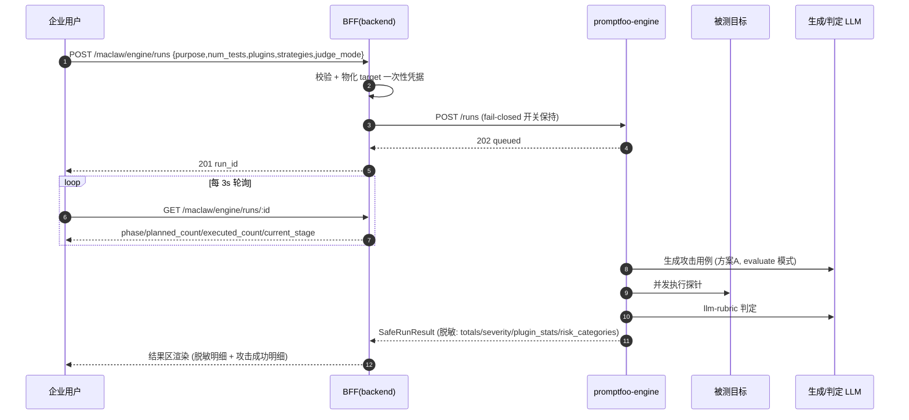

# 01 · 需求文档与交互流程确认

> 项目：LLM / Agent 红队安全评测平台（评估平台 × promptfoo 合并形态）
> 角色：产品经理 许清楚（Xu）
> 版本：v1 草稿（2026-10-09）— **本阶段只产出 Markdown，不写/不改任何代码**
> 依据：`PROJECT_GUIDE.md`、`AGENTS.md`、`evaluating_platform/docs/architecture/*`、`specs/2026-09-28-企业端问题修复计划.md`、`D:\eva平台开发记录\2026-09-16-需求分析与软件实现方案.md`、`2026-09-16-合并架构设计方案.md`、`html原型/*`、前端 `enterprise/*` 与 `services/*`。

---

## 0. 本次澄清的目标（用户原话落点）

> **"构建一个支持对 Agent 进行红队测试的系统；像 promptfoo 一样支持插件与策略拓展；交互方式沿用原系统，即通过与 LLM 聊天自动生成红队测试方案。"**

拆成三个正交产品目标：

- **G1 对话即规划**：企业用户用自然语言描述需求，AI（MaClaw）通过聊天澄清 → 产出结构化「执行确认卡」→ 用户确认后自动执行。**这是推荐主链路**，交互形态沿用现有系统，不新增独立配置流程。
- **G2 像 promptfoo 一样可扩展**：插件（攻击类别/检测项）与策略（攻击包装手法）可检索、可组合、可**持续扩充**，并向 promptfoo 官方能力谱系对齐；长期支持专家发布自定义插件、管理员治理。
- **G3 Agent 可评测**：被测目标不止 LLM，还要能对**用户已有的 Agent**（对外暴露对话端点）做红队测试，并解决多轮会话、协议范围、副作用隔离三个难题。

---

## 1. 产品定位与目标用户

### 1.1 一句话定位

> **面向企业的「大模型 / 智能体红队安全评测平台」：以对话式 AI 自动生成红队测试方案为主入口，用可扩展的插件 × 策略攻击矩阵对用户自有 LLM / Agent 做并发安全测试，产出中文 PDF 安全评估报告。**

### 1.2 三个门户 × 三类角色

| 门户 | 角色 | 核心诉求 | 主要入口 |
|---|---|---|---|
| 企业门户 | **企业用户**（被测模型/Agent 所有方） | ① 对话优先：说人话就能发起评测；② 明确知道要测什么时，用自选评测页自助组合插件/策略；③ 拿到中文 PDF 报告 + 脱敏结果明细；④ 费用透明、可管可控 | 聊天工作台（推荐）、自选评测、评测报告、计费 |
| 专家门户 | **安全专家**（攻击资产供给方） | ① 供给样本 / 模板 / 已组合攻击 / Skill；② 发布自定义插件并查看安装量与收益；③ 版本管理与下架 | 数据管理、Skill 发布、插件发布（规划）、MCP 服务 |
| 管理员门户 | **平台管理员**（运营治理方） | ① 引擎与租户健康可见；② 插件/策略目录启停治理；③ 自定义插件审核；④ 跨租户任务治理、模型配置 | 平台概览、用户与租户、资源治理、评测与任务、模型配置、Hub 管理 |

> **关键澄清**：被测 Agent **不由平台提供**。平台职责只有三件事——**连得上**（配置端点与凭据）、**调得动**（把用例发给它并取回回复）、**判得出**（对回复做安全判定与汇总）。若用户没有现成 Agent，那是"被测对象准备问题"，不是平台功能缺口（见 `agent-target-preparation-guide.md`）。

---

## 2. 需求池（P0 / P1 / P2）

> 优先级口径：**P0 = 主链路成立与阻断性缺陷**；**P1 = 本期必须交付**；**P2 = 可延后/可选**。
> 每条含：需求描述 / 用户故事 / 验收标准 / 依赖 / 现状与缺口。

### 2.1 聊天式自动生成红队测试方案（主交互）

#### N-01【P0】对话澄清 → 执行确认卡 → 确认执行主链路
- **需求**：企业用户在聊天工作台描述评估需求，MaClaw 自由对话/追问，信息足够时返回结构化 `plan_confirm` 执行确认卡；用户可覆盖测试轮次后确认；确认后执行评测并回传进度与报告。
- **用户故事**：As a 企业安全负责人, I want 用一句话描述"帮我测一下客服 Agent 的提示注入风险"就能拿到可执行的评测方案卡, so that 我不需要理解插件/策略细节也能发起一次合规的红队评测。
- **验收标准**：
  1. 输入模糊需求 → 出现 `ask_user` 追问气泡（含可点选选项按钮），**不显示 JSON 原文**。
  2. 信息足够 → 出现「执行确认」卡，且卡内必含：任务名称/评估目标/目标类型/评估类型/资源模式/选择策略/使用能力/选择理由/测试问题数。
  3. 点击「确认执行」请求必须携带 `plan_message_id` + 最终 `test_count`。
  4. 确认后进度卡**单调推进**（排队→执行→报告），完成后出现报告卡（风险等级 + 安全分 + 下载）。
- **依赖**：MaClaw `redteam_evaluation_v1` profile、BFF confirm 边界、平台红队 MCP bridge。
- **现状与缺口**：链路已通；**缺口 = 历史"消息抖动"（P0 缺陷，见 N-02）**，以及确认卡字段在极端情况下可能缺 `test_count`/风险类型（需在 confirm 前做最低校验兜底）。

#### N-02【P0】修复确认执行后聊天消息"出现→消失→再出现"抖动
- **需求**：确认执行后，聊天窗口进度卡只能由**单一数据源**驱动，不得出现双通道并发覆盖同一 `assessment_id` 的进度卡。
- **用户故事**：As a 企业用户, I want 确认执行后进度卡稳定单调推进, so that 我不会怀疑"评测到底有没有在跑"。
- **验收标准**（取 `2026-09-28` 计划 §P1）：
  1. `test_count=3` 评测，进度卡单调推进（排队→执行→报告），无抖动。
  2. 完成后稳定显示报告卡，不闪回。
  3. 稳定期 `messages` 数组长度不再周期性增减。
  4. 已落地措施为"SSE 激活期间 job 轮询不并发写同一 `assessment_id`"（见 `PROJECT_GUIDE.md` §聊天窗口抖动修复），需回归确认覆盖**自选评测链路**与**会话切换**场景。
  5. **（架构师补充，见 SP-01 结论）** 仅"确认后 SSE 连接失败 → 回退轮询"的切换瞬间存在残余风险，需补一条前端单测锁定 `streamStopRef` 回退路径。
- **依赖**：`ChatPage.tsx` / `chatDisplay.ts` / `jobProgressMessages.ts` / `maclawRuntime.ts`。
- **现状与缺口**：**已由架构师核实关闭**（见 `02-系统代码与架构审计报告.md` §3.6）：SSE 分支 `assessment_id = run_id`（`toEventChatMessage`），引擎 `pfj-` 分支不开 SSE、改用 job 轮询直刷 `job-${jobId}` 卡（`ChatPage.tsx:337-347`），二者不共享 `assessment_id`，不会被 `collapseProgressMessages` 误判为两条卡；主修复实现正确（`ChatPage.tsx:316-333` 单数据源注释 + `!streamStopRef.current` 守卫）。**剩余缺口仅 1 条**：补 SSE 失败回退轮询切换瞬间的单测（验收标准第 5 条）。

#### N-03【P1】`ask_user` 追问的交互规范
- **需求**：追问气泡用于缺目标/缺风险类型/缺轮次；可携带可选项按钮；不得暴露内部 JSON/工具调用细节。
- **用户故事**：As a 企业用户, I want 被追问时看到"人话选项", so that 我不用自己猜平台需要什么参数。
- **验收标准**：追问文案为自然语言；选项来自 `ask_user_options_json`；点击选项等价于发送该文本。
- **现状与缺口**：已实现（`MessageBubble` 的 `ask_user` 分支）；**缺口 = 追问与"疑似计划但缺 schema"的纠偏消息（BFF 内部追加一次）在 UI 上应保持不可见/不误导**，需在交互规范中固化。

#### N-04【P1】被测目标连接（LLM / Agent 两种类型）
- **需求**：聊天页底部「被测模型连接」支持切换 `LLM` 与 `智能体`；保存即探测连通性；凭据 write-only。
- **用户故事**：As a 企业用户, I want 在一个抽屉里配好我被测的模型或 Agent, so that 后续所有评测都能直接复用这个连接。
- **验收标准**：
  1. Drawer 可切换 LLM / 智能体；智能体分支含：端点 URL / HTTP 方法 / 请求头模板 / 请求体模板 / 响应提取路径 / API Key。
  2. 保存后自动探测（2xx=健康）。
  3. Agent 密钥不出现在浏览器响应 / 日志 / `engine_runs` / 报告。
- **依赖**：`maclaw_target_configs`、`kind=agent` 存储与校验、引擎 `buildTargetProvider`。
- **现状与缺口**：`kind=agent` v1 已实现（自定义 HTTP 端点、单轮、纯文本）；**缺口 = 多轮会话、OpenAI Assistants/有状态协议、MCP Agent 属阶段 2**（见 N-11）。

### 2.2 类 promptfoo 的插件/策略可扩展机制

#### N-05【P0/P1】插件 × 策略目录对齐 promptfoo（L1 目录对齐）
- **需求**：自选评测页与能力目录的插件/策略集合，向 promptfoo 官方能力谱系对齐（分类组织、id 命名对齐），使攻击覆盖真实可用。
- **用户故事**：As a 企业用户, I want 在插件下拉里按"有害内容/隐私/提示注入/越狱/偏见/安全利用/行业合规…"分类挑选检测项, so that 我能贴合业务风险做针对性评测。
- **验收标准**：
  1. 插件下拉按风险类别 `optGroup` 分组，覆盖 promptfoo 主要安全类别。
  2. 策略覆盖直攻 + 多轮/编码/假设已知等常用手法，且与引擎生成词表一致。
  3. 选中新插件（如 `harmful:cybercrime`）跑 `num_tests=3`，`plugin_stats`/`severity` 归类正确（非 `other`）。
  4. **fail-closed 开关全程未动**（`PROMPTFOO_DISABLE_REMOTE_GENERATION` 等）。
- **依赖**：`promptfoo_plugin_catalog.go`、`engineEval.ts`、引擎 `generateTests.ts` 的 `inferSeverityFromPlugin`/`CATEGORY_PREFIXES`。
- **现状与缺口（重要事实更正）**：`specs/2026-09-28` 描述的"6 插件 + 4 策略"为**过时快照**。实际当前代码 `frontend/src/services/engineEval.ts` 的 `ENGINE_PLUGIN_OPTIONS` 已扩到 **100+ 条**（harmful 家族约 26 条、industry 行业合规家族约 50 条、dataset 基准 6 条等），`ENGINE_STRATEGY_OPTIONS` 已含 **30 条**（含 crescendo/goat/hydra/iterative 等）。**真正缺口 = 前后端目录单一来源**（当前前端"同源清单"仍是手写注释、后端目录与前端目录存在漂移风险），建议后端出 `GET /maclaw/engine/catalog`，前端拉取（见 SP-02）。

#### N-06【P1】插件/策略的"发现-解释-选择"能力
- **需求**：MaClaw 能检索插件/策略目录并把选中能力纳入 `plan_confirm`；用户可看到"选了什么 + 为什么选"。
- **用户故事**：As a 企业用户, I want 让 AI 帮我挑该用哪些检测项并告诉我理由, so that 我不懂红队也能得到合理的攻击覆盖。
- **验收标准**：确认卡"使用能力"展示选中能力（人类可读），"选择理由"展示 ≤3 条摘要；能力来源可含内置插件、专家样本/模板、Skill。
- **现状与缺口**：`search_redteam_plugin_catalog` + 卡内"使用能力/选择理由"已实现；**缺口 = 能力命中中文别名需持续维护**，且 skill ref 别名（`skillhub:xxx/YYY`）需按 canonical 名比较。

#### N-07【P1·关键抉择】用户/管理员能否**自助新增**插件或策略
- **需求**：明确"插件/策略生态的开放边界"——是仅平台内置、还是允许专家发布自定义插件、还是允许企业用户自建。
- **用户故事**：As a 安全专家, I want 发布我自研的攻击插件并看到使用数据, so that 我的能力能产生价值。
  As a 平台管理员, I want 审核所有外部插件, so that 平台不被恶意/违规插件污染。
- **验收标准（建议形态，待 SP-03 拍板）**：
  1. **企业用户：不自助新增**，只能从目录中**选择**（保持"专家/企业角色分离"治理模型）。
  2. **专家：可发布自定义插件**（三形态：yaml plugin / JS strategy / script provider），经**管理员审核**后进入目录；首期**建议只开 yaml 形态**，JS/脚本形态存在任意代码执行风险，需沙箱达标后再开。
  3. **管理员：可启停/下架**内置与自定义插件（治理动作）。
- **依赖**：`maclaw_resources`（加密存储）、Hub 分发机制、`promptfoo_engine` 的包加载与沙箱。
- **现状与缺口**：Phase 3 尚未开始；**缺口 = 插件发布/审核/分发全链路 + 沙箱边界未设计**（见 N-12、SP-03）。

### 2.3 Agent 红队（多轮 / 协议 / 副作用）

#### N-08【P0】Agent 作为被测目标（v1：自定义 HTTP 端点，单轮）
- **需求**：企业可将自有 Agent 的对话端点配置为被测目标，平台按模板逐条调用并判定。
- **用户故事**：As a 企业用户, I want 直接把我的客服 Agent 端点接进来做安全测试, so that 我能验证上线前的真实防护水平。
- **验收标准**：配置 `kind=agent` 后发起 `num_tests=3` 能成功调用并出结果；连通性探测可用；密钥零泄漏。
- **现状与缺口**：已实现；**缺口 = 无多轮上下文**，多轮诱导策略在 Agent 上不构成真实多轮。

#### N-09【P1】多轮 Agent 会话承载
- **需求**：让多轮攻击策略（crescendo 等）在 Agent 目标上形成**真实会话上下文**（thread / 记忆）。
- **用户故事**：As a 企业用户, I want 用渐进式多轮诱导测试我的 Agent, so that 能发现单轮发现不了的渐进式越狱。
- **验收标准（待定）**：同一会话内多条攻击用例按序共享会话状态；会话生命周期明确（何时新建/结束）；结果仍按"每轮判定 + 会话级汇总"呈现。
- **依赖**：Agent 协议是否支持会话（有状态 thread）、引擎侧会话组织逻辑。
- **现状与缺口**：未实现；**这是 Agent 红队最大的能力缺口**。

#### N-10【P1】Agent 协议范围
- **需求**：明确 v1/阶段 2 各支持哪些 Agent 接入协议。
- **用户故事**：As a 企业用户, I want 知道平台能连我这类 Agent 吗, so that 我不白折腾接入。
- **验收标准**：文档 + 产品页明确列出支持的协议矩阵（无状态 HTTP / OpenAI Assistants / MCP Agent …）。
- **现状与缺口**：v1 = 仅无状态 HTTP 对话端点；**有状态协议与 MCP Agent 未做**（见 SP-04）。

#### N-11【P1】副作用隔离
- **需求**：评测向 Agent 发送对抗性提示，必须避免触发真实副作用（发消息、下单、改数据、调真实工具）。
- **用户故事**：As a 企业用户, I want 评测不会把我的生产系统搞乱, so that 我敢在准生产环境做测试。
- **验收标准**：
  1. 接入指引明确"首选沙箱/mock 端点"，其次"只读/幂等账号"，再次"评测前挂起副作用集成"。
  2. 平台对"无法隔离"的情形给出**显式风险提示**（不静默）。
  3. （阶段 2）平台可提供**声明式 mock 清单**配置。
- **现状与缺口**：v1 仅文档提示，用户自担；**平台不做隔离**（明确边界，见 Out of Scope）。

### 2.4 结果展示与报告

#### N-12【P1】结果展示（逐条/明细，脱敏）
- **需求**：自选评测页与聊天报告卡展示**脱敏**的攻击结果明细（风险类别分组、插件/策略维度、严重度、脱敏原因摘要），完整内容留在 PDF/evidence。
- **用户故事**：As a 企业用户, I want 一眼看到"哪类攻击打穿了多少条、大概什么原因", so that 我能判断风险并安排修复。
- **验收标准**：
  1. 自选评测页：`risk_categories` 分组 + 组内 `top_reasons`（≤3 条，≤200 字）+ 攻击成功明细表；0 条时展示"未发现攻击成功"。
  2. 聊天 `ReportCard`：可展开"攻击成功摘要（脱敏）"。
  3. 展示文本必须经 `redactReason`，**不含**原始 prompt/响应/payload。
- **现状与缺口**：已实现（`EngineEvalPage.tsx` `ResultDetails`、`ChatCards.tsx` 折叠区）；**缺口 = 聊天链路 findings 过滤逻辑较启发式**（按 severity/judge_result 推断），需架构师确认与报告口径一致（见 SP-05）。

#### N-13【P0】中文 PDF 安全评估报告
- **需求**：评测完成产出固定中文 PDF 报告（`redteam_report_zh_v1` / 渲染 `redteam_report_pdf_layout_v2`）。
- **用户故事**：As a 企业用户, I want 一份可直接汇报的中文 PDF, so that 我能交给管理层/客户作为合规证据。
- **验收标准**：报告含 基本信息 / 评估摘要 / 风险等级与安全评分 / 评估发现 / 攻击成功样例 / 评估指标 / 修复建议；`success_count=0` 时安全分 100、风险"最高安全"；不含完整 payload/响应/密钥/路径。
- **现状与缺口**：已实现；**缺口 = P5 展示粒度与报告口径一致性**，以及"报告模板取舍"需拍板（见 SP-06）。

### 2.5 专家侧供给 / 管理员治理

#### N-14【P1】专家数据与 Skill 供给
- **需求**：专家管理三类数据（`sample` / `template` / `composed_attack`）与 Skill（Hub 发布→企业安装）；企业只能看到安全摘要。
- **验收标准**：模板上传支持 xlsx/CSV 三列（序号/分类/模板内容）；Skill 走 Hub-first 分发；企业/管理员看不到 payload/Skill archive/密钥/evidence content。
- **现状与缺口**：已实现；**缺口 = Skill 与 pf 插件两套体系的定位需在文档层说清"并存不合并"**。

#### N-15【P1】管理员治理
- **需求**：管理员可见引擎健康、插件目录治理、自定义插件审核、跨租户任务治理、模型配置（密钥 write-only）。
- **验收标准**：模型更新不得移除既有 MCP bridge/Hub/源策略；资源可启停/归档；job/run 只展示安全摘要与可用恢复动作（retry/resume 当前为 `409` manual-review）。
- **现状与缺口**：大部分已实现；**缺口 = 自定义插件审核流未建**（依赖 N-07/SP-03）。

#### N-16【P2】计费与用量透明
- **需求**：引擎生成/判定/目标调用三类 token 用量可计量、可展示。
- **验收标准**：`token_usage`（generation/judging/target）可见；计费分项入账。
- **现状与缺口**：`SafeRunResult.token_usage` 已返回；**缺口 = 计费域入账与"生成消耗计入谁"未定**（见 SP-07）。

---

## 3. 交互流程确认

### 3.1 端到端流程图（Mermaid）

### 3.2 时序图 · 企业聊天确认评测全流程

### 3.3 时序图 · 自选评测流程

### 3.4 关键交互规则（逐条）

| # | 规则 | 说明 / 期望行为 |
|---|---|---|
| IR-01 | **何时追问** | 缺目标摘要 / 缺风险类型 / 缺有效 `test_count` / 需求模糊 / 存在匹配歧义 → 返回 `ask_user`，以普通气泡 + 选项按钮展示，**绝不显示 JSON 原文**。 |
| IR-02 | **何时出确认卡** | 仅当 MaClaw 返回 `response_source=plan_confirm`。BFF **不自行生成计划**；对"疑似计划但缺 schema"的普通文本，BFF 只追加一次内部纠偏，不渲染为卡片。 |
| IR-03 | **确认卡必含字段** | 任务名称 / 评估目标（goal） / 目标类型 / 评估类型（风险类型） / 资源模式 / 选择策略 / 使用能力（选中能力） / 选择理由（≤3 条） / 测试问题数（可编辑）。缺任一项即为无效确认卡。 |
| IR-04 | **test_count 覆盖** | 输入框默认取 `plan.test_count`（缺省 20），范围 1–2000；确认请求携带 `plan_message_id` + 最终 `test_count`，BFF 按**指定卡片**执行，避免后续追问消息污染。 |
| IR-05 | **确认前最低校验** | 目标已配置或计划含目标摘要、风险类型存在、有效 `test_count` 存在。校验不通过则退回追问。 |
| IR-06 | **进度展示** | 进度卡字段：`planned_count` / `executed_count` / `current_stage` / `duration_ms`（+ `stage_durations_json`）；阶段中文标签映射；进度百分比取"计数比例"与"阶段兜底值"的较大者。 |
| IR-07 | **报告展示** | 完成后报告卡显示：风险等级（色标）+ 安全分 + 执行/成功/失败计数 + 下载按钮 +（可选）"展开攻击成功摘要（脱敏）"。 |
| IR-08 | **脱敏边界** | 前端/SSE/job progress/report DTO 一律不含：原始 prompt、原始目标响应、payload 正文、target/agent secret、token、evidence content、本地路径。明细只展示 `redactReason` 处理后的 ≤200 字摘要。 |
| IR-09 | **错误与中断** | job 轮询连续失败 5 次 → 显示失败进度卡 + 提示刷新（不静默）；SSE 连接失败 → 提示并可刷新会话；retry/resume 当前返回 `409` → 展示"人工复核"提示，不暴露 run error detail。 |
| IR-10 | **会话切换/隔离** | 切换会话/回到历史会话时：若有可恢复 job 则续跑，否则若有待回复用户消息则轮询助手回复；卡片按 `session_id` 过滤，不得跨会话串卡。 |
| IR-11 | **确认后资源准备** | BFF **只**准备确认卡中选中的资源/MCP 引用/Skill backfill；Skill 执行必须 `manage_skill.run → register_skill_payload_dataset → execute_redteam_evaluation_batch`，缺 handles 明确失败，**不得回落原始样本直测**。 |

### 3.5 历史"消息抖动"问题的交互层根因与期望行为（重点标注）

**根因（交互层）**：确认执行后，同一张进度卡被**两个写入方并发修改**——
- **SSE 通道**：progress 卡 `id = maclaw-event:${type}:${runID}:${status}:${createdAt}`，`assessment_id = runID`；
- **job 轮询通道**：progress 卡 `id = job-${jobId}-queued`，`assessment_id = progress.run_id`。

当两者 `assessment_id` 取值不一致（如 job 的 `progress.run_id` 未回填）时，`collapseProgressMessages` 会视为**两条不同**的进度卡，两者交替成为"各自 assessment_id 的最新"，导致卡片 A/B 互相顶掉 → 视觉抖动。叠加 `applySessionSnapshot` 的**全量替换**与局部追加竞争，进一步产生"撤销→重现"。

**已落地修复**（`PROJECT_GUIDE.md`）：SSE 事件流激活期间，job 轮询**不再并发写同一 `assessment_id`**；仅在 SSE 未连接时播种 `queued` 卡，SSE 断开时自动回退为轮询写入。

**期望行为（产品验收口径）**：
1. 确认执行后进度卡**单调推进**，任一时刻同一评测只可见一张进度卡。
2. 报告卡出现后**不再闪回**进度卡。
3. **引擎链路（`pfj-`）**与 **MaClaw 链路**在 UI 层对同一评测只保留一条进度来源；不得因两条链路并存再次引入双写。

---

## 4. 关键交互细节确认清单

| # | 项目 | 期望约定 | 依据 |
|---|---|---|---|
| C-01 | `plan_confirm` 卡片字段 | 见 IR-03；字段缺失即无效卡，退回追问 | `maclawRuntimePlan.ts`、`ChatCards.tsx` |
| C-02 | `test_count` 覆盖语义 | 表示"本次最多执行多少条最终测试问题"；默认计划值，用户可改；随 `plan_message_id` 提交 | `ChatCards.tsx`、`maclawRuntime.ts#confirmPlan` |
| C-03 | 确认请求载荷 | `POST .../sessions/:id/confirm` body = `{ plan_message_id, test_count }` | `maclawRuntime.ts:538` |
| C-04 | `ask_user` 展示 | 普通追问气泡 + 选项按钮；隐藏 JSON | `ChatCards.tsx` `ask_user` 分支 |
| C-05 | 进度卡字段 | `planned_count`/`executed_count`/`current_stage`/`duration_ms`/`stage_durations_json` | `jobProgressMessages.ts` |
| C-06 | 阶段标签 | 排队中/启动评估/组合载荷/调用被测模型/判定攻击结果/保存证据/生成报告/完成，需覆盖引擎与 Skill 两条链路 | `ChatCards.tsx` `PROGRESS_STAGE_LABELS` |
| C-07 | 报告卡字段 | 风险等级 + 安全分 + 执行/成功/失败 + 下载；`success_count=0` → 安全分 100 / "最高安全" | `ChatCards.tsx` `ReportCard` |
| C-08 | 脱敏展示边界 | 明细仅 `redactReason` 摘要；不得展示原始 prompt/响应/payload | `2026-09-28` §P5 安全边界 |
| C-09 | 多轮 Agent 会话承载 | **本期未定**：会话如何组织、生命周期、判定汇总方式（待 SP-04 拍板） | `agent-target-preparation-guide.md` §7 |
| C-10 | 被测目标类型 | `kind=llm`（OpenAI 兼容）与 `kind=agent`（自定义 HTTP，v1 单轮/纯文本） | `PROJECT_GUIDE.md` 企业被测智能体连接 |
| C-11 | 自选评测入口定位 | 辅助入口；页首固定"推荐使用 AI 对话"引导条 + 返回按钮 | `EngineEvalPage.tsx` |
| C-12 | 能力目录来源 | **当前为前端手写同源清单**；期望改为后端目录单一来源 | `engineEval.ts` 注释、`2026-09-28` §P2 |
| C-13 | 报告产出 | 固定中文 PDF（`redteam_report_zh_v1`）；聊天与自选评测两链路汇聚到同一报告 | `PROJECT_GUIDE.md` §报告与判定 |
| C-14 | 判定口径 | 二分类 `success/failure`；`attack_score = score*20 + no-refusal(20)`，默认阈值 80；明确拒答必判 `failure` | `maclaw-current-state.md` |

---

## 5. 待用户确认的决策点

> 推荐项为产品经理建议，非最终结论；请交付总监/用户拍板。

| 编号 | 问题 | 选项 | 推荐 | 影响 |
|---|---|---|---|---|
| **SP-01** | 引擎链路（`pfj-`）与 MaClaw 链路并存时，前端进度卡是否已彻底单一来源？ | A. 已隔离，仅需回归验证 ／ B. 仍需统一 `assessment_id` ／ C. 引擎链路改回 SSE | **✅ 已关闭（架构师结论）**：A 成立，两条分支 `assessment_id` 语义已隔离，P1 修复对引擎/自选评测场景成立 | 仅剩"SSE 失败回退轮询切换瞬间"补前端单测；见 `02-系统代码与架构审计报告.md` §3.6 |
| **SP-02** | 插件/策略目录是否改为"后端单一来源 + 前端拉取"？ | A. 后端出 `GET /maclaw/engine/catalog`，前端拉取 ／ B. 维持前后端双份手写 | **A** | 消除漂移；涉及后端新端点 + 前端改造 |
| **SP-03** | 插件/策略**开放自助注册**的边界？ | A. 仅内置，不开放 ／ B. 专家可发布、管理员审核（首期仅 yaml） ／ C. 专家可发布（yaml+JS+脚本全开） ／ D. 企业用户也可自建 | **B（分阶段，先 yaml）** | 决定 N-07/N-12；C 引入任意代码执行沙箱风险 |
| **SP-04** | Agent 协议范围与多轮会话 | A. 维持 v1（无状态 HTTP + 单轮） ／ B. 补有状态协议 + 多轮会话 ／ C. 再加 MCP Agent 直连 | **B（本期）/ C（下期）** | 决定 N-09/N-10 是否进本期；多轮是 Agent 红队最大能力缺口 |
| **SP-05** | 结果展示粒度与判定口径一致性 | A. 维持脱敏摘要（自选页 + 聊天折叠区） ／ B. 聊天链路也做逐条脱敏明细（需后端新增安全字段） | **A（本期）/ B（评估后）** | 决定 N-12 范围；B 需后端补 `findings_summary` |
| **SP-06** | 报告模板取舍 | A. 维持固定模板（不含评测范围/判定方法/附录） ／ B. 增加"判定方法/机器可读附录"章节 ／ C. 增加逐条 CSV 导出 | **A** | B/C 触及浏览器红线从严口径（逐条 CSV 需管理员审批） |
| **SP-07** | 计费口径 | A. 生成/判定/目标分项计量，生成消耗计入企业 ／ B. 生成消耗计平台成本 | **A** | 决定 N-16 与商业化模型 |
| **SP-08** | Agent 副作用隔离责任边界 | A. 用户自担（仅文档提示） ／ B. 平台提供声明式 mock/沙箱清单（阶段 2） | **A（本期）/ B（阶段 2）** | 决定 N-11；平台不做内部隔离是明确边界 |
| **SP-09** | `fail-closed` 开关是否放宽（P2 L2 原生插件） | A. 不放宽（维持 L1 目录对齐） ／ B. 放宽并自托管生成端点 | **A** | 放宽与既定安全决策直接冲突，需用户显式接受 |

---

## 6. 本期明确不做（Out of Scope）

| # | 不做事项 | 原因 |
|---|---|---|
| O-01 | 不嵌 promptfoo Web UI（iframe/微前端） | pf UI 无多租户/权限，技术栈与平台割裂 |
| O-02 | 不放宽 promptfoo `fail-closed` 开关（无远程生成/遥测/分享） | 数据外发合规风险；L2 原生插件依赖放宽，暂不做 |
| O-03 | 不引入 pf CLI / pf 本地 server / telemetry / share / cloud | 与 BFF 架构冲突且涉数据外发 |
| O-04 | 不让企业用户直接编辑 pf yaml 配置 | 专家/企业角色分离是既有治理模型 |
| O-05 | 不做"用户显式选引擎"开关 | 用户选择的是能力（插件/策略），路由由 MaClaw + BFF 决定 |
| O-06 | 不持久化 pf TestCase/Eval 原文到平台库 | 运行期临时态只在引擎工作目录，任务结束清理 |
| O-07 | 不做逐探针 CSV 导出（含脱敏 reason 的逐条导出需管理员审批） | 浏览器红线从严；首期仅插件维度汇总 |
| O-08 | 不做跨设备向导草稿（服务端草稿） | YAGNI，localStorage 足够 |
| O-09 | 不做 Skill 与 pf 插件体系合并 | 两套语义并存；远期可用 pf custom plugin 包装 Skill，不承诺 |
| O-10 | 平台不替用户隔离 Agent 内部副作用（不内置隔离层） | 端点行为由接入方负责；本期仅文档提示 + 沙箱建议 |
| O-11 | 不做 OpenAI Assistants/有状态协议、MCP Agent 直连（v1） | 属阶段 2；本期 Agent 目标为无状态 HTTP 单轮 |
| O-12 | 不引入 echarts 等新图表依赖 | antd Progress/自绘即可；如需引入图表库需单独确认 |
| O-13 | 不暴露原始 prompt / 响应 / payload / secret / evidence / 本地路径到浏览器 | 全平台安全红线，任何功能不得违反 |

---

## 7. 给下游（架构师 / 主理人）的交接要点

1. **主链路不变**：对话澄清 → `plan_confirm` → 确认 → 执行 → 报告；任何扩展不得绕过确认边界。
2. **两处事实更正**：① 插件目录现状（前端 100+ 插件 / 30 策略），非"6+4"；② 聊天 findings 过滤逻辑偏启发式，需与报告口径对齐。
3. **最大能力缺口**：Agent **多轮会话** 与 **Agent 协议范围**（SP-04），以及 **插件/策略自助注册与审核**（SP-03）。
4. **工程约束**：浏览器红线、`fail-closed` 不放宽、`internal/maclaw` 防腐层不改、MaClaw 补丁点升级需重放。
