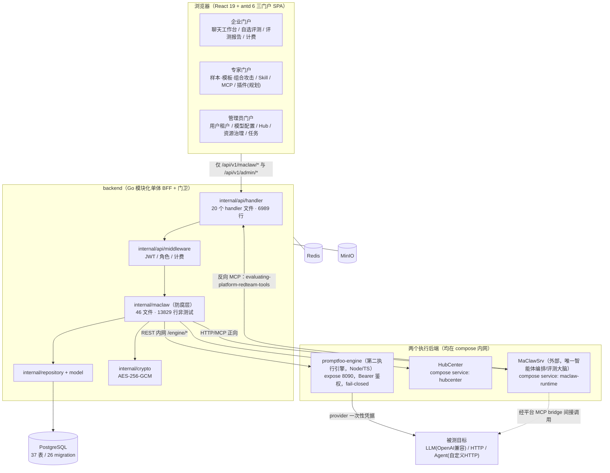
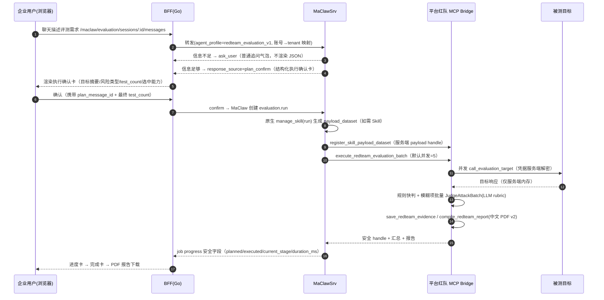
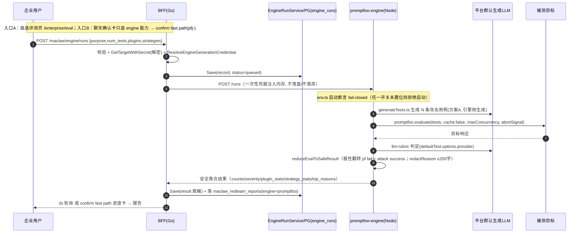

# 02 · 系统代码与架构审计报告

> 项目：LLM / Agent 红队安全评测平台（企业门户 + 专家门户 + 管理员门户 + MaClaw BFF + promptfoo 引擎）
> 审计人：软件架构师 高见远（Gao）
> 日期：2026-10-09
> 审计对象：`D:\evaluating-platform-backup-1009\evaluating_platform`（主张"最新版本"工作区）
> 参考：`D:\evaluating-platform-backup`（旧克隆）、`D:\promptfoo`（promptfoo v0.123.0 参考）、`D:\eva平台开发记录`
> **纪律：本阶段不写/不改任何业务代码，只产出 Markdown。所有结论均附文件路径 / 行号 / 命令证据。**

---

## 1. 执行摘要（5 条最关键的发现）

| # | 发现 | 严重度 | 一句话证据 |
|---|---|---|---|
| **F-1** | **版本控制彻底失控**：整个 promptfoo 引擎子系统（Phase 0/1/2）与 2026-09~10 的服务器迭代**全部未纳入任何提交**，本机磁盘是唯一副本。 | 🔴 **CRITICAL** | `git status --porcelain`＝252 modified + 33 untracked + 3 deleted；未跟踪项包含 `promptfoo_engine/`（整个 Node 服务）、`internal/maclaw/agent_target.go`、`promptfoo_plugin_catalog.go`、`engine_*.go`、`migrations/026_promptfoo_engine.sql`、`specs/`。当前分支与 origin 一致（0 领先 0 落后），即成果不在历史里。 |
| **F-2** | **文档与代码严重漂移**：作为"事实来源"的三份铁律文档写的插件/策略数量，比实际代码少一个数量级。 | 🟠 **HIGH** | `AGENTS.md`/`PROJECT_GUIDE.md`/`maclaw-current-state.md` 均称"6 插件 + 4 策略"或"15 插件/10 策略"；实际 `internal/maclaw/promptfoo_plugin_catalog.go` ＝ **119 个插件 `p(...)` + 30 个策略 `s(...)`**（`grep -c`），前端 `engineEval.ts`＝119+30 项粘贴副本。 |
| **F-3** | **双引擎架构张力 + 插件目录"三重硬编码"且无一致性测试**：Skill 链路与 promptfoo 链路在"生成/判定/报告"三处功能重叠；插件/策略词表分散在三处，唯一同步手段是一个**永远 pass** 的手工 dump 测试。 | 🟠 **HIGH** | 生成/判定重叠见 §4.5；硬编码三处：Go `promptfoo_plugin_catalog.go`、前端 `engineEval.ts`（注释"由后端生成，勿手改 id"）、引擎 `redteamRun.ts` 的 `CATEGORY_PREFIXES`(L458)/`inferSeverityFromPlugin`(L433)。`gen_frontend_options_test.go` 只 `t.Log` 不 assert。 |
| **F-4** | **巨型文件与关注点纠缠**：红队工具桥单个文件 3042 行，把 9+ MCP 工具分发、payload 组合、并发目标调用、批量判定、脱敏、评分、报告编译全塞在一起；`internal/maclaw` 46 个文件平铺无二级结构。 | 🟠 **HIGH(可维护性)** | `wc -l internal/maclaw/redteam_tool_bridge.go`＝3042；`internal/api/handler/maclaw_runtime.go`＝1587；`client.go`＝1565（U1 删 `ImportSkill`/`ExportSkill` 后实测，原报1595）；`redteam_artifact_service.go`＝1437（原报 1436）。 |
| **F-5** | **数据模型历史包袱**：26 个 migration、37 张表，**从无一次 `DROP TABLE`**；至少 11 张历史表在非测试代码中 0 引用（死表）。 | 🟡 **MEDIUM** | `grep -rh "DROP TABLE" migrations/` 无输出；`assessment_logs`/`target_systems`/`assets`/`skill_versions`/`skill_runs`/`external_mcp_servers`/`external_mcp_tools`/`app_detectors`/`auxiliary_llm_configs`/`orchestration_llm_configs`/`target_llm_configs` 引用数＝0。 |

**给决策者的第一句话**：**技术上这个系统是可运行、可演示、安全边界基本守住的；真正的高风险不在代码质量，而在"工程治理"——成果没有进版本控制、文档已失真、两套引擎的边界靠人肉维护。** 详见 §9「失控开发」。

---

## 2. 系统上下文与两条评测链路

### 2.1 系统上下文图（System Context）



> 关键边界（已由代码核实）：**浏览器不直连 MaClaw、不直连 promptfoo-engine、不持有任何 secret**（`engine_run.go` 头注释 L13-19；`maclaw-current-state.md` §BFF 安全边界）。

### 2.2 链路一：Skill 链路（既有主链路）



### 2.3 链路二：promptfoo 引擎链路（Phase 0/1/2，方案 A）



**两条链路的职责对比（已核实）**：

| 维度 | Skill 链路 | promptfoo 引擎链路 |
|---|---|---|
| 决策/规划 | MaClawSrv | MaClaw 发现/规划；确认后 BFF 直接编排（`engine_confirm.go`） |
| 用例生成 | MaClaw 原生 Skill（CCBOS/AutoDAN/…）输出 `payload_dataset` | 引擎侧 `generateTests.ts` 直接调平台生成 LLM（方案 A） |
| 执行 | 平台 MCP bridge `execute_redteam_evaluation_batch` | promptfoo `evaluate` 模式（http provider） |
| 判定 | 规则 + 平台 LLM 判定（`judge_profile`+CC-BOS 阈值） | `llm-rubric` 单一 rubric + 插件前缀推断 severity |
| 报告 | `compile_redteam_report` 中文 PDF v2 | 复用 `maclaw_redteam_reports`（`engine=promptfoo`） |
| fail-closed | 不涉及 | env.ts 四个开关强制置位（远程生成/redteam远程/telemetry/share） |

> **架构张力（F-3）**：两条链路在"生成 + 判定 + 报告"三处功能重叠，但判定语义不同（平台用 `judge_profile` 分档 + 0-100 阈值；引擎用单一中英文 `llm-rubric` + 极性翻转）。当前靠"由 MaClaw 计划卡选能力、BFF 决定路由"来分工，**没有统一的引擎抽象层**，重复度与漂移风险在系统扩展时会被放大。

---

## 3. 逐维度审计结论

> 每个维度：**现状 → 证据 → 问题 → 风险等级（高/中/低）**

### 3.1 总体架构与模块边界

- **现状**：分层清晰——`api/handler`（HTTP 表面）→ `internal/maclaw`（MaClaw 防腐层 + 平台确定性工具）→ `repository/model`（持久化）；`internal/crypto` 独立。依赖方向基本单向：handler 依赖 maclaw，maclaw 依赖 repository/model/crypto。MaClaw 认知锁在 `internal/maclaw`，不 import MaClaw 源码（`AGENTS.md` §maclaw Upgrade Boundary）。
- **证据**：`internal/` 目录树（`internal/api, internal/billing, internal/crypto, internal/maclaw, internal/model, internal/repository, internal/sample`）；`PROJECT_GUIDE.md` L129-136；`maclaw_gateway_provider.go` 通过 `GatewayProvider` 接口解耦 handler 与 runtime。
- **问题**：
  1. **`internal/maclaw` 46 个文件平铺，缺二级结构**——redteam 相关的 4 个文件（`redteam_tool_bridge.go` 3042 + `redteam_artifact_service.go` 1436 + `redteam_llm_judge.go` 764 + `redteam_payload_provider.go`）实质是一个"红队子系统"，无包边界。
  2. **两套执行引擎并存**（§2.3 张力），且引擎集成代码（`promptfoo_engine_bridge.go`、`promptfoo_engine_client.go`、`promptfoo_plugin_catalog.go`）也塞进同一 `maclaw` 平铺包。
  3. 防腐层出现"绕过"：`engine_confirm.go`（Phase 1 confirm fast path）在 handler 层直接编排引擎编排，虽经 `engineBridge`，但**执行编排逻辑上移到了 handler**。
- **风险等级**：架构健康度 **中（可维护性风险）**；引擎边界 **中高**。

### 3.2 后端代码质量

- **现状**：Go 137 文件、非测试 25,656 行、测试 14,598 行（测试/生产比约 0.57，测试习惯良好）。最大文件 `redteam_tool_bridge.go` 3042 行。
- **证据**：
  - `internal/maclaw` 非测试 13,829 行 / 测试 9,487 行；`internal/api` 非测试 6,989 行。
  - `redteam_tool_bridge.go` 单文件含 `SearchRedteamCapabilities`、`ComposeRedteamPayloads`、`RegisterSkillPayloadDataset`、`ExecuteRedteamEvaluationBatch`、`JudgeAttackResult`、`SaveRedteamEvidence`、`CompileRedteamReport` 以及 payload 存储/清理、判定 profile 解析、评分归一化等 **115 个顶层函数**（`grep -c "^func "` 实测；U3 验收复核确认）。
  - **`client.go`（1565 行，U1 删两个方法后实测）不是纯死代码，但含旧 slim-runtime 残留**：它是 `MaclawSrvClient` 的**基类/共享 HTTP 传输层**（`maclawsrv_client.go:103 return &MaclawSrvClient{Client: client}`），但同时也承载旧 slim API 方法（`StartEvaluationRun`/`ListEvaluationJobs`/`SearchEvaluationResources`/`CreateRuntimeSession`/`ListSkills`/`ImportSkill`… 共 50+ 方法）。
- **关键问答（回答 `重构规划-主文档.md` §2c "client.go 去留"）**：**不能删**。证据：`runtime_kind.go:28` / `provisioner.go:375` 通过 `NewMaclawSrvClient` 构造，而 `maclawsrv_client.go` 嵌入 `*Client`；handler 通过 `session.Client`（`GatewaySession.Client` 接口）调用这些方法（如 `maclaw_evaluation.go:279 gateway.StartEvaluationRun`、`admin_maclaw.go:431 session.Client.ListEvaluationJobs`）。**结论：`client.go` 是"接口 + 传输层 + 旧 slim 方法"的混合体，属于"技术债"而非"死代码"；退役前需先拆出共享传输层，再评估旧 slim 方法是否仍有调用。**
- **问题**：
  1. **超大类**：`redteam_tool_bridge.go` 3042 行，工具分发、组合、并发、判定、脱敏、评分、报告编织纠缠。
  2. **关注点纠缠**：脱敏/评分/阈值（`finalizeJudgeScore`、`safeJudgeScoreMetadata`、`inferJudgeProfileName`）与业务分发在同一文件。
  3. **`client.go` 混合体**：接口定义 + 传输 + 旧方法，注释文档称其为"旧适配器残留"（`重构规划-主文档.md` L39），实际仍在用——**文档与代码不一致**。
  4. **错误处理**：整体有统一 `UpstreamError`（`client.go:28`）与安全错误摘要（`SafeErrorSummary` `redteam_tool_bridge.go:1748`），但 `engine_confirm.go:124` 把 `err.Error()` 作为 `detail` 直接回浏览器（**潜在边界裂缝**，见 §3.4）。
  5. **并发/超时**：目标并发默认 5（`MACLAW_REDTEAM_TARGET_CONCURRENCY`），判定批量分块（`redteamJudgeBatchSize`/`chunkRedteamJudgeItems`）；HTTP client 超时分散硬编码（`redteam_tool_bridge.go:49` 180s、`target_config_service.go:29` 30s、`maclaw_skill.go:177` 60s、`promptfoo_engine_client.go:191`）——**无集中超时策略**。
- **风险等级**：**中高（可维护性）**；局部**中（一致性）**。

### 3.3 数据模型与迁移

- **现状**：26 个 migration（001–026），37 张表，1,068 行 SQL。命名规范（`update_updated_at()` 触发器统一），无 down 迁移。
- **证据**：
  - `ls migrations | wc -l`＝26；`grep -rh "CREATE TABLE" migrations/ | wc -l`＝37；`grep -rh "DROP TABLE" migrations/`＝**空**。
  - **死表（非测试代码 0 引用）**：`assessment_logs`、`target_systems`、`assets`、`skill_versions`、`skill_runs`、`external_mcp_servers`、`external_mcp_tools`、`app_detectors`、`auxiliary_llm_configs`、`orchestration_llm_configs`、`target_llm_configs`。
  - 新表 `engine_runs`（026）：`id TEXT PK / platform_user_id UUID FK / status CHECK / judge_mode CHECK / plugins JSONB / strategies JSONB / result JSONB / error_code/error_brief`，含 3 个索引（`idx_engine_runs_user_created`、`_status`、`_session` 部分索引）。设计**基本够用且符合安全契约**（`result` 只存脱敏汇总）。
- **问题**：
  1. **无表退役**：历史表长期只建不拆，schema 与"当前形态"严重脱节（`AGENTS.md` 明确"历史表只保留不删"是**合规策略**，但已积累 11 张 0 引用表）。
  2. **`engine_runs` 与 AI 对话链路是否统一？**：表注释称"AI 对话链路与自选评测链路统一"，但 `source` 枚举仅 `wizard|chat`，而 confirm fast path 的 `pfj-` 是**内存 job store**（`engine_job_store.go`），不是 `engine_runs` 行——**存在两处 job 记录**（PG `engine_runs` vs 内存 `engine_jobs`），进程重启会丢。
  3. **字段冗余/缺索引**：`plugins`/`strategies`/`result` 用 JSONB 无 GIN 索引（按插件查询性能未优化，但当前查询模式是按 user/时间，暂可接受）。
  4. **无 down migration**：回滚只能靠人工写反 SQL。
- **风险等级**：**中**（历史包袱 + job 记录双写/易失）。

### 3.4 安全边界

- **现状**：安全边界设计**完整且有文档**，实现上大体守住。
- **证据（正面）**：
  - **fail-closed**：`promptfoo_engine/src/env.ts:34-49` `assertSecuritySwitches` 启动即断言 `PROMPTFOO_DISABLE_REMOTE_GENERATION` / `_REDTEAM_REMOTE_GENERATION` / `_TELEMETRY` / `_SHARE` 全置位，否则 `throw`；`loadEnv` 还强制 `PROMPTFOO_ENGINE_BEARER_TOKEN` ≥16 字符。
  - **加密**：`internal/crypto/aes.go` AES-256-GCM；`keystore.go` 多 key_id；`maclaw_target_configs.encrypted_config BYTEA`（021）；凭据物化 `engine_credential_materializer.go` + `keycrypto.go`。
  - **执行授权**：`redteam_execution_grant.go` 有 TTL（2h）的 grant token（`mintRedteamExecutionGrant` / `verifyRedteamExecutionGrantPayload`），`run_promptfoo_redteam_evaluation` 需 grant。
  - **脱敏**：引擎 `sanitize/redact.ts` `redactReason`（≤200 字）；bridge `sanitizeMetadataMapFromAny`/`isUnsafeMetadataKey`（`redteam_tool_bridge.go:2945/2998`）。
  - **progress 白名单**：`engine_run.go:429 writeEngineSSEEvent` 只回 safe 字段。
- **证据（裂缝）**：
  1. `internal/api/handler/engine_confirm.go:124`：`gin.H{"error": "failed to submit engine evaluation", "code": "engine_submit_failed", "detail": err.Error()}` —— **把上游 error 原文回浏览器**，与"不得泄漏内部细节/路径"边界存在冲突（虽多数 error 为安全摘要，但这是反模式，应统一走 `SafeErrorSummary`）。
  2. `client.go` 部分方法错误回传上游 body（需逐处确认）；`engineErrorCode` 有白名单但 `detail` 无。
  3. **无 CI 安全回归**：fail-closed 断言只在引擎启动时；无自动化测试在 CI 中守护"某次改动放宽开关"。
- **风险等级**：**中**（整体守住，个别裂缝 + 无自动化守护）。

### 3.5 promptfoo 引擎集成深度

- **现状**：方案 A（引擎侧 LLM 生成 + evaluate 模式 + llm-rubric 判定）已上线并端到端验证（`promptfoo-generation-options.md` §9）。promptfoo 依赖锁定 `0.123.0`（`promptfoo_engine/package.json:19`），非 `file:` 本地 link。
- **证据**：`generateTests.ts`（生成，1 次重试）、`redteamRun.ts`（evaluate + 极性翻转 `reduceEvalToSafeResult` L304）、`sanitize/redact.ts`、`env.ts`、`manager/taskManager.ts`、`routes/runs.ts`；promptfoo 库仅用于 `evaluate`（不设 `writeLatestResults`/`redteam`）。
- **问题**：
  1. **功能重叠**：见 §2.3。引擎链路与 Skill 链路都做"生成→执行→判定→报告"，**判定保真度不同**（evaluate 无 redteam grader severity，severity 靠 `inferSeverityFromPlugin` 正则推断，属"展示近似"）。
  2. **三重硬编码漂移**（F-3）：Go catalog（119/30）/ 前端 `engineEval.ts`（粘贴副本）/ 引擎 `CATEGORY_PREFIXES`+`inferSeverityFromPlugin`（正则覆盖子集）。**无断言**：`gen_frontend_options_test.go` 只 `t.Log`。
  3. **plugin_id 未做白名单校验**：`generateTests.ts:154` LLM 返回的 `plugin_id` 不校验是否在 catalog 内（可产生 `custom`/任意值），导致 `plugin_stats` 可能归入 `other`。
  4. **`judge_mode` 未真正分流**：类型定义了 `auto|promptfoo_native|platform_rejudge`，但 evaluate 模式当前恒走 `llm-rubric`，`judge_mode` 类字段落库但未见分支消费（需进一步核实 handler/引擎）。
- **风险等级**：**中高**（漂移 + 判定保真度）。

### 3.6 交互与前端

- **现状**：三门户 SPA（React 19 + antd 6），前端 48 个 ts/tsx，8,606 行。聊天工作台（ChatPage 968 行）、自选评测页（EngineEvalPage 386 行）、卡片渲染（ChatCards 749 行）。
- **证据**：
  - **progress 卡单一数据源（P1 抖动修复）已落地且实现正确**：`ChatPage.tsx:316-333` 注释明确"once the SSE stream is active it owns every progress card"；`!streamStopRef.current` 时 job 轮询才播种 `queued` 卡并 `startRunStream`；引擎 job（`pfj-`）走 `ChatPage.tsx:337-347` 轮询直刷、**不回落 snapshot**。`frontend/src/pages/enterprise/chatDisplay.ts:228 collapseProgressMessages` 按 `assessment_id` 折叠。
  - **回答 PM 的 SP-01**：SSE 分支 progress 卡 `assessment_id = runID`（`maclawRuntime.toEventChatMessage`），引擎 `pfj-` 分支**不开 SSE**（`maclaw-current-state.md` §Phase 1 修复说明），改用 job 轮询直刷同一 `job-${jobId}` 卡。**两条分支的 `assessment_id` 语义已隔离**（一条用 runtime run id，一条用 job id），**不共享同一 assessment_id**，因此不构成双通道覆盖。**结论：P1 修复对本场景成立；剩余风险仅在"确认后 SSE 连接失败 → 回退轮询"的切换瞬间，建议补一条前端单测锁定 `streamStopRef` 回退路径。**
  - 前端测试：**6 个 `*.test.ts`**（`chatDisplayConfirmedPlan` / `chatDisplayReportCard` / `chatDisplaySessionIsolation` / `chatMarkdown` / `jobProgressMessages` / `runtimeRunPolicy`）+ 4 个手工 `.mjs` 脚本。**但 `package.json` 只有 `test:adapters`，6 个 `.test.ts` 无统一 runner**（无 vitest/jest devDep）。
- **问题**：
  1. **巨型组件**：ChatPage 968 行（轮询/SSE/状态/UI 耦合）；ChatCards 749 行；`maclawRuntime.ts` 674 行（类型+SSE+转换+API）。
  2. **前端测试未接入 runner**：6 个 `.test.ts` 存在但 `npm test` 不存在，等于"写了不跑"。
  3. **目录漂移无守护**（F-3）。
  4. **双门户欢迎卡双写**：`frontend/src/pages/enterprise/chatDisplay.ts:15 AGENT_WELCOME_CAPABILITIES` 与后端 `enterprise_welcome.go` 各写一份（注释承认"mirror"）。
- **风险等级**：**中**（可维护性 + 测试未生效）。

### 3.7 可运维性

- **现状**：`docker-compose.yml` 9 个服务（postgres/redis/minio/minio-init/maclaw-runtime/hubcenter/backend/frontend/promptfoo-engine），含 healthcheck。
- **证据**：compose 服务数与 `PROJECT_GUIDE.md` §启动编排一致；`frontend/nginx.conf` `/api/v1` 代理超时 650s（覆盖 confirmed run 长请求）。
- **问题**：
  1. **compose 内硬编码默认口令**：`POSTGRES_PASSWORD`/`MINIO_ROOT_PASSWORD`/`JWT_SECRET: change-me-in-dev`/`CRYPTO_MASTER_KEY`（常量）——生产必须覆盖，但**无启动断言强制**（对比引擎侧有 fail-closed 断言）。
  2. **`PROMPTFOO_ENGINE_TIMEOUT_SECONDS: 15`**（BFF→引擎提交超时）而 confirm fast path 等待窗口 `promptfooEngineWaitTimeout = 15 * time.Minute`（`engine_confirm.go:27`）——两处时长语义不同但都命名 timeout，易误读。
  3. **缺 Docker 时无本地验证路径**：`specs/execution-acceptance-checklist.md` 承认本机可能无 Go 工具链，回归证据不足。
  4. **无 CI**（§3.8）。
- **风险等级**：**中**。

### 3.8 可靠性 / 性能 / CI

- **现状**：长请求超时链路已打通（nginx 650s、MacClaw `MAX_TIMEOUT_SECONDS≥180`、BFF write timeout ≥600）。
- **证据**：`nginx.conf:13-15/26-28`；`PROJECT_GUIDE.md` L158-159；`engine_confirm.go:27`。
- **问题**：
  1. **无 CI**（`find . -name "*.yml" -path "*workflows*"` 无输出；无 gitlab-ci/Jenkinsfile）。所有回归靠手工 `go test ./...` / `npm run build` / `vitest` / `compose config` / `git diff --check`。
  2. **confirm fast path 的 job 是内存态**（`engine_job_store.go`），进程重启丢进度（与 Skill 链路 MaClaw 侧 job 不同）。
  3. **20 轮评测并发**：Skill 链路有自适应批量（batch_size/concurrency）与判定分块；引擎链路 evaluate `maxConcurrency` ≤50，生成是**单次 chat 调用**（`generateTests.ts` 一次要 N 条），**N 大时单次 LLM 生成可能截断/超时**（`GENERATION_TIMEOUT_MS=120s`，`MAX_PROMPT_CHARS=4000`）。
  4. **LLM 判定/生成重试/降级**：生成重试 1 次（`attempts=2`），失败即 `generation_failed`（无降级到规则/模板）；引擎判定失败无平台 judge 回退（对比 Skill 链路有规则 fallback）。
- **风险等级**：**中**。

---

## 4. 目标系统缺口分析（对照用户意图）

> 用户目标：**① 像 promptfoo 一样支持插件与策略拓展；② 沿用原交互（与 LLM 聊天自动生成红队方案）；③ 支持对 Agent 做红队测试。**

| 目标 | 现状能力 | 缺口 | 等级 |
|---|---|---|---|
| **G1 聊天式自动生成方案** | Skill 链路完整（澄清→plan_confirm→confirm→进度→报告）；引擎链路有 confirm fast path | ① 抖动仅在主场景修复（残留 SSE→轮询切换瞬间）；② 引擎链路无前端对话入口（须走自选评测页）；③ 确认卡字段极端缺失时的兜底 | 🟡 中 |
| **G2 类 promptfoo 的插件/策略扩展** | 有 119 插件 / 30 策略**静态目录**（L1 目录对齐）；方案 A 下插件/策略只是给生成 LLM 的**标签** | ① **无原生 promptfoo 插件**（`redteam.run` 被 fail-closed 禁用）；② **无专家自定义插件发布**（Phase 3 未做）；③ **目录三重硬编码无单一来源**；④ 插件/策略不真正驱动生成逻辑（仅作 prompt 提示词） | 🔴 高 |
| **G3 Agent 红队测试** | `kind=agent` 自定义 HTTP 端点（对齐 pf `http` provider），复用加密凭据，模板 `{{prompt}}`/`{{api_key}}` | ① **v1 仅单轮**（`session_mode` 概念存在但未实现多轮）；② **纯文本**（图片载荷 → `target_multimodal_not_supported`）；③ **无 MCP Agent 协议**；④ **无工具调用副作用隔离/沙箱**；⑤ 无多轮攻击策略（crescendo 等）与会话绑定 | 🔴 高 |
| **判定保真度** | 平台 judge 分档（`judge_profile`+0-100 阈值+refusal 强制失败）；引擎 llm-rubric 极性翻转 | 引擎 evaluate 无 severity grader（展示近似）；双轨判定口径可能不一致（用户困惑） | 🟡 中 |

**结论**：现有能力**满足 G1 的大部分**；**G2 是"目录级对齐"而非"机制级可扩展"**；**G3 是 v1 骨架，离"真正能对 Agent 做多轮、可隔离副作用、支持 MCP 的红队测试"还有明显距离**。

---

## 5. 问题清单表

> 编号规则：`A`=架构，`Q`=代码质量，`D`=数据，`S`=安全，`E`=引擎，`F`=前端，`O`=运维，`R`=可靠性。严重度：🔴高 / 🟠中 / 🟡低。

| 编号 | 描述 | 证据（文件:行 / 命令） | 严重度 | 建议动作 | 涉及文件 |
|---|---|---|---|---|---|
| A-01 | 单个红队工具桥 3042 行，9+ 工具与判定/评分/脱敏/报告纠缠 | `wc -l internal/maclaw/redteam_tool_bridge.go`=3042；`grep -c "^func "`=115 | 🟠 | 拆 `internal/maclaw/redteam/` 二级包（bridge/executor/judge/evidence/report） | `redteam_tool_bridge.go`、`redteam_artifact_service.go`、`redteam_llm_judge.go` |
| A-02 | 两套执行引擎并存，无事前统一抽象层 | §2.3；`engine_confirm.go` handler 直接编排 | 🟠 | 定义 `EvaluationRunner` 接口，收敛路由 | `engine_confirm.go`、`promptfoo_engine_bridge.go` |
| A-03 | `client.go` 混合体（接口+传输+旧 slim 方法），文档称"残留"但仍在用 | `maclawsrv_client.go:103` 嵌入；`maclaw_evaluation.go:279` 调用 | 🟡 | 拆出 `transport.go`，旧方法单列并标记 | `client.go`、`maclawsrv_client.go` |
| Q-01 | `internal/api/handler/maclaw_runtime.go` 1587 行，会话/消息/运行/SSE 堆叠 | `wc -l` | 🟠 | 按子域拆 handler 包 | `internal/api/handler/maclaw_runtime.go` |
| Q-02 | HTTP 超时分散硬编码（30/60/180s…） | `redteam_tool_bridge.go:49`、`target_config_service.go:29`、`maclaw_skill.go:177` | 🟡 | 集中到 config | 上述文件 + `configs/config.yaml` |
| Q-03 | 全局技术债标记仅 1 处（`billing.go:11`）→ 注释规范但"隐性债"不可见 | `grep -rn "TODO\|FIXME"` 仅 1 命中 | 🟡 | 补 issue tracker / 代码分层 TODO | 全局 |
| D-01 | 11 张死表 0 引用，26 migration 无一次 DROP | `grep -rh "DROP TABLE" migrations/` 空；各表引用数=0 | 🟠 | 单起"数据退役计划"（先归档再 drop） | `migrations/*` |
| D-02 | job 记录双写：PG `engine_runs` vs 内存 `engine_job_store`（重启丢） | `engine_job_store.go`；`engine_confirm.go:130` | 🟠 | 引擎 job 也落库或明确标注易失 | `engine_job_store.go`、`engine_runs` |
| D-03 | 无 down migration | `migrations/` 仅有 up | 🟡 | 回滚脚本单列 | `migrations/` |
| S-01 | `engine_confirm.go` 回传上游 `err.Error()` 作 detail | `engine_confirm.go:124` | 🟠 | 统一走 `SafeErrorSummary` | `engine_confirm.go` |
| S-02 | compose 硬编码默认口令且无启动断言 | `docker-compose.yml`（POSTGRES/JWT_SECRET/CRYPTO_MASTER_KEY） | 🟠 | 非默认值启动断言 + 生产强制 | `docker-compose.yml`、`cmd/server/main.go` |
| S-03 | fail-closed 开关无 CI 守护 | `env.ts:34`；无 `.github/workflows` | 🟡 | CI 增加开关断言测试 | `promptfoo_engine/src/env.ts`、CI |
| E-01 | 插件/策略目录三重硬编码，无一致性断言 | Go catalog(119/30)/`engineEval.ts`/`redteamRun.ts:433,458` | 🟠 | 后端单一来源 + 生成脚本 + CI 断言 | `promptfoo_plugin_catalog.go`、`engineEval.ts`、`redteamRun.ts` |
| E-02 | `plugin_id` 未做 catalog 白名单校验 | `generateTests.ts:154` | 🟡 | 生成后按 catalog 过滤/归一 | `generateTests.ts` |
| E-03 | 引擎 evaluate 无 severity grader，靠正则推断 | `redteamRun.ts:433 inferSeverityFromPlugin` | 🟡 | 文档标注近似 + 可换 redteam grader（需 L2 决策） | `redteamRun.ts` |
| E-04 | `judge_mode` 字段疑似未真正分流 | `engine_run.go:180`；引擎恒走 llm-rubric | 🟠 | 明确实现或删除该字段 | `engine_run.go`、`redteamRun.ts` |
| F-01 | ChatPage 968 行巨型组件 | `wc -l` | 🟠 | 拆 Hook（useChatSession/useEvaluationJob/useRunEventStream） | `ChatPage.tsx` |
| F-02 | 6 个 `.test.ts` 未接入 runner | `package.json` 仅 `test:adapters` | 🟠 | 加 vitest + `npm test` | `frontend/package.json` |
| F-03 | 欢迎卡双写（前端+后端 mirror） | `frontend/src/pages/enterprise/chatDisplay.ts:15` vs `enterprise_welcome.go` | 🟡 | 单一来源（API 提供） | 上述两处 |
| O-01 | 无 CI | `find ... workflows` 空 | 🟠 | 建 `.github/workflows/ci.yml` | 新增 |
| O-02 | 缺 Docker 时无本地验证路径 | `specs/execution-acceptance-checklist.md` | 🟡 | 提供 sqlite/mock 或明确标注 | CI/docs |
| R-01 | 引擎生成单次调用，N 大时截断/超时风险 | `generateTests.ts:46,93`（120s/单请求） | 🟡 | 分批生成 + 每批重试 | `generateTests.ts` |
| R-02 | 引擎判定失败无平台 judge 回退 | `redteamRun.ts`（仅 llm-rubric） | 🟡 | 增加降级路径或明确语义 | `redteamRun.ts` |
| **G-01** | **最新成果未纳入版本控制** | `git status --porcelain`：252+33+3 | 🔴 | 见 `05-Git现状审计`：先隔离敏感→再快照提交 | 全仓库 |

---

## 6. 亮点与可保留资产

- ✅ **安全边界设计成熟且有文档纪律**：fail-closed 启动断言、AES-256-GCM、执行 grant、脱敏白名单、progress 字段白名单，均为一等公民设计（`env.ts`、`crypto/aes.go`、`redteam_execution_grant.go`、`redact.ts`）。
- ✅ **防腐层意识强**：`internal/maclaw` 集中所有 MaClaw 认知，MaClaw 升级补丁点有明确清单（`maclaw-current-state.md` §升级补丁点）。
- ✅ **测试体量可观**：Go 测试 14,598 行（≈生产 0.57），引擎 10 个 vitest 文件（含真实 promptfoo evaluate smoke e2e）。
- ✅ **方案 A 决策工程质量高**：`promptfoo-generation-options.md` 对 A/B/C 三方案做了**源码级论证**（dist 行为验证）、记录了实施中修复的 3 个额外 bug 与端到端验证数据——这是难得的"决策留痕"。
- ✅ **文档体系完备**：`PROJECT_GUIDE`/`AGENTS`/`docs/architecture/*`/`specs/*`/`重构规划-主文档`/HTML 原型，覆盖架构、流程、修复计划、前端原型。
- ✅ **前端 P1 抖动修复落地正确**（单数据源 + 折叠 + 会话隔离）。
- ✅ **长请求超时链路打通**（nginx/后端/compose 一致 650s）。

---

## 7. "失控开发"的具体表现与治理建议

### 7.1 具体表现

1. **版本控制失控（最严重）**：整个 promptfoo 引擎子系统 + Agent target + 插件目录 + `specs/` + 10 月迭代，**全部未提交**；本机 = 唯一副本；且已删除 3 文件未提交。详见 `05-Git现状审计与GitHub备份建议.md`（其结论与本审计一致：252 modified + 33 untracked + 3 deleted）。
2. **文档/代码漂移**：三份"事实来源"文档的插件/策略数量比代码少一个数量级（F-2）；`client.go` 被文档称为"残留"实为在用（§3.2）。文档更新是靠人工记忆，无 CI 校验。
3. **双引擎张力**：两套生成/判定/报告路径并存，无统一抽象；插件目录三重硬编码，唯一同步手段是"永远 pass 的手工 dump 测试"（F-3、E-01）。
4. **无 CI**：安全开关、目录一致性、前端测试、护栏全靠人工；回归证据不可信。
5. **历史数据只增不减**：11 张死表 + 无 down migration。

### 7.2 治理建议（对应到 03 号文档的任务）

| 治理动作 | 目标 | 优先级 |
|---|---|---|
| 立即快照提交（先隔离敏感） | 消除"唯一副本"风险 | P0 |
| 建 CI（build + test + compose + 目录一致性 + fail-closed 断言） | 把人工回归变成自动门 | P0 |
| 文档与代码对齐机制（改代码必改文档 + CI 检查关键常量） | 止血漂移 | P1 |
| 插件目录单一来源（后端生成前端 + CI 相等断言） | 消除三重硬编码 | P1 |
| 死表退役计划（先归档） | 数据模型瘦身 | P2 |
| 引擎边界抽象（EvaluationRunner 接口） | 收敛双引擎张力 | P2 |

---

## 8. 审计方法与可复现命令

```bash
# 编译与测试（本次实测）
cd evaluating_platform && go build ./...                                   # exit=0
go test ./...                                                              # exit=0，全绿
#    ok  cmd/server 10.5s | internal/api/handler 15.2s | internal/billing 8.1s
#    ok  internal/maclaw 16.4s | internal/repository 8.6s | internal/sample 13.7s | pkg/config 19.7s
# 代码规模
find . -name "*.go" -not -name "*_test.go" | xargs wc -l | tail -1        # 25656
find internal/maclaw -name "*_test.go" | xargs wc -l | tail -1            # 9487
# 插件目录真相
grep -c "^	p(" internal/maclaw/promptfoo_plugin_catalog.go                 # 119
grep -c "^	s(" internal/maclaw/promptfoo_plugin_catalog.go                 # 30
grep -c "{ id:" frontend/src/services/engineEval.ts                       # 152(119+30+3)
# 死表
grep -rh "DROP TABLE" migrations/ || echo "无 DROP"
# 版本控制
git status --porcelain | wc -l                                            # 288
# CI
find . -name "*.yml" -path "*workflows*" || echo "无 CI"
```

---

## 9. 与团队成员文档的衔接

- `01-需求文档与交互流程确认.md` 的 **SP-01（pfj- 与 SSE 的 assessment_id 隔离）**：本报告 §3.6 已给出结论——**两条分支 assessment_id 语义已隔离，P1 修复成立**，仅建议补回退路径单测。
- `05-Git现状审计与GitHub备份建议.md` 的 Git 结论与本审计 §7.1 一致，本报告不重复，直接引用。
- 下游 `03-重构与开发计划.md` 基于本报告 §5 问题清单编排任务；`04-关键技术与决策细节.md` 承载双引擎边界、插件单一来源、Agent 协议、判定框架等关键设计点与待决策项。
