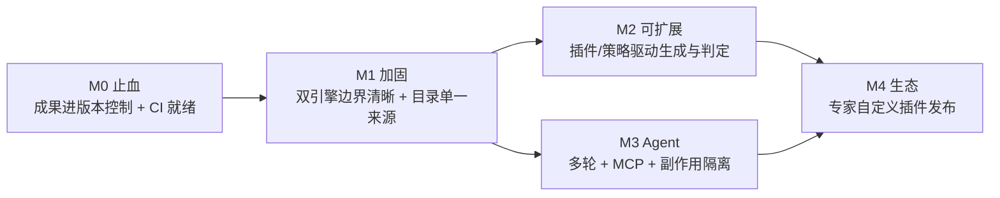

# 03 · 重构与开发计划

> 项目：LLM / Agent 红队安全评测平台
> 编制：软件架构师 高见远（Gao）｜日期：2026-10-09
> 依据：`02-系统代码与架构审计报告.md`（问题清单）、`01-需求文档与交互流程确认.md`（需求池）、`05-Git现状审计与GitHub备份建议.md`（Git 决策）
> 代码基线：`D:\evaluating-platform-backup-1009`（当前最新工作区，252+33 未提交）
> **本阶段性质：只做调研/设计（不改业务代码）。任务表中标注 `[设计]` 的为本阶段可交付，标注 `[编码]` 的为后续实施阶段。**
> 已验证基线命令：`go test ./...` / `npm run build` / `promptfoo_engine: npm test` / `docker compose config --services` / `git diff --check`

---

## 0. 总纲：三类工作 + 四个阶段

审计结论（`02` 号文档 §1）指向三块彼此正交、但存在依赖顺序的工作：

| 类别 | 目标 | 与审计问题的对应 |
|---|---|---|
| **A. 治理与止血** | 消除"唯一副本""无 CI""文档漂移"三重失控 | F-1（G-01）、O-01、F-2、F-3 |
| **B. 架构加固** | 拆巨型文件、收敛双引擎张力、数据模型瘦身 | A-01/A-02/A-03、D-01/D-02、E-01/E-04 |
| **C. 目标能力建设** | 插件/策略"机制级"可扩展 + Agent 多轮红队 | G2、G3、E-03 |

**阶段（Phase）与验收门（Gate）：**

```
Phase 0  治理与止血（先做，零/低风险）
   ├─ 0.1 [编码] Git 快照备份（依赖 05 号文档 Step 0 隔离敏感）→ Gate G0：成果已进版本控制
   ├─ 0.2 [编码] 建 CI（go test/vet + npm build + vitest + compose config + 目录一致性 + fail-closed 断言）→ Gate G0：CI 红绿可信
   └─ 0.3 [设计] 文档-代码对齐机制 + 全量文档勘误 → Gate G0：事实来源可信

Phase 1  架构加固（中风险，需 CI 就绪）
   ├─ 1.1 [设计] 双引擎边界抽象（EvaluationRunner 接口 + 路由收敛）
   ├─ 1.2 [设计+编码] 插件/策略单一来源（后端生成前端 + CI 相等断言）
   ├─ 1.3 [编码] 红队子系统拆二级包（git mv + 逐文件拆）
   └─ 1.4 [设计] 数据退役计划（死表归档）+ job 记录统一 → Gate G1：回归全绿

Phase 2  目标能力建设（对齐用户意图，需 Phase 1 边界就绪）
   ├─ 2.1 [设计] 插件/策略"驱动式"扩展机制（从标签 → 生效于生成/判定）
   ├─ 2.2 [设计] Agent 目标协议 v2（多轮会话 + MCP Agent + 副作用隔离）
   ├─ 2.3 [设计] 判定框架统一（judge_profile × llm-rubric 双轨裁决 + 保真度）
   └─ 2.4 [设计] 专家自定义插件发布链路（Phase 3 前置设计）→ Gate G2：能力缺口收敛

Phase 3  可选（按需触发，YAGNI）
   └─ 自托管生成端点 / 引擎独立扩缩容 / 事件总线
```

**依赖关系（关键）**：**Phase 0 → 所有后续**（无 CI 不动架构）；**1.1 → 2.1/2.3**（插件机制与判定统一需先有引擎抽象）；**1.2 → 2.1**（单一来源是可扩展机制的前提）；**2.2 独立**于 1.x（Agent 协议可并行设计）。

---

## 1. Phase 0 · 治理与止血

### T0.1 —【编码】Git 快照备份（P0，最高优先）

- **来源**：审计 F-1 / G-01；`05` 号文档 §4 Step 0-2。
- **目标**：消除"本机磁盘 = 唯一副本"。
- **任务清单**：
  1. 执行 `05` 号文档 Step 0（隔离 `deploy-backups/`（含明文密钥/pg_dump）、`deploy-demo/`、`deploy-skill-sync/`、两个 7.4MB 导出 zip、补 `.gitignore`）。
  2. `git check-ignore -v` 逐项校验敏感项被忽略；`git status --porcelain | grep -iE "\.env$|pg_dump|\.db$|deploy-backups"` 必须为空。
  3. 按 `05` Step 1 由用户拍板正式远端，Step 2 新建备份分支（`codex/redteam-platform-20261009`）提交现状快照并推送。
- **依赖**：**无**（但需用户决策 GD-1/GD-3）。
- **验收标准**：`git log` 包含引擎/Agent/目录/specs 全部成果；`git status --porcelain` 无未跟踪的业务文件；敏感项零暂存。
- **涉及文件**：`.gitignore`、全仓库。
- **风险**：误推密钥（缓解＝Step 0 先行）；历史分叉（缓解＝先开新分支保备份，历史合并且后专项）。
- **不做代码修改**。

### T0.2 —【编码】建立 CI（P0）

- **来源**：审计 O-01 / F-02 / S-03 / F-3。
- **目标**：把人工回归变成自动门，并为后续架构改动提供安全网。
- **任务清单**：
  1. 新增 `.github/workflows/ci.yml`，作业：
     - 后端：`go vet ./...` + `go test ./...`（`go.mod` 已锁依赖）。
     - 前端：`npm ci && npm run build && npm run lint`；**新增 vitest**（见下）跑 6 个 `.test.ts` + 4 个 `.mjs` 脚本。
     - 引擎：`cd promptfoo_engine && npm ci && npm run typecheck && npm test`（10 个 vitest）。
     - 编排：`docker compose config --services`（无 docker 环境则标注跳过，不假装通过）。
     - 收尾：`git diff --check`。
  2. **fail-closed 断言进入 CI**：加一条测试断言 `env.ts:assertSecuritySwitches` 在任一开关缺失时抛错（防止未来放宽）。
  3. **目录一致性断言进入 CI**（与 T1.2 联动）：断言前端 `ENGINE_PLUGIN_OPTIONS` 与后端 `promptfoo_plugin_catalog.go` 逐项相等。
- **依赖**：T0.1（需先有提交）。
- **验收标准**：一次 push 触发全绿；故意改坏任一护栏 → CI 变红。
- **涉及文件**：`.github/workflows/ci.yml`（新增）、`frontend/package.json`（加 vitest devDep + `test` 脚本）、`promptfoo_engine/src/env.test.ts`（已有）、`internal/maclaw/promptfoo_plugin_catalog_test.go`。
- **风险**：无 Docker 环境的作业需明确跳过语义。

### T0.3 —【设计】文档-代码对齐机制 + 全量勘误（P1）

- **来源**：审计 F-2 / §7。
- **目标**：让"事实来源"重新可信，防止继续漂移。
- **任务清单（本阶段交付 = 勘误清单 + 机制设计）**：
  1. 产出**文档勘误表**：逐条列出 `AGENTS.md`、`PROJECT_GUIDE.md`、`maclaw-current-state.md` 中与代码不符的陈述（重点：插件/策略数量 6/15 → 119/30；`client.go` "残留"定性；compose 服务数；引擎 Phase 状态）。
  2. 设计**对齐机制**：
     - 关键常量（插件/策略数量、服务清单）改为"由代码/脚本生成文档片段"或"CI 校验文档中的数字"。
     - 定义"改代码必改文档"的 PR 检查清单（复用 `AGENTS.md` §文档同步 的事实清单）。
  3. 设计 `maclaw-current-state.md` 的"事实与代码锚点"约定（每条事实附证据文件路径/测试名）。
- **依赖**：无（可与 T0.1/T0.2 并行）。
- **验收标准**：勘误表覆盖全部高偏差项；机制在设计文档中可评审通过。
- **涉及文件**：`AGENTS.md`、`PROJECT_GUIDE.md`、`evaluating_platform/docs/architecture/*.md`、新增 `audit-2026-10-09/` 勘误附件。
- **风险**：文档量大，需分批；低。

**Gate G0（进入 Phase 1 的前置）**：✅ 成果已进版本控制；✅ CI 红绿可信；✅ 事实来源勘误完成。

---

## 2. Phase 1 · 架构加固

### T1.1 —【设计→编码】双引擎边界抽象与路由收敛（P1）

- **来源**：审计 A-02、E-04；§2.3 张力。
- **目标**：给"Skill 链路"与"promptfoo 链路"一个统一抽象，消除 handler 直接编排引擎、`judge_mode` 未分流等隐患。
- **任务清单（本阶段 = 设计）**：
  1. 定义 `EvaluationRunner` 接口（`Plan`/`Prepare`/`Execute`/`Wait`/`Result` 语义），Skill 链路与引擎链路各出一个实现。
  2. 明确**路由决策归属**：谁在什么时候选哪条链路（保持"发现/规划归 MaClaw，执行平台受控"不变）。
  3. 决定 `judge_mode`（`auto|promptfoo_native|platform_rejudge`）的真实语义：实现双轨裁决，或删除该字段（当前疑似未消费 —— 见 `02` E-04）。
  4. 设计 handler 层与编排层的边界（`engine_confirm.go` 的编排逻辑下沉到 maclaw 层）。
- **依赖**：G0。
- **验收标准**：接口 + 序列图评审通过；明确 `judge_mode` 去留结论。
- **涉及文件（设计产出）**：新增设计文档；后续编码涉及 `engine_confirm.go`、`promptfoo_engine_bridge.go`、`redteam_tool_bridge.go`。
- **风险**：接口抽象过度（YAGNI）——控制在"恰好覆盖两条链路"。

### T1.2 —【设计+编码】插件/策略单一来源（P1）

- **来源**：审计 E-01、F-3。
- **目标**：消除三重硬编码，杜绝漂移。
- **任务清单**：
  1. **设计单一来源方案**（详见 `04` 号文档 §插件/策略单一来源）：后端 `promptfoo_plugin_catalog.go` 为唯一真源。
  2. 生成机制：把 `gen_frontend_options_test.go` 从"永远 pass 的 dump"改为**真正的生成器**（写 `engineEval.ts` 的 options 段）或**校验器**（断言已存在文件与后端一致，不一致则 fail）。
  3. 引擎 `redteamRun.ts` 的 `CATEGORY_PREFIXES`/`inferSeverityFromPlugin`：改为**由共享词表驱动**（生成或校验），或明确标注"正则兜底 + 覆盖清单"并加测试。
  4. `plugin_id` 白名单校验（审计 E-02）：生成后按 catalog 过滤/归一。
- **依赖**：G0；（编码）T0.2 的 CI 断言。
- **验收标准**：三处词表一致且 CI 可检出漂移；新增一个插件只改一处。
- **涉及文件**：`internal/maclaw/promptfoo_plugin_catalog.go`、`frontend/src/services/engineEval.ts`、`promptfoo_engine/src/runner/redteamRun.ts`、`promptfoo_engine/src/runner/generateTests.ts`、`gen_frontend_options_test.go`、CI。
- **风险**：生成器误覆盖前端文件（缓解＝仅替换标注段 + 生成后 `tsc -b`）。

### T1.3 —【编码】红队子系统拆二级包（P1，中风险）

- **来源**：审计 A-01、Q-01；`重构规划-主文档.md` §2a/2b。
- **目标**：`redteam_tool_bridge.go`（3042）等巨型文件按关注点拆分，包边界清晰。
- **任务清单**：
  1. 目标结构（`重构规划-主文档.md` §2a）：
     ```
     internal/maclaw/redteam/
       bridge.go          # 工具注册与分发（薄路由壳）
       payload_compose.go # sample/template/composed_attack 组合
       batch_executor.go  # execute_redteam_evaluation_batch 主体
       judge.go           # 判定规则 + LLM 编排（从 redteam_llm_judge 迁入）
       evidence.go        # 证据保存（从 artifact_service 拆出）
       report.go          # 报告编译（从 artifact_service 拆出）
     ```
  2. 手法：**`git mv` 保历史 → 先拆分发薄壳 → 再按工具逐个迁业务**；每迁一步跑 `go test ./...`。
  3. handler 层 `maclaw_runtime.go`（1587）按子域拆（sessions/messages/runs/events），**路由注册不变**。
  4. `client.go`：拆出共享传输层，旧 slim 方法单列并标注去留结论（审计 A-03）。
- **依赖**：G0；建议在 T1.1 设计后进行（避免二次搬迁）。
- **验收标准**：`go test -cover` 覆盖率只升不降；MCP 工具清单（名称/schema）拆分前后快照一致；`git mv` 使 blame 可追溯。
- **涉及文件**：上述全部 + 对应 `*_test.go`。
- **风险**：拆分破坏 MCP 工具注册（缓解＝工具清单快照对比）；测试迁移丢覆盖（缓解＝迁移前后跑 `-cover`）。

### T1.4 —【设计】历史表登记 + job 记录统一（P2）

> **⛔ 已调整（2026-10-09 用户决策 DD-8=B）**：**保留全部历史表，不执行 DROP**。原"数据退役/drop 计划"取消，改为"历史表登记与文档标注 + job 记录统一"。

- **来源**：审计 D-01、D-02、D-03；决策 `06` D-08。
- **目标**：① 把 11 张历史遗留/0 引用表**登记并标注**（避免新人误用），不删表；② 消除 job 记录双写/易失。
- **任务清单（本阶段 = 设计）**：
  1. 历史表**登记清单**（11 张）：在架构文档中标注"历史遗留 / 当前未引用 / 保留不删"，附每张表的历史用途与最后引用版本；**不写任何 drop migration**。
  2. job 记录统一设计（`engine_job_store.go` 内存态 vs `engine_runs` PG）：按 `04` DD-6 推荐 **A（落库）** 设计。
  3. down migration 规范（可选，仅新增表需要；因不做 drop，回滚以"新增表反向 SQL"为主）。
- **依赖**：G0。
- **验收标准**：历史表登记表评审通过；job 语义明确（落库）。
- **涉及文件（设计）**：`migrations/*`（不再新增 drop）、`engine_job_store.go`、`engine_run_service.go`、架构文档。
- **风险**：无（不删表，无数据风险）。

**Gate G1**：✅ 双引擎边界清晰；✅ 插件目录单一来源；✅ 红队子系统包边界清晰；✅ 回归全绿（go test / npm build / vitest / compose config）。

---

## 3. Phase 2 · 目标能力建设（对齐用户意图）

### T2.1 —【设计】插件/策略"驱动式"可扩展机制（P1）

- **来源**：审计 G2、E-03；用户目标"像 promptfoo 一样支持插件与策略拓展"。
- **目标**：从"目录标签"升级为"真正影响生成与判定的机制"。
- **任务清单（本阶段 = 设计，详见 `04` 号文档）**：
  1. 定义插件/策略的**元数据 schema**（id/category/risk_types/default_severity/生成提示模板/判定 rubric 片段/可选参数）。
  2. 定义"插件驱动生成"的契约：`generateTests.ts` 按插件拼装生成提示（而非当前单一通用 systemPrompt）。
  3. 定义"插件驱动判定"：per-plugin rubric（当前是单一 `SAFETY_RUBRIC`）。
  4. **L1/L2 决策落点**：当前保持 L1（目录对齐 + 方案 A）；L2（原生 promptfoo 插件/`redteam.run`）需用户接受放宽 fail-closed（决策点 DD-1）。
  5. 可扩展性边界：企业用户不可编辑 promptfoo yaml；插件的"发布"归专家门户（T2.4）。
- **依赖**：T1.1（引擎抽象）、T1.2（单一来源）。
- **验收标准**：schema + 契约评审通过；能回答"新增一个带自定义判定的插件需要改几处"。
- **涉及文件（设计）**：`promptfoo_plugin_catalog.go`、`generateTests.ts`、`redteamRun.ts`、`engineEval.ts`。
- **风险**：L2 与 fail-closed 冲突（须用户裁决）。

### T2.2 —【设计】Agent 目标协议 v2（多轮 + MCP + 副作用隔离）（P1）

- **来源**：审计 G3；用户目标"支持对 Agent 做红队测试"；`specs/2026-09-28` §P3a/P3b。
- **目标**：把 Agent v1（单轮纯文本 HTTP）扩展为可多轮、可 MCP、副作用可控的红队目标。
- **任务清单（本阶段 = 设计，详见 `04` 号文档 §Agent 协议）**：
  1. **协议矩阵**：`openai_assistants` / 有状态 `chat_completions` / 无状态 `custom` / MCP Agent，各自 v1/v2 支持边界。
  2. **多轮会话模型**：会话状态承载（session_id 透传 / 客户端维护 history / Assistants thread），用例如何按会话组织（与"单轮 prompt→响应"不同的数据模型）。
  3. **副作用隔离**：评测环境 mock/沙箱端点指引；检测 Agent 工具调用并隔离（防真实副作用）。
  4. **多模态**：Agent 是否支持图文（当前一律 `target_multimodal_not_supported`）。
  5. 目标配置 schema 扩展（`agent_protocol`/`session_mode`/`agent_id`…），复用加密 `credential_secret`。
- **依赖**：可独立于 1.x 并行（仅依赖 T0）。
- **验收标准**：协议范围 + 多轮方案 + 隔离方案评审通过；回答 PM 的 N-（Agent 相关）需求。
- **涉及文件（设计）**：`internal/maclaw/agent_target.go`、`promptfoo_engine/src/runner/redteamRun.ts`（`buildTargetProvider`）、`frontend/src/pages/enterprise/ChatPage.tsx`（Drawer）、`docs/architecture/agent-target-preparation-guide.md`。
- **风险**：多轮状态承载复杂度高（建议 v2 只开 `openai_assistants` + 有状态 chat，MCP 后置）。

### T2.3 —【设计】判定框架统一（双轨裁决 + 保真度）（P1）

- **来源**：审计 §3.5、§4 判定保真度、E-04。
- **目标**：让 Skill 链路（judge_profile + 0-100 阈值）与引擎链路（llm-rubric 极性翻转）的判定语义清晰、可对照、可裁决。
- **任务清单（本阶段 = 设计，详见 `04` 号文档 §判定框架）**：
  1. 定义统一结果模型：`{result(success/failure), attack_score, severity, confidence, judge_source, reason(脱敏)}`。
  2. `judge_mode` 双轨落地设计（`auto`/`promptfoo_native`/`platform_rejudge`），含极性翻转与阈值映射（pf severity → 平台安全分）。
  3. 报告双轨分列展示或以选定模式为准（决策点 DD-2）。
  4. 保真度：引擎 evaluate 的"插件前缀推断 severity"标注为展示近似；是否引入 redteam grader（依赖 L2 决策）。
- **依赖**：T1.1。
- **验收标准**：结果模型 + 极性翻转测试用例设计通过。
- **涉及文件（设计）**：`redteam_llm_judge.go`、`redteam_tool_bridge.go`（judge 段）、`promptfoo_engine_bridge.go`、`redteamRun.ts`。
- **风险**：双轨不一致引发用户困惑（缓解＝报告分列 + 文档说明）。

### T2.4 —【设计】专家自定义插件发布链路（P2，Phase 3 前置）

- **来源**：审计 G2 缺口③；`specs/2026-09-16-合并架构设计方案.md` §Phase 3。
- **目标**：为专家门户"插件包发布"设计存储/分发/注入链路。
- **任务清单（本阶段 = 设计）**：
  1. 复用 `maclaw_resources`（加密）存插件包 + `maclaw_skill_publications`/`shadows` 分发机制（新增 `resource_kind='pf_plugin'`）。
  2. 引擎侧注入方式（挂载卷/上传）+ **沙箱边界**（只读根文件系统、非 root、无外网——最重安全项，对应旧方案风险 R3）。
  3. 形态取舍（决策点 DD-4）：仅 yaml 插件 vs JS 策略/provider。
- **依赖**：T1.2、T2.1。
- **验收标准**：发布链路 + 沙箱边界设计评审通过。
- **涉及文件（设计）**：新增设计文档；`maclaw_resource_*`、`skill_projection.go`、引擎 Dockerfile。
- **风险**：JS/脚本 = 任意代码执行（缓解＝先只开 yaml 形态）。

**Gate G2**：✅ 三项用户目标各有可实施设计；✅ 待决策点（DD-1~DD-5）收敛。

---

## 4. 任务总表（依赖 + 属性）

| 任务 | 名称 | 类型 | 依赖 | 优先级 | 阶段 |
|---|---|---|---|---|---|
| T0.1 | Git 快照备份 | 编码 | — | P0 | 0 |
| T0.2 | 建立 CI | 编码 | T0.1 | P0 | 0 |
| T0.3 | 文档对齐机制 + 勘误 | 设计 | — | P1 | 0 |
| T1.1 | 双引擎边界抽象 | 设计→编码 | G0 | P1 | 1 |
| T1.2 | 插件/策略单一来源 | 设计+编码 | G0, T0.2 | P1 | 1 |
| T1.3 | 红队子系统拆包 | 编码 | G0, T1.1 | P1 | 1 |
| T1.4 | 数据退役 + job 统一 | 设计 | G0 | P2 | 1 |
| T2.1 | 插件/策略驱动式扩展 | 设计 | T1.1, T1.2 | P1 | 2 |
| T2.2 | Agent 协议 v2 | 设计 | T0 | P1 | 2 |
| T2.3 | 判定框架统一 | 设计 | T1.1 | P1 | 2 |
| T2.4 | 专家插件发布链路 | 设计 | T1.2, T2.1 | P2 | 2 |

> **本阶段（2026-10-09）可交付**：T0.3、T1.1、T1.2（设计）、T1.4、T2.1、T2.2、T2.3、T2.4 的**设计文档**；T0.1/T0.2/T1.2/T1.3 为后续编码任务。

---

## 5. 里程碑（与用户目标对齐）



| 里程碑 | 交付 | 对应目标 | 验收 |
|---|---|---|---|
| **M0** | T0.1+T0.2+T0.3 | 治理与止血 | Git 有备份、CI 全绿、文档勘误完成 |
| **M1** | T1.1+T1.2+T1.3+T1.4 | 架构加固 | 回归全绿、插件目录零漂移、巨型文件拆分 |
| **M2** | T2.1+T2.3 | G2 可扩展（机制级） | 插件/策略真正驱动生成与判定 |
| **M3** | T2.2 | G3 Agent | Agent 支持多轮/MCP、副作用隔离 |
| **M4** | T2.4 | G2 生态 | 专家可发布自定义插件 |

---

## 6. 风险登记表

| # | 风险 | 概率 | 影响 | 缓解 | 触发/回滚 |
|---|---|---|---|---|---|
| R-1 | 快照提交误带密钥/数据转储 | 中 | 高 | 先执行 `05` Step 0 隔离 + `git check-ignore` 校验 | 回滚＝撤分支；轮换密钥（GD-5） |
| R-2 | 重构破坏 SSE/轮询时序（前端最脆弱） | 中 | 高 | 先补表征测试（T0.2）；Hook 隔离；先测试后迁移 | 单步回滚 |
| R-3 | 拆包破坏 MCP 工具注册契约 | 低 | 高 | 工具名/schema 快照对比 | 回滚该 PR |
| R-4 | 插件目录生成器误覆盖前端 | 中 | 中 | 仅替换标注段 + 生成后 `tsc -b`/`npm run build` | 回滚生成提交 |
| R-5 | 双引擎判定口径不一致（用户困惑） | 中 | 中 | 报告分列 + 文档说明语义差异 | 设计阶段裁决 |
| R-6 | L2 放宽 fail-closed 引发合规事故 | 低 | 高 | 默认 L1；L2 需用户显式接受 | 保持开关不动 |
| R-7 | Agent 多轮状态承载复杂度过高 | 中 | 中 | v2 先开 `openai_assistants`+有状态 chat，MCP 后置 | 分期上线 |
| R-8 | 无 Docker 环境回归证据不足 | 中 | 中 | CI 明确跳过语义 + mock/单测补充 | 文档标注 |
| R-9 | 测试迁移丢覆盖 | 中 | 中 | 迁移前后跑 `go test -cover` / vitest 计数只升不降 | 回滚该步 |
| R-10 | 历史表 drop 误删业务数据 | 低 | 高 | 先导出归档 + 用户确认；本阶段只设计不执行 | 备份恢复 |

---

## 7. 验证 / 回滚策略（每个里程碑收尾执行）

```bash
# 后端
cd evaluating_platform && go vet ./... && go test ./...
# 前端（T0.2 后）
cd frontend && npm ci && npm run build && npm run lint && npm test
# 引擎
cd promptfoo_engine && npm ci && npm run typecheck && npm test
# 编排
docker compose config --services
# 收尾
git diff --check
```

- **回滚单位**：每个任务 = 一个 PR，可独立回滚（`重构规划-主文档.md` §4 纪律）。
- **验证红线**：① `go test`/`npm run build`/`vitest`/`compose config` 全绿；② 覆盖率只升不降；③ MCP 工具清单快照一致；④ 安全边界抽查（`engine_runs`/日志零泄漏）。
- **本阶段（设计）无代码回滚需求**——只产出文档。

---

## 8. 与用户目标的对齐声明

| 用户目标 | 本计划的落点 | 里程碑 |
|---|---|---|
| 与 LLM 聊天自动生成红队方案（沿用原交互） | 保持 Skill 链路为主链路；修抖动残留（02 §3.6）；引擎链路补对话入口设计 | M1/M2 |
| 像 promptfoo 一样支持插件与策略拓展 | T1.2 单一来源 → T2.1 机制级驱动 → T2.4 专家发布 | M1/M2/M4 |
| 支持对 Agent 做红队测试 | T2.2 协议 v2（多轮 + MCP + 隔离） | M3 |

**核心判断**：**先把"治理与止血 + 架构加固"做扎实（M0/M1），再谈"目标能力建设"（M2/M3/M4）**——在无版本控制、无 CI、文档漂移、巨型文件纠缠的状态下直接堆能力，只会加速失控。
