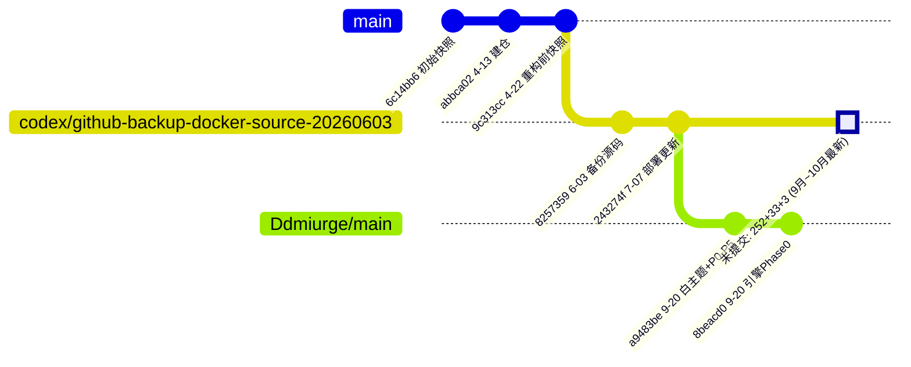

# 05 · Git 现状审计与 GitHub 备份建议

> 项目：LLM / Agent 红队安全评测平台
> 审计对象：`D:\evaluating-platform-backup-1009`（工作区，主张"最新版本"）及相邻的 `D:\evaluating-platform-backup`（旧克隆）
> 审计人：交付总监 齐活林（Qi）｜日期：2026-10-09
> **结论先行：当前最新成果几乎完全未纳入版本控制，且工作区内存在未被 `.gitignore` 覆盖的明文密钥与数据库转储。在完成"清理 + 分仓确认"之前，禁止使用 `git add -A` 直接全量提交推送。**

---

## 0. 更新记录（2026-10-09 用户确认后的执行结果）

| 项 | 决策 / 结果 |
|---|---|
| **正式远端** | ✅ 用户确认：**使用 `Ddmiurge/evaluating-platform-backup`**（即 `D:\evaluating-platform-backup` 旧克隆所指向的仓库）。1009 工作区在推送前需先 `git remote set-url origin https://github.com/Ddmiurge/evaluating-platform-backup.git`（或新增该远端）。 |
| **敏感资产** | ✅ 已执行移出：`deploy-backups/`、`deploy-demo/`、`deploy-skill-sync/`、两个 `*_data_export_*.zip` 已**物理移出仓库**到 `D:\eva-nonrepo-sensitive-20261009\`（可逆，未删除）。 |
| **`.gitignore` 加固** | ✅ 已追加"敏感/部署资产"段（`deploy-*/`、`*.pg_dump.sql`、`*.db`、`*.before`、`*.patch`、`*_data_export_*.zip` 等），并保留 `!**/.env.example`。 |
| **校验** | ✅ `git check-ignore -v` 全部命中；`git status` **零敏感项待提交**；`.env.example` 未被误忽略。 |
| **未推送** | ⏸️ 按流程，本阶段**只做隔离，不做提交/推送**；待用户指示后再执行快照提交。 |

---

## 1. 一句话结论

**"提交并推送到 GitHub"这个动作本身是对的，但当前工作区不能直接 `git add -A && push`。** 必须先做三件事：① 隔离密钥/数据库转储；② 确认"哪个远端才是正式仓"；③ 决定"以哪条历史线为主"。否则轻则把生产密钥和数据转储推到公开/半公开仓库，重则造成两条不可合并的历史线。

---

## 2. 事实清单（均已实测）

### 2.1 当前工作区仓库（1009）

| 项 | 值 |
|---|---|
| 仓库根 | `D:\evaluating-platform-backup-1009` |
| 当前分支 | `codex/github-backup-docker-source-20260603` |
| HEAD | `243274f`（2026-07-07 `chore: update maclaw redteam platform deployment`） |
| 与远端关系 | **与 origin 同名分支完全一致（0 领先 0 落后）** |
| 远端 origin | `https://github.com/boyang-x/evaluating-platform-backup.git` |
| 本地分支 | `main`、`codex/next-agent-refactor`、`codex/github-backup-docker-source-20260603` |
| 远端分支 | `origin/main`、`origin/codex/backup-2026-04-22-pre-refactor`、`origin/codex/github-backup-docker-source-20260603`、`origin/codex/next-agent-refactor` |
| 提交总数 | 7 条（2026-04-13 → 2026-07-07） |
| 跟踪文件数 | 374 |

**提交历史（1009）**

```
243274f 2026-07-07 chore: update maclaw redteam platform deployment
8257359 2026-06-03 chore: back up maclaw redteam platform source
bbd1456 2026-05-08 feat: add institute logo to portals
58dd5cb 2026-05-08 feat: update ccbos skill and report downloads
9c313cc 2026-04-22 chore: snapshot before next refactor
abbca02 2026-04-13 Set up root workspace repository
6c14bb6 2026-04-13 Initial backup snapshot of evaluating platform workspace
```

### 2.2 工作区未提交规模（CRITICAL）

`git status --porcelain` 汇总：**252 modified + 33 untracked + 3 deleted**。

| 维度 | 数量 / 内容 |
|---|---|
| 已修改 | 252（覆盖 `internal/` 133、`frontend/src/` 50、`migrations/` 26、`docs/` 9、configs/cmd/pkg 等） |
| 已删除 | 3：`frontend/src/services/enterprise.ts`、`internal/api/handler/llm_provider_validation.go`、`internal/billing/meter.go` |
| **未跟踪（整个子系统！）** | `evaluating_platform/promptfoo_engine/`、`internal/api/handler/engine_confirm.go`、`engine_run.go`、`handlerutil.go`、`internal/maclaw/agent_target.go`、`engine_*.go`、`promptfoo_engine_bridge.go`、`promptfoo_plugin_catalog.go`、`internal/repository/engine_run.go`、`migrations/026_promptfoo_engine.sql`、`frontend/.../EngineEvalPage.tsx`、`frontend/src/services/engineEval.ts`、`specs/`、`deploy-*` |

> **这意味着：整个 promptfoo 引擎接入（Phase 0/1/2）、Agent target、插件目录、以及 `specs/` 设计与修复计划，全部只存在于本机工作区，未进入任何一次提交。本机磁盘 = 唯一副本。**

### 2.3 第二个本地克隆（旧仓）——存在分叉

| 项 | 值 |
|---|---|
| 路径 | `D:\evaluating-platform-backup` |
| 当前分支 | `main` @ `8beacd0`（2026-09-20） |
| 远端 origin | `https://github.com/Ddmiurge/evaluating-platform-backup.git` ← **注意：与 1009 的远端属主不同** |
| 工作区 | **干净（无未提交改动）** |
| 是否已提交 `promptfoo_engine` | **是，27 个文件已跟踪** |
| 与 1009 的共同祖先 | `abbca02`（2026-04-13） |

**旧仓独有、1009 没有的提交：**

```
8beacd0 2026-09-20 Ddmiurge  feat(engine): promptfoo engine Phase 0 — 9th compose service, BFF endpoints, tests
a9483be 2026-09-20 Ddmiurge  feat(ui): white modern theme + chat high-priority bug fixes (P0-P5)
```

**分叉示意：**



> 换句话说：**"9 月的工作"在两处各有一份且不一致**——旧仓把它提交进了 `Ddmiurge/main`；1009 把它们放在工作区未提交，并在此基础上继续做了 10 月的迭代（如 `engine_job_store.go` 改于 10-08、`docker-compose.yml` 改于 10-08）。**1009 工作区是最新的，但它的历史根基停留在 7 月。**

### 2.4 敏感数据风险（CRITICAL）

`.gitignore`（顶层）已覆盖：`.env`、`*.zip`、`*.dump`、`node_modules/`、`dist/`、`postgres_data/` 等。**但以下未被覆盖：**

| 路径 | 内容 | 是否被忽略 | 若 `git add -A` 的后果 |
|---|---|---|---|
| `deploy-backups/20260707-144039/.env.before` | **明文环境变量（含真实 key）** | ❌ **未忽略** | 密钥进公开仓库 |
| `deploy-backups/20260707-144057/.env.before` | 同上 | ❌ **未忽略** | 同上 |
| `deploy-backups/*/evaluating_platform.pg_dump.sql` | **PostgreSQL 全库转储** | ❌ **未忽略**（只忽略 `*.dump`） | 业务数据/账号数据外泄 |
| `deploy-backups/20260707-152631-hub-rate-window/maclaw-hubcenter.db` | SQLite（HubCenter） | ❌ **未忽略** | 同上 |
| `deploy-backups/*/docker-compose.*.patch` / `.before` | 部署快照 | ❌ **未忽略** | 低风险 |
| `deploy-demo/demo_target.py`、`deploy-skill-sync/*.zip` | 演示/同步资产 | `.sql/.py` 未忽略，zip 已忽略 | 低风险 |
| `evaluating_platform/.env` | **明文密钥（sk-…、JWT_SECRET、MINIO_SECRET_KEY、MACLAW_ADMIN_SECRET、MACLAW_TOKEN_SECRET、MACLAW_REDTEAM_MCP_SECRET、PROMPTFOO_ENGINE_BEARER_TOKEN）** | ✅ 已忽略 | 安全 |

**历史扫描结论（好消息）**：对两个仓库执行 `git log --all --name-only` 扫描，**历史上从未提交过 `.env`/密钥/`.sql` 转储/`.db`/`.patch`**（命中的只是合法的 `.env.example` 与 `migrations/*.sql`）。**即：目前尚未泄漏，风险控制窗口仍在。**

---

## 3. 风险等级与影响

| # | 风险 | 等级 | 影响 | 触发条件 |
|---|---|---|---|---|
| G-1 | 最新成果（引擎/Agent/插件/10月迭代）未提交，仅存本机 | 🔴 高 | 磁盘损坏=全部丢失，无法回滚，无法协作 | 现在就在发生 |
| G-2 | `deploy-backups/` 明文密钥 + 数据库转储未忽略 | 🔴 高 | 一旦 `git add -A` 推送，密钥/数据落入 GitHub（可能公开） | 执行全量提交时 |
| G-3 | 两条远端（boyang-x / Ddmiurge）指向不同仓库 | 🟠 中高 | 推错仓库、协作方拉不到、历史混乱 | 直接 push 时 |
| G-4 | 两条分叉历史线（1009 7月 vs 旧仓 9月） | 🟠 中高 | 合并冲突、重复提交、以为"丢代码" | 想做统一历史时 |
| G-5 | 无 CI（无 `.github/workflows`） | 🟡 中 | 回归靠手动；推送缺乏质量门 | 长期 |
| G-6 | 2 个 7.4MB 导出 zip 双份存在 | 🟡 低 | 仓库膨胀（当前已被 `*.zip` 忽略，风险低） | 若被强制加入 |

---

## 4. 推荐方案（分四步，先止血、再备份）

### Step 0 —— 止血：立即隔离敏感与临时资产（**先做，零风险**）

在**任何提交动作之前**，把以下内容移出仓库（或至少加入忽略），推荐直接移出到 `D:\_nonrepo_backups\`：

- `deploy-backups/`（**必须移出**：含明文密钥、pg_dump、hubcenter.db）
- `deploy-demo/`、`deploy-skill-sync/`（演示与同步资产，非源码）
- `evaluating_platform/evaluating_platform_data_export_20260508_111942.zip` 与根目录同名 zip（各 7.4MB，可移出）
- `evaluating_platform/.env`（保留本机，确认已被忽略；**切勿提交**）

并补齐顶层 `.gitignore`（示例，按需增删）：

```gitignore
# 部署备份与转储（含密钥/数据库）
deploy-backups/
deploy-demo/
deploy-skill-sync/
*.pg_dump.sql
*.sql.dump
*.db
*.env.before
*.before
*.patch

# 数据导出
*_data_export_*.zip

# 运行时与敏感
**/.env
**/.env.*
!**/.env.example
```

> 校验命令（确认敏感项已被忽略，应全部有输出且显示命中规则）：
> ```bash
> git check-ignore -v deploy-backups/20260707-144039/.env.before
> git check-ignore -v deploy-backups/20260707-144039/evaluating_platform.pg_dump.sql
> git check-ignore -v deploy-backups/20260707-152631-hub-rate-window/maclaw-hubcenter.db
> ```
> 并再次确认**没有**任何敏感项被暂存：
> ```bash
> git status --porcelain | grep -iE "\.env$|\.env\.|pg_dump|\.db$|\.patch$|deploy-backups" || echo "OK: 无敏感项待提交"
> ```

### Step 1 —— 拍板：确定"正式远端"与"主历史线"

这是**需要你决策**的事，二选一（或组合）：

| 方案 | 做法 | 适用 |
|---|---|---|
| **方案 A：以 1009 工作区为准，统一到一个正式远端** | 选定 `boyang-x` 或 `Ddmiurge` 之一为唯一 origin；把 1009 工作区的全部最新改动整理成一个（或几个）**新提交**，推送到该远端的一个新分支（如 `codex/redteam-platform-20261009`）。旧仓的另一条线保留为历史归档，不再推送。 | 简单、快；**但会新增一条与 9 月线分叉的历史** |
| **方案 B：先对齐历史，再提交** | 在 1009 中把旧仓的 9 月提交（`a9483be`、`8beacd0`）作为基线的"后来者"接上（例如以旧仓 `main` 为基础，把 1009 工作区改动叠加），再提交 10 月增量。 | 追求单一、连续、可追溯历史；代价是需人工处理冲突 |

> **我的建议**：考虑到"当前工作区才是最新、且 9 月工作已在旧仓有提交"，最稳妥的是**方案 B 的轻量变体**：
> 1. 保留旧仓（Ddmiurge）作为 **archived 参照**；
> 2. 在 1009 中新建分支 `codex/redteam-platform-20261009`，先把当前工作区**整体**提交为一次"现状快照"提交（在 Step 0 清理之后）；
> 3. 之后再逐步做小提交。**不要**现在纠结历史合并——先保证"有备份"，历史合并且后专门做一次。

### Step 2 —— 备份：创建现状快照提交并推送（在 Step 0/1 之后）

> ⚠️ 以下命令**请在你确认 Step 0 已完成、且已选定远端后**再执行。本阶段不代为执行。

```bash
cd /d/evaluating-platform-backup-1009

# 1) 二次确认无敏感项（务必先看到"无敏感项待提交"）
git status --porcelain | grep -iE "\.env$|\.env\.|pg_dump|\.db$|\.patch$|deploy-backups" || echo "OK: 无敏感项"

# 2) 新建备份分支（不动 7 月那条线）
git switch -c codex/redteam-platform-20261009

# 3) 添加（此时 deploy-* 已忽略）、审查
git add -A
git status --short | head -50
git diff --cached --stat | tail -5

# 4) 提交
git commit -m "chore(snapshot): 平台 2026-09~10 服务器迭代现状（promptfoo引擎/Agent target/插件目录/specs）

- 纳入此前未跟踪的 promptfoo_engine/ 及全部 engine_* 后端与前端文件
- 纳入 internal/maclaw 的 agent_target、plugin_catalog、engine bridge 等
- 纳入 migrations/026_promptfoo_engine.sql 与 specs/ 设计与修复计划
- 排除 deploy-backups（含明文密钥与数据库转储）等非源码资产"

# 5) 推送（远端名以 Step 1 结论为准）
git push -u origin codex/redteam-platform-20261009
```

### Step 3 —— 硬化：补 CI 与仓库卫生（备份之后，可与开发并行）

- 新增 `.github/workflows/ci.yml`：`go test ./...` + `go vet` / `frontend npm ci && npm run build` + 手工测试脚本 / `promptfoo_engine npm test` / `docker compose config --services`（无 docker 时跳过并标注）。
- 增加"目录防漂移"断言：当前前端 `engineEval.ts` 与后端 `promptfoo_plugin_catalog.go` 靠一个**永远 pass 的手工生成器测试**（`gen_frontend_options_test.go`）同步，没有 CI 断言。建议改为真正的相等性断言或后端单一来源。
- 清理 3 个已删除文件的连带引用（`enterprise.ts`/`llm_provider_validation.go`/`meter.go`）——确认无残留 import。
- 视需要补 `LICENSE`、根 `README.md`（当前仓库根缺少项目级 README）。

---

## 5. 直接回答你的两个问题

**Q1：现在能不能直接"提交并推送"到 GitHub？**
> **不能直接全量推。** 最新成果值得立刻备份（G-1 是真实且正在发生的风险），但必须先做 **Step 0 的敏感隔离**，否则 `git add -A` 会把 `deploy-backups/.env.before`（真实密钥）和 `*.pg_dump.sql`（全库转储）一起推上去。历史上尚未泄漏，窗口还在，务必先清理。

**Q2：应该推到哪个仓库？**
> 目前有两个不同属主的远端：`boyang-x/evaluating-platform-backup`（1009）与 `Ddmiurge/evaluating-platform-backup`（旧仓）。**这需要你来确认哪个是正式协作仓**。确认前，建议按上文 Step 2 先推到一个**新建的备份分支**（不覆盖任何既有分支），把"有备份"这件事先落地，再从容处理历史与远端统一。

---

## 6. 待你确认的 Git 决策点

| # | 决策点 | 选项 | 结论 |
|---|---|---|---|
| GD-1 | 正式远端 | A. boyang-x ／ B. Ddmiurge ／ C. 新建统一仓 | ✅ **选 B：Ddmiurge/evaluating-platform-backup** |
| GD-2 | 历史处理 | A. 直接以 1009 现状开新分支 ／ B. 先与旧仓 9 月线对齐 | 建议 **先 A 保备份，后 B 专项对齐**（待执行） |
| GD-3 | `deploy-backups` 处置 | A. 移出仓库 ／ B. 仅加入忽略 | ✅ **已执行 A**（移出到 `D:\eva-nonrepo-sensitive-20261009\`） |
| GD-4 | 数据导出 zip | A. 移出 ／ B. 保留但忽略 ／ C. Git LFS | ✅ **已执行 A** |
| GD-5 | 是否轮换已落盘密钥 | A. 轮换 ／ B. 暂不 | ⏳ 待你决定（历史未泄漏；若曾把 `.env` 内容外发，建议轮换 `LLM_API_KEY`/`JWT_SECRET`/`MINIO_SECRET_KEY`/`MACLAW_*`） |
| GD-6 | CI 上线时机 | A. 备份后立即 ／ B. 随重构阶段 | 建议 **A**（待执行） |
