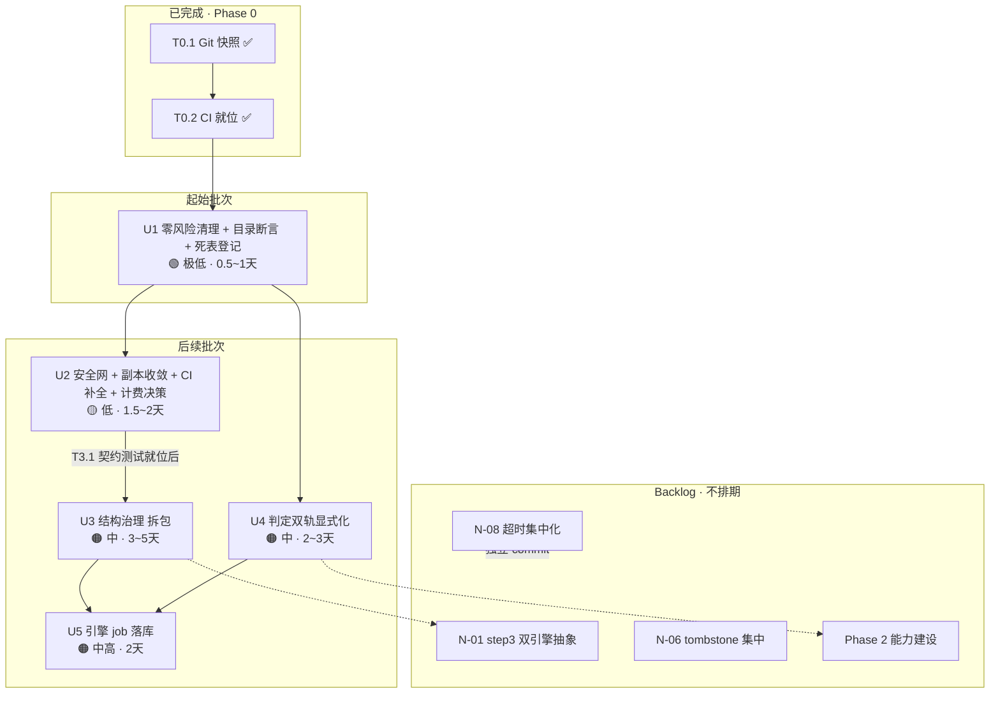

# 08 · 统一执行计划（Phase 0~2 唯一实施依据）

> 项目：LLM / Agent 红队安全评测平台（evaluating_platform）
> 编制：软件架构师 高见远（Gao）｜日期：2026-10-09
> 性质：**把 `03-重构与开发计划.md`（路线图型）与 `07-冗余架构与代码审计报告与优化计划.md`（专项冗余型）融合为一份统一执行计划**，作为后续逐批迭代的唯一依据。
> **本阶段只产出 Markdown，不改业务代码。**
> 依据：`02`（前两轮主审计）、`03`（路线图）、`04`（技术决策细节）、`06`（用户已确认决策台账）、`07`（第三轮冗余专项）。

---

## 0. 基线确认（开工前必须复核，已实测）

| 事实 | 证据 | 状态 |
|---|---|---|
| 分支/提交 | `git log --oneline -3` → `d85eae1 Merge branch 'codex/redteam-platform-20261009'` | ✅ T0.1 已闭环 |
| 远端 | `git remote -v` → `git@github.com:Ddmiurge/evaluating-platform-backup.git`（GD-1 闭环） | ✅ |
| 工作区干净度 | `git status --porcelain` 仅 1 条未跟踪（`07` 本文档），无业务改动 | ✅ |
| CI 已就位 | `.github/workflows/ci.yml` 存在，5 job：`backend` / `frontend` / `engine` / `compose` / `guards` | ✅ `07` 的「O-01 无 CI」**已过时，确认关闭** |
| 文档勘误（部分） | `PROJECT_GUIDE.md:59` 已校正为「**119 插件 / 30 策略**」 | 🟡 T0.3 部分完成 |
| 环境 | 本机 Go 1.25 + Node 22；**无 Docker**；推送走 SSH | ⚠️ compose job 本地不可复现 |

> **结论**：Phase 0 的 T0.1/T0.2 已完成并在远端 `main`；T0.3 只完成文档勘误的一半。统一计划从 **T0.3 收尾 + `07` 的零风险批次** 起跑。

---

## 1. 两计划映射与去重表

### 1.1 逐条映射（`03` 的 `T*` ⟶ `07` 的 `B*/T*`）

| `03` 任务 | `07` 对应 | 关系判定 | 采纳裁定 |
|---|---|---|---|
| **T0.1** Git 快照备份 | —（`07` 未重复） | 已完成 | ✅ 关闭 |
| **T0.2** 建 CI | `07 §0` 确认 CI 已存在 | 已被 `07` 复核为**完成** | ✅ 关闭；**但 `07` 指出的 CI 缺口（前端 vitest 未接入、目录断言未落地、fail-closed 未入 CI）转入 U1/U2** |
| **T0.3** 文档勘误 + 对齐机制 | `07 U-5`（未复核文档数字） | 互补（`07` 只核代码不核文档） | 🟡 **并入 U1**（勘误收尾）；对齐机制设计保留 |
| **T1.1** 双引擎边界抽象 | `07 B7/T7.3` | **冲突**：`03` 要求"Phase 1 就抽 `EvaluationRunner`"，`07` 建议"**推迟**，先只做分类单一来源" | ⚠️ **采纳 `07`**：U1 先做"分类/严重度单一来源"（N-01 第一步），抽象层降级到 **U4/U5 之后按需评估**（YAGNI 闸门＝"混合计划是否为真需求"） |
| **T1.2** 插件/策略单一来源 | `07 B2（T2.1 catalog assert / T2.2 引擎删正则 / T2.3 欢迎清单）` | **互补＋部分重复**：`03` 有"生成机制 + 白名单校验（E-02）"，`07` 把切口拆得更细且有实测证据 | ✅ **以 `07` 拆解为准**：`T2.1`（assert）进 U1；`T2.2/T2.3` 进 U2；`03` 的 `E-02 plugin_id 白名单` 作为 U2 附带项 |
| **T1.3** 红队拆包 | `07 B4（T4.1 拆 redteam 子包 / T4.2 client.go 分层）` | **重复**：`04`→`03 T1.3` 是同一件事，`07` 给出更细的物理方案与前置 | ✅ **以 `07` 为准**：`T4.1`+`T4.2` 合并为 **U3**；**保留 `03` 的硬约束**——"必须 `git mv` 保历史 + MCP 工具清单快照一致 + 覆盖率只升不降" |
| **T1.4** 历史表登记 + job 统一 | `07 B3/T3.2`（死表登记）+ `07 B6/T6.1`（job 落库） | **互补**：`03` 把两件事并成一个任务，`07` 拆成两批（风险不同） | ✅ **采纳 `07` 拆分**：死表登记（T3.2）进 **U1**（纯文档，零风险）；job 落库（T6.1）独立为 **U5**（DD-6=A，中高风险） |
| **T2.1** 插件驱动式扩展 | —（`07` 无；`07` 把等效收益归入 N-01 step1/step2） | 新增（能力建设） | ⏭️ 保留至 Phase 2（`N-01` 第二步之后再评估） |
| **T2.2** Agent 协议 v2 | — | 新增 | ⏭️ 保留至 Phase 2，**按 `D-04` 收窄为 "Dify 优先 + `conversation_id` 多轮"** |
| **T2.3** 判定框架统一 | `07 B5/T5.1` | **重复（部分）**：`07` 只落地 `judge_track` 字段 + 脚注（DD-2=A 的最小实现） | ✅ **以 `07` 为准**：字段 + 脚注进 **U4**；完整的 `judge_mode` 双轨分流留 Phase 2 |
| **T2.4** 专家插件发布链路 | — | 新增 | ⏭️ 保留至 Phase 3（按 `D-03`：专家直发 + 管理员治理，首期仅 yaml） |

### 1.2 `07` 独有项（`03` 无对应 = 净新增）

| `07` 任务 | `03` 是否有对应 | 裁定 | 落位 |
|---|---|---|---|
| **B1/T1.1** 删 8 个死函数 | ❌ 无（`03` 无"死代码"章节） | 新增 | **U1**（`BillingMeter`/`CreateRecord` 例外，见 §6） |
| **B1/T1.2** 删 `ImportSkill`/`ExportSkill` | ❌ 无 | 新增 | **U1** |
| **B2/T2.3** 欢迎清单单一来源（N-10） | ⚠️ `02 F-03` 有，`03` 无独立任务 | 新增 | **U2** |
| **B3/T3.1** 接口↔路由契约测试 | ❌ 无 | **新增，且是前置安全网** | **U2**（必须先于 U3 拆包） |
| **B7/T7.1** 超时集中化（N-08） | ⚠️ `02 Q-02` 有，`03` 无独立任务 | 新增 | **Backlog**（`07` 明确"不要第一批做"） |
| **B7/T7.2** tombstone 集中（N-06） | ⚠️ `02` 有 | 新增 | **Backlog**（P2，低收益） |

### 1.3 三对重点重叠的裁决摘要

1. **`03 T1.2` ↔ `07 B2`** → **`07` 胜出**。理由：`07` 逐项给了实测命令（`143 = 143`、`gen_frontend_options_test.go` 永远 pass）、把"生成机制"降级为"先 assert（1 天）再生成（技术债）"，切口更小、当天可验证。`03` 的生成器方案保留为 `07 T2.1 Step2` 的技术债项。
2. **`03 T1.3` ↔ `07 B4`** → **合并、`07` 细化**。同一目标（拆巨型文件），`07` 补了 `client.go` 的**物理分层**（而非删除）与"**先有契约测试再拆**"的前置。以 U3 执行，`03` 的验收红线（工具清单快照、覆盖率不降）叠加保留。
3. **`03 T1.1` ↔ `07 T7.3`** → **`07` 胜出（推迟）**。`03` 想在 Phase 1 抽 `EvaluationRunner`；`07` 论证"当前靠能力类型路由工作正常，统一抽象回归面覆盖全部评测路径，收益不匹配风险"，建议**先只做分类单一来源（第一步）**。采纳 `07`：抽象层进 Backlog，**闸门＝"混合计划是否为真需求"（§6 待决策项）**。

### 1.4 `07 T3.1` 的正确先后位置（关键）

`04`/`07` 反复强调：`client.go` 是 `MaclawSrvClient` 的**嵌入基类**（`maclawsrv_client.go:103` 嵌入 `*Client`），**不能盲删**。因此 **`T3.1 接口↔路由契约测试` 必须是 U3（拆包/收窄接口）之前的安全网**：

```
U1（零风险：删真死代码 + 目录断言 + 文档登记）
   └─ U2（安全网：契约测试 T3.1 + 引擎/前端副本收敛 + CI 补全 + BillingMeter 决策落地）
        └─ U3（结构治理：拆 redteam 子包 T4.1 + client.go 物理分层 T4.2）  ← 依赖 U2 的契约测试
             └─ U4（判定双轨显式化 judge_track）
             └─ U5（引擎 job 落库）
```

> **纪律**：**没有 `T3.1` 契约测试就禁止动 `client.go` 的方法集合与包边界**（`07 §6`「明确不建议做的事」）。

---

## 2. 统一批次序列（U1 ⟶ U5）

> 排序原则（硬性）：**先零风险零回归（死代码 / 文档登记）→ 再安全网（契约测试 / CI 断言）→ 再结构治理（拆包）→ 最后语义类（判定双轨 / job 落库）**。
> 每批 = 一个可独立回滚的提交序列（§5 迭代协议）。

### U1 · 零风险清理 + 目录单一来源断言 + 死表登记　【起始批次】

| 维度 | 内容 |
|---|---|
| **批次目标** | ① 清除**真死代码**；② 把 `07 T2.1` 的**目录一致性断言**挂进 CI（阻断）；③ 发布**死表登记文档**；④ 收尾文档勘误。**零业务回归、拿到 CI 绿灯。** |
| **任务明细** | `T1.1a` 删 `crypto/secure_buffer.go`（整文件 4 函数）／`T1.1b` 删 `pkg/logger/logger.go` 的 `Logger.Debug`+包级 `Debug`／`T1.1c` 删 `engine_job_store.go:134 ListBySession`／`T1.2` 删 `client.go` 的 `ImportSkill`+`ExportSkill`（含 `provider.go` 接口声明）／`T2.1` `gen_frontend_options_test.go` 改为**真实断言**并加注 CI 阻断／`T3.2` 新建 `docs/architecture/legacy-schema-registry.md`（11 张死表）／`T0.3` 文档勘误收尾（compose 默认口令断言、`client.go` 定性、`maclaw-current-state.md` 数字复核） |
| **涉及文件** | 删：`internal/crypto/secure_buffer.go`；改：`pkg/logger/logger.go`、`internal/maclaw/engine_job_store.go`、`internal/maclaw/client.go`、`internal/maclaw/provider.go`、`internal/maclaw/gen_frontend_options_test.go`、`.github/workflows/ci.yml`、`PROJECT_GUIDE.md`、`evaluating_platform/docs/architecture/maclaw-current-state.md`；增：`evaluating_platform/docs/architecture/legacy-schema-registry.md` |
| **前置依赖** | 无（T0.1/T0.2 已完成） |
| **风险等级** | 🟢 **极低**（编译器 + 14,598 行测试双保险；删除项均 0 引用，`deadcode` 实证） |
| **验收标准** | ① `deadcode.exe -test ./...` 真实死代码归零（`BillingMeter` 例外，见 §6）；② `go build ./... && go test ./...` 全绿；③ 手工在前端 `engineEval.ts` 塞假 id → **CI 红**；④ `legacy-schema-registry.md` 含 11 张表；⑤ Skill 上传/安装 e2e 手工走通（`T1.2` 影响面） |
| **预估工作量** | 0.5~1 天 |
| **可交付** | 代码 + CI + 文档（**本批即可合并**） |

### U2 · 安全网固化 + 副本收敛 + CI 补全 + 计费决策落地

| 维度 | 内容 |
|---|---|
| **批次目标** | ① 建立**接口↔路由契约测试**（拆包/收窄接口的前置）；② 消除引擎侧**正则重复实现**与欢迎清单**双写**；③ 补全 CI（前端 vitest 接入 + fail-closed 断言）；④ 落定 `BillingMeter`/`CreateRecord` 去留。 |
| **任务明细** | `T3.1` 新增 `GatewayClient` 方法 ↔ `main.go` 路由映射契约测试／`T2.2` 删 `redteamRun.ts:432 inferSeverityFromPlugin`+`:458 CATEGORY_PREFIXES`，改为从后端 catalog 拉取（含 category+severity）／`T2.3` 前端欢迎清单改从 `GET /api/v1/enterprise/welcome-capabilities` 取（失败回退本地）／`F-02` 前端加 `vitest` devDep + `npm test` 脚本，接 6 个 `*.test.ts`／CI 增 `assertSecuritySwitches` fail-closed 断言 job／`E-02` `generateTests.ts:154` 增加 `plugin_id` 白名单归一／**计费裁决**（§6） |
| **涉及文件** | 增：`internal/maclaw/*_contract_test.go`、`frontend/vitest.config.ts`；改：`promptfoo_engine/src/runner/redteamRun.ts`、`promptfoo_engine/src/runner/generateTests.ts`、`frontend/src/services/chatDisplay.ts`、`frontend/package.json`、`.github/workflows/ci.yml`、`internal/api/middleware/billing.go`、`internal/repository/billing.go`、`cmd/server/main.go` |
| **前置依赖** | U1（`T2.1` 断言已就位，作为副本收敛的护栏） |
| **风险等级** | 🟡 低（`T2.2`/`T2.3` 属 display-level 字段；契约测试为纯新增；计费裁决为决策驱动） |
| **验收标准** | ① 契约测试：新增一个无路由方法 → 失败；② 引擎 `plugin_stats` 的 category/severity 与后端 catalog 逐项一致；③ 改后端欢迎文案 → 前端刷新同步；④ `npm test`（vitest）在 CI 阻断运行；⑤ 计费去留**有书面结论** |
| **预估工作量** | 1.5~2 天 |
| **可交付** | 代码 + 测试 + CI |

### U3 · 结构治理（拆包，不改行为）

| 维度 | 内容 |
|---|---|
| **批次目标** | ① `redteam_tool_bridge.go`（3042 行/115 函数）按关注点拆二级包；② `client.go`（1595 行）**物理分层**（不删方法，只让"待退役"可见）。 |
| **任务明细** | `T4.1` 拆 `internal/maclaw/redteam/`：`bridge.go`（薄路由）/ `payload_compose.go` / `batch_executor.go` / `judge.go` / `evidence.go` / `report.go`，手法＝**`git mv` 保历史 → 先拆薄壳 → 逐工具迁业务，每步 `go test ./...`**／`T4.2` 拆 `transport.go`（共享 HTTP 层）+ `client_evaluation.go` / `client_runtime.go` / `client_legacy.go`（待退役集中）／handler 层 `maclaw_runtime.go`（1587）按子域拆（可选，随本批或下一批） |
| **涉及文件** | `internal/maclaw/redteam_tool_bridge.go`、`redteam_artifact_service.go`、`redteam_llm_judge.go`、`redteam_payload_provider.go`、`client.go`、`maclawsrv_client.go`、`maclaw_runtime.go` + 对应 `*_test.go` |
| **前置依赖** | **U2（契约测试 `T3.1` 必须先就位）** |
| **风险等级** | 🟠 中（纯移动 + 改包名，但回归面覆盖红队全部路径） |
| **验收标准** | ① `go test -cover` **覆盖率只升不降**；② **MCP 工具清单（名称/schema）拆分前后快照一致**；③ `git mv` 使 blame 可追溯；④ `go build ./... && go test ./...` 全绿；⑤ 至少一次完整企业评测 e2e 手工验证 |
| **预估工作量** | 3~5 天 |
| **可交付** | 代码（**结构，不含行为变更**） |

### U4 · 判定双轨显式化（承接 DD-2=A / DD-5=A）

| 维度 | 内容 |
|---|---|
| **批次目标** | 报告按**本次实际链路**显示判定口径，加 `judge_track` 字段 + 页脚注说明两套口径差异；安全分按所选模式计算。 |
| **任务明细** | `T5.1` 报告 schema 增 `judge_track`（`platform` \| `engine`）字段，向后兼容（旧报告不填）；报告卡 + PDF 页脚注；对 `maclaw_redteam_reports` 复用同一 schema（`metadata.engine` 已区分，`DD-5=A`）。**不引入统一评分**（避免 `DD-2` 的 C 方案过早）。 |
| **涉及文件** | `redteam_artifact_service.go`、`promptfoo_engine_bridge.go`、报告前端组件、`docs/architecture/*` |
| **前置依赖** | U1（`T2.1`/`T2.2` 已让两侧 category/severity 同源，报告口径才可对齐） |
| **风险等级** | 🟠 中（触及报告渲染） |
| **验收标准** | ① 同一目标分别走两条链路，报告 `judge_track` 与分数口径**自洽**；② PDF 渲染正常（`redteam_report_pdf_layout_v2`）；③ 旧报告仍可渲染 |
| **预估工作量** | 2~3 天 |
| **可交付** | 代码 + 报告模板 |

### U5 · 引擎 job 落库（承接 DD-6=A，用户未表态按推荐执行）

| 维度 | 内容 |
|---|---|
| **批次目标** | confirm fast path 的 `pfj-` 内存 job 也写 PostgreSQL（`engine_runs`），BFF 重启进度可恢复。 |
| **任务明细** | `T6.1` `engine_job_store.go` 增加 PG 持久化；`engine_runs` 加 `source=chat_confirm` 区分；`engine_confirm.go` 写入/恢复逻辑；重启后前端进度恢复。**必须单独一批**（状态同步 + 恢复语义）。 |
| **涉及文件** | `internal/maclaw/engine_job_store.go`、`engine_confirm.go`、`engine_run_service.go`、`migrations/027_*.sql`（如新增字段） |
| **前置依赖** | U3（结构就位）、U4（报告语义就位） |
| **风险等级** | 🟠 中高（状态同步 + 恢复语义） |
| **验收标准** | 确认执行中重启 BFF → 前端进度可恢复；job 与 `engine_runs` 一致；`go test ./...` 全绿 |
| **预估工作量** | 2 天 |
| **可交付** | 代码 + migration |

### Backlog（长期债 / 不排期，YAGNI 闸门）

| 项 | 来源 | 触发条件 |
|---|---|---|
| **N-01 step3** 双引擎抽象（`EvaluationRunner`） | `03 T1.1` / `07 T7.3` | **仅当"混合计划"确认为真需求**（§6） |
| **N-08** HTTP 超时集中化（22 处） | `07 T7.1` / `02 Q-02` | 单独 commit、单独验证（`07` 明确不混入大重构） |
| **N-06** 55 条 410 tombstone 集中到 `legacy_tombstones.go` | `07 T7.2` | P2，需先确认无存量调用方 |
| **T2.1/T2.2/T2.3/T2.4** 插件驱动生成/判定、Agent 协议 v2、判定完全统一、专家插件发布 | `03 Phase 2` | Phase 2 能力建设（`D-04` 收窄 Dify） |

---

## 3. 起始批次裁定与理由

**起始批次 = U1（零风险清理 + 目录断言 + 死表登记）。**

主理人倾向「B1 死代码 + B2 catalog assert + B3 死表登记文档合并为第一批」——**本计划采纳该倾向，并做一处必要修订**：

- ✅ **采纳**：U1 = `07` 的 `B1`（死代码）+ `B2/T2.1`（catalog assert）+ `B3/T3.2`（死表登记）；全部零业务回归、能立刻拿 CI 绿灯。
- ⚠️ **修订**：**`B1` 中的 `BillingMeter` + `CreateRecord` 从 U1 移出**，因为它们是"**功能缺失**"而非纯冗余（§6），不能当死代码删。U1 只删**无决策依赖**的死代码（`secure_buffer` / `logger.Debug` / `ListBySession` / `ImportSkill` / `ExportSkill`）。
- ➕ **并入**：`07 B2/T2.2`（引擎删正则）与 `T2.3`（欢迎清单）**不并入 U1**，理由：`T2.2` 需引擎侧从后端拉 catalog（跨进程契约），比"纯删除"风险高一档，放 U2 更稳；且 U1 已足够"零风险、当天见效"。

**理由（3 条）**：
1. **风险最低**：U1 全部动作是"0 引用删除 + 新增文档 + 新增断言"，编译器（`go build`）与 14,598 行测试是双重安全网；`07` 用 `deadcode.exe -test ./...` 给出了硬证据。
2. **立刻见效**：目录断言（`T2.1`）是 `07` 自评"**全清单性价比最高的一项**"，约 40 行测试、零生产代码改动，当天可阻断未来漂移。
3. **建立纪律**：U1 是**第一个走完整迭代协议（§5）的批次**——用它验证"实现 → 本地全绿 → 提交 → 推送 → 等 CI 绿 → 下一批"的闭环能否跑通，为 U3 拆包这类高风险批次铺路。

---

## 4. 批次依赖图



---

## 5. 迭代协议（每批标准流程）

**每批 = 一个独立的、可回滚的提交序列。禁止一个批次里混入不相关改动。**

```bash
# ① 实现（在一个特性分支上，如 codex/unify-U1）
# ② 后端改动 → 本地自测
cd evaluating_platform && go build ./... && go test ./...
#    引擎改动 → 追加
cd promptfoo_engine && npm run typecheck && npm test
#    前端改动 → 追加
cd frontend && npm run build && npm test      # U2 起 npm test 才存在
# ③ 提交（每批一个语义化 commit，信息带批次号）
git add -A && git commit -m "chore(U1): 死代码清零 + 目录一致性断言 + 死表登记"
# ④ 推送
git push origin <branch>
# ⑤ 等 CI 绿（backend/frontend/engine/compose/guards 5 job）
gh run watch            # 或到 GitHub Actions 页面确认
# ⑥ 绿 → 进入下一批；红 → 修复后重推，不得绕过
```

**纪律红线**：
1. **每批独立提交、可独立回滚**（`git revert <commit>`）；跨批不得耦合。
2. **CI 未绿不得进入下一批**；故意改坏护栏验证 CI 会红的"反向测试"只在 U1 做一次。
3. **无 Docker 环境**：`compose` job 在 CI（ubuntu-latest + docker）中运行；本机无法复现时**明确标注"未本地验证，以 CI 为准"，不假装通过**。
4. **拆包/收窄接口必须先有契约测试**（U2 的 `T3.1`）；`client.go` 是 `MaclawSrvClient` 嵌入基类（`maclawsrv_client.go:103`），**禁止盲删方法**，删除只能由编译器 + 契约测试双保险驱动。
5. **测试覆盖率只升不降**；MCP 工具清单（名称/schema）在拆包前后**快照一致**。
6. **敏感资产红线不变**：`.gitignore` 段与 CI `guards` job 不得放宽；新代码不得放宽 `env.ts` fail-closed 开关。

---

## 6. 遗留待决策项（须用户拍板）

| # | 事项 | 现状 / 证据 | 影响 | 建议 |
|---|---|---|---|---|
| **P-1** | **计费是否应生效？**（`BillingMeter` 从未挂载） | `middleware/billing.go:8 BillingMeter` 全仓 0 调用；`main.go` 仅挂 `JWTAuth`/`RateLimit`/`RequireRole`（`main.go:218/223/248…`）→ `/billing/*` 四个活跃路由**当前不受任何计费中间件约束**；L11 有技术债标记 | 决定 `BillingMeter` + `repository/billing.go:24 CreateRecord` 是"**补挂**"还是"**删除**"；**这是 U1 唯一不能当纯冗余处理的一项** | **须产品侧先拍板**。若应生效 → 补挂（属功能补齐，非 U1）；若已废弃 → handler 层计费路由一并归入 tombstone（Backlog N-06）。**决策前 `BillingMeter`/`CreateRecord` 保持不动** |
| **P-2** | **"混合计划"是否为真需求？**（同一次评测部分走 Skill、部分走引擎） | `03 T1.1` 想在 Phase 1 抽 `EvaluationRunner`；`07 T7.3` 建议推迟；当前路由靠"能力类型 → 路由"工作正常 | 决定 `N-01` 第三步（EvaluationRunner 抽象，Backlog 的 B1）**是否提前** | **暂按"短期不做"**，抽象层留 Backlog；若确认为真需求 → 提前到 U3 之后且优先级升 P0 |
| **P-3** | **`DD-6` 引擎 job 落库用户未表态** | `04 DD-6` 推荐 **A（落库）**；`06 §2` 记"用户未表态，暂按 A 执行" | 决定 `U5`（`pfj-` → PG）是否执行 | **按推荐 A 执行**（`U5`），如无异议即落地 |
| **P-4** | `DD-1` 插件对齐深度 L1/L2 | `04 DD-1`；当前 L1（目录对齐），L2 需放宽 fail-closed | 决定是否启用 promptfoo 原生 `redteam.run` | **维持 L1**（`04`/`06` 已倾向），L2 需用户显式接受"放宽开关 + 端点只指向平台 LLM" |

> **最需要用户拍板的前 3 项**：**P-1（计费去留）> P-2（混合计划）> P-3（job 落库确认）**。P-1 是 U1 的阻塞项（不决策则 `BillingMeter` 不删不清）；P-2 决定 Backlog 是否解锁；P-3 决定 U5 是否开工。

### 6.1 决策更新（2026-10-09，见 `06 §7`）

| 编号 | 用户裁定 | 对计划的影响 |
|---|---|---|
| **P-1** | **「暂不处理」**（计费不需要生效，但本轮不动） | `BillingMeter`/`CreateRecord` **保持原样**；`deadcode` 长期保留这 2 条（已知且接受）。计费域整体下线另行排期。**U1 的这 2 条非阻塞项关闭为"已知遗留"。** |
| **P-2** | **红线：同一次评测不得一半走 Skill、一半走引擎** | **`N-01` 第三步（`EvaluationRunner` 统一抽象）标记为「不做」**，移出 Backlog。双引擎并存、单次评测单链路（现状不变）。 |
| **P-3** | 待用户表态（已解释"落库"含义） | `U5` 是否开工待定；默认不阻塞 U2/U3/U4。 |

---

## 7. 起始批次「可直接开工说明书」（交付工程师 U1）

> 目标：**零业务回归**，删真死代码 + 挂目录断言 + 发死表登记文档。开工前重跑 §0 基线命令确认 `main = d85eae1` 未变。

### 7.1 任务卡 U1-A · 删除真死代码（0 引用，`deadcode` 实证）

| 动作 | 精确路径 | 内容 | 注意 |
|---|---|---|---|
| **删除文件** | `evaluating_platform/internal/crypto/secure_buffer.go` | 整文件（`SecureBuffer` 结构 + `NewSecureBuffer`/`Bytes`/`Len`/`Close` 4 函数，均 0 引用） | 删前 `grep -rn "SecureBuffer\|NewSecureBuffer" --include=*.go` 应为空 |
| **改** | `evaluating_platform/pkg/logger/logger.go` | 删 `func (l *Logger) Debug`（L64）+ 包级 `func Debug`（L85） | **保留** `Info/Warn/Error`；`DEBUG Level` 常量保留（`Level.String()` 仍用）；删后 `go build ./...` 若报错说明有隐藏调用 → 停下上报 |
| **改** | `evaluating_platform/internal/maclaw/engine_job_store.go` | 删 `ListBySession`（L134-159） | 删后确认 `isTerminalEvaluationJobStatus`（L161）等仍被 `UpdateProgress` 使用，勿误删 |
| **改** | `evaluating_platform/internal/maclaw/client.go` | 删 `func (c *Client) ImportSkill`（L1116）+ `func (c *Client) ExportSkill`（L1142） | **额外收益**：`ExportSkill` 导出 Skill archive 与"浏览器不得持有 Skill archive"安全契约冲突，删除即消潜在越权面 |
| **改** | `evaluating_platform/internal/maclaw/provider.go` | 删 `GatewayClient` 接口中 `ImportSkill`（L673）+ `ExportSkill`（L675）声明 | **接口收窄**：删接口方法后 `go build` 会指出所有实现/调用点；预期 0 调用（`07` 实证）。若编译器报出非预期调用点 → **停手上报**，不可强删 |

**U1-A 验收命令**：
```bash
cd D:/evaluating-platform-backup-1009/evaluating_platform
go build ./... && go test ./...
"$(go env GOPATH)/bin/deadcode.exe" -test ./...   # 唯一残留应为 billing.go:8 BillingMeter（P-1 决策前保留）
```
**U1-A 手工验收**：Skill 上传/安装 e2e 走通一次（`ImportSkill`/`ExportSkill` 影响面）。

> ⚠️ **本批不删** `internal/api/middleware/billing.go BillingMeter` 与 `internal/repository/billing.go CreateRecord`——等 **P-1 决策**。

### 7.2 任务卡 U1-B · 目录一致性断言（`07 T2.1`，承接 DD-7=A）

| 动作 | 精确路径 | 内容 |
|---|---|---|
| **改（核心）** | `evaluating_platform/internal/maclaw/gen_frontend_options_test.go` | 从"永远 pass 的 dump"（现文件头注明 `// The test always passes`）改为**真实断言**：读 `frontend/src/services/engineEval.ts`，解析 `ENGINE_PLUGIN_OPTIONS` / `ENGINE_STRATEGY_OPTIONS` 的 `id` 集合，断言 == `promptfooPluginCatalog`（`promptfoo_plugin_catalog.go:86`）+ `promptfooStrategyCatalog`（`:220`）的 `id` 集合，**双向差集为空** |
| **改** | `.github/workflows/ci.yml` | `backend` job 已跑 `go test ./...`，断言测试天然纳入**阻断**；保留 `guards`/`frontend`/`engine` job 不变；去掉本文件末尾 NOTE 中"DD-7 待办"一行（改为已落地） |

**U1-B 验收命令 / 反向测试**：
```bash
# 正向：应通过
go test ./internal/maclaw/ -run TestFrontendOptionsConsistency -v
# 反向：手工在 engineEval.ts 塞一个假 id 'harmful:__fake__' → 测试必须 FAIL（CI 变红）→ 撤销
```
**解析注意**：`engineEval.ts:84` 起为 `{ id: '...', name: '...', category: '...' },` 形式；用正则 `id:\s*'([^']+)'` 提取即可（勿依赖 TS 编译）。

### 7.3 任务卡 U1-C · 死表登记文档（`07 T3.2`，承接 DD-8=B 保留不 drop）

| 动作 | 精确路径 | 内容 |
|---|---|---|
| **新增** | `evaluating_platform/docs/architecture/legacy-schema-registry.md` | 列出 **11 张**死表：`assessment_logs` / `target_systems` / `assets` / `skill_versions` / `skill_runs` / `external_mcp_servers` / `external_mcp_tools` / `app_detectors` / `auxiliary_llm_configs` / `orchestration_llm_configs` / `target_llm_configs`；每张给：表名 / 建表 migration 文件 / 原用途 / 当前状态"未引用" / **"引用前必须先评估"一句话提示** |
| **不写** | `migrations/*` | **不新增任何 `DROP TABLE`**（DD-8=B 已拍板）；本批纯文档 |

**U1-C 验收命令**：
```bash
cd D:/evaluating-platform-backup-1009/evaluating_platform
# 逐表复核引用数（应为 0；assets 的 2 处为 legacyGone 退役路由，已在 07 §3.2 闭环）
for t in assessment_logs target_systems assets skill_versions skill_runs \
         external_mcp_servers external_mcp_tools app_detectors \
         auxiliary_llm_configs orchestration_llm_configs target_llm_configs; do
  echo "$t : $(grep -rn "$t" --include='*.go' internal/ cmd/ | grep -v _test.go | wc -l)"
done
grep -rh "DROP TABLE" migrations/ || echo "无 DROP（符合 DD-8=B）"
```

### 7.4 任务卡 U1-D · 文档勘误收尾（`03 T0.3`）

| 动作 | 内容 |
|---|---|
| 复核数字 | `PROJECT_GUIDE.md:59` 已校正为 119/30 ✅；复核 `evaluating_platform/docs/architecture/maclaw-current-state.md` 中同类数字 |
| 定性校正 | 把文档中"`client.go` 是残留/死代码"改为"**接口 + 传输层 + 旧 slim 方法的混合体；含 2 个零调用方法（已在 U1 删除）**"（`02 §3.2` 结论） |
| compose 断言 | 在文档标注"compose 默认口令无启动断言"（`02 S-02`）为**已知待办**（不本批实现，避免改 `main.go` 启动逻辑） |

### 7.5 U1 完成定义（Definition of Done）

- [ ] `go build ./... && go test ./...` 全绿
- [ ] `deadcode.exe -test ./...` 仅剩 `billing.go:8 BillingMeter`（P-1 决策前保留）
- [ ] `go test -run TestFrontendOptionsConsistency` 通过；塞假 id 时**失败**
- [ ] `legacy-schema-registry.md` 含 11 张表并已提交
- [ ] Skill 上传/安装 e2e 手工走通
- [ ] 一个语义化 commit（`chore(U1): ...`）已推送，`main` 上 CI **5 job 全绿**
- [ ] `BillingMeter`/`CreateRecord` **保持原样**（等 P-1）

> **【本批可交付】** U1-A/B/C/D。　**【后续批次】** U2~U5 见 §2；Backlog 见 §2 末。

---

## 8. 附：统一验收命令清单（替代 `03 §7`）

```bash
# 后端（每批必跑）
cd D:/evaluating-platform-backup-1009/evaluating_platform
go vet ./... && go build ./... && go test ./...
# 死代码（U1 起）
"$(go env GOPATH)/bin/deadcode.exe" -test ./...
# 前端（U2 起）
cd frontend && npm ci && npm run build && npm run lint && npm test
# 引擎（U2 起，改动 redteamRun.ts/generateTests.ts 时）
cd ../promptfoo_engine && npm ci && npm run typecheck && npm test
# 编排（本机无 Docker → 以 CI compose job 为准）
cd .. && docker compose config --services
# 收尾
cd .. && git diff --check
```

---

## 9. 与既有文档的关系声明

| 文档 | 关系 |
|---|---|
| `02-系统代码与架构审计报告.md` | 问题清单来源（A/Q/D/S/E/F/O/R/G），本计划不重复其结论 |
| `03-重构与开发计划.md` | 路线图型计划；本计划**融合并取代其任务编排层面**（Phase/Milestone 表述保留为背景），**冲突处按 §1.3 以 `07` 的实测证据为准** |
| `04-关键技术与决策细节.md` | 技术决策细节（双引擎边界、单一来源、判定框架）——本计划引用，不重复 |
| `06-用户确认决策记录.md` | **决策台账，实施以该文件为准**：`DD-2=A`/`DD-5=A`/`DD-7=A`/`DD-8=B` 已确认并被本计划落地到 U1/U2/U4；`DD-6` 待表态（P-3） |
| `07-冗余架构与代码审计报告与优化计划.md` | 冗余专项计划（B1~B7）；本计划**融合其批次，冲突处以其实测证据为准** |

---

✅ **下一步（工程师）**：按 §7 执行 U1；开工前回跑 §0 基线命令，完成后用 §7.5 DoD 逐项自检，推送并等 CI 绿。
❓ **下一步（用户）**：对 §6 的 **P-1（计费去留）** 拍板（U1 阻塞项），并对 **P-2/P-3** 表态以解锁 Backlog/U5。
