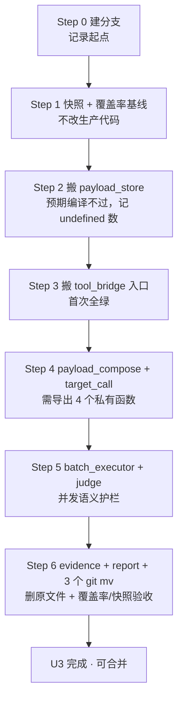

# 11 · U3 结构治理详细设计（拆包，零行为变更）

> 项目：LLM / Agent 红队安全评测平台（evaluating_platform）
> 编制：软件架构师 高见远（Gao）｜日期：2026-10-10
> 依据：`08-统一执行计划.md` §2 U3 批次定义 + §5 迭代协议与纪律红线；`07` §4 B4/T4.1、T4.2；`10-U2独立验收报告.md`
> 性质：**只出设计，不改业务代码。** 本文档中所有行号均为**本次实测**（直接读代码得到），未照抄审计文档。

---

## 0. 结论摘要（先看这个）

> 🚨 **先读这一条：§0.1 的 import 循环已被实测证实，原「步骤 3–6」的执行方式必须改为 §0.1 的方案 B。**
> 架构师在 Bash 恢复后做了双向依赖实测，结论是确定性的，不是推测。

| 项 | 结论 |
|---|---|
| **目标包结构** | `internal/maclaw/redteam/`（**新建子包**，package名 `redteam`），**只放无状态纯逻辑**；`ToolBridge` 类型与其34 个方法**留在父包**。见 §0.1 |
| **执行步数** | **6 步**，每步独立 `go build ./... && go test ./internal/... ./cmd/...` 通过；每步一个 commit |
| **`redteam_tool_bridge.go` 去向** | 115 个函数中 **79 个无状态纯函数 → 拆入 `redteam/` 子包**；**34 个方法 + 1 个构造函数（ToolBridge 本体）→ 留在父包**。逐个映射见 §2.2 |
| **覆盖率基线** | ✅ **已采集并存档**（工程师 Step 1，2026-10-10）：maclaw **75.3%** / redteam_tool_bridge.go **48.3%**（115 个函数）/ client.go **50.3%** / handler **52.2%**。profile 与函数级清单已入库，见 §5.2 |
| **`client.go` 分层取舍** | **本批只做 T4.1（拆 redteam 子包），T4.2（client.go 分层）推到下一批**。理由见 §7 |
| **最大风险** | **import 循环**（已实测证实，见 §0.1）。次高是 **同包测试文件对私有符号的访问**（`redteam_tool_bridge_test.go` 有 11 处直接调私有方法/字段），见 §6 R1 |

---

### 0.1 🚨 决策前置：import 循环已实测证实，方案改为 B

> **这一节推翻本文档 §2/§3 原始的「ToolBridge 整体搬入子包」设计。**
> 原设计把 `ToolBridge` 及其 34 个方法整体搬进 `redteam/`，靠「`maclaw` 侧建类型别名」解决反向调用。
> **实测证明该方案必然产生 import cycle，别名救不了。工程师不要执行 §3 的 Step 3 原写法。**

**实测证据（架构师 Bash 恢复后亲自跑，非推测）**：

```bash
# ① redteam 子包需要父包的 12 个类型（全部在父包定义）
ResourceProjectionService   -> resource_projection.go
SkillProjectionService      -> skill_projection.go
TargetConfigService         -> target_config_service.go
PromptfooEngineRunner       -> promptfoo_engine_bridge.go
EngineRunService            -> engine_run_service.go
EngineTargetProvider        -> engine_credential_materializer.go
EngineGenerationProvider    -> engine_credential_materializer.go
RuntimeIdentity             -> instance_resolver.go
GatewaySession              -> provider.go
RedteamArtifactService      -> redteam_artifact_service.go
=> redteam 包必然 import maclaw

# ② 父包有 8 个方法挂在 ToolBridge 上（不止原设计的 5 个）
$ grep -o 'func (b \*RedteamToolBridge) [A-Za-z]*' internal/maclaw/promptfoo_engine_bridge.go
SetPromptfooEngine / promptfooEngineReady / SearchRedteamPluginCatalog
PreparePromptfooEngineRun / RunPromptfooRedteamEvaluation
WaitPromptfooRedteamEvaluation / GetPromptfooEvaluationResult / pollEngineRun
=> maclaw 包必然需要 ToolBridge 类型
```

**Go 语言规则**：一个类型的**方法必须与其类型定义在同一包**。
- 若 `ToolBridge` 定义在 `redteam` → `maclaw` 的 8 个方法无法存在 → 要么把它们也搬进 `redteam`（但它们依赖 `EngineRunService` 等父包类型 → `redteam` 又要 import `maclaw`）→ **循环**。
- 类型别名 `maclaw.RedteamToolBridge = redteam.ToolBridge` **不能打破循环**——别名只是同一个类型的第二个名字，不改变「方法必须同包」这条规则，也不改变 import 方向。

#### 方案 A（❌ 已否决）：ToolBridge 整体搬入 redteam
`redteam → maclaw`（12 个类型）且 `maclaw → redteam`（8 个方法）→ **import cycle，编译不过。**

#### 方案 B（✅ 采用）：ToolBridge 留父包，只搬无状态纯函数

**分工**（实测计数，`grep -c` 得出）：

| 归属 | 数量 | 内容 |
|---|---|---|
| **留 `maclaw`（父包）** | **34 个方法 + 2 个导出函数 + struct 本体 + 全部 DTO**（DTO 归属待B1/B2 决策，见下） | `RedteamToolBridge` 及其 34 个方法（`SearchRedteamCapabilities` / `ComposeRedteamPayloads` / `ExecuteRedteamEvaluationBatch` / `JudgeAttackResult` / `CallEvaluationTarget` / …）、`redteamStoredPayload`、`skillPayloadDatasetItem` 等私有结构、全部 Input/Output DTO |
| **搬 `redteam`（子包）** | **79 个无状态纯函数** | 判定档位表与推断、payload 组合策略、脱敏与摘要工具、批量结果统计、handle 加盐哈希、payload 存取与 TTL 清理、图片归一化 |

**依赖方向**：`maclaw → redteam`（父包调子包的纯函数），**单向，无循环**。✅

**权威计数口径（实测，务必按这个剪裁）**：

```bash
grep -c '^func (b \*RedteamToolBridge)' internal/maclaw/redteam_tool_bridge.go   # 34  留父包
grep -c '^func [a-z]'          internal/maclaw/redteam_tool_bridge.go            # 79  搬子包
grep -c '^func [A-Z]'          internal/maclaw/redteam_tool_bridge.go            # 2   见下
# 34 + 79 + 2 = 115✅ 平
```

⚠️ **本文档 §2.2 的表已修正两处「方法是纯函数」的错列**（`nowUTC` / `cleanupExpiredPayloadsLocked` 用了 receiver `b`，不能搬）：
- `nowUTC`（`:2427`，依赖私有字段 `b.now`）与 `cleanupExpiredPayloadsLocked`（`:2034`）**都是方法，留父包**，已从纯函数表中移除。

**115 的完整归属**：

| 类别 | 数量 | 归属 | 说明 |
|---|---|---|---|
| `func (b *RedteamToolBridge)` 方法 | **34** | **留父包** | 载体是 `ToolBridge`（在父包），必须同包 |
| `^func [a-z]` 顶层纯函数 | **79** | **搬 `redteam/`** | 已实测**全部无 receiver**（`grep -c '\bb\.'` = 0） |
| `^func [A-Z]` 导出函数 | **2** | ⚠️ **两者都留父包** | `NewRedteamToolBridge`(`:67`) 是 `ToolBridge` 的构造函数；`SafeErrorSummary`(`:1748`) 被 `internal/api/handler/attack_sample.go:78,157` 以 `maclaw.SafeErrorSummary` 调用，搬走要改 handler |
| 合计 | **115** | | 与覆盖率清单行数一致 |

> 📌 **Step 6 覆盖率比对口径**：搬到子包的是**79 个纯函数**，不是 114也不是 115。
> 基线清单 115 行里，有 36 行（34 方法 + 2 导出函数）**留在父包**，应在父包的 after 清单里比对；
> 只有 79 行在子包清单里比对。**别按「115 减几」推算，直接用 `grep -c` 现算。**

**为什么 79 个纯函数搬得动**（实测其外部依赖）：
- `model.*`（2 处）→ `evaluating_platform/internal/model` 是**独立包**，合法跨包依赖，不构成环；
- `RedteamPayloadImage`(14 处) / `JudgeAttackResultInput`(7 处) / `CapabilityCard`(4 处) / `EvaluationTargetInput`(2 处) → 这些是**纯 DTO**。

> **落地建议（影响 Step 2 的剪裁方式，二选一）**：
> - **B1（推荐）**：把 DTO 也搬到 `redteam` 包，父包改用 `redteam.XXX` 限定名。`redteam` 不 import 父包，方向仍单向。**代价**：父包 34 个方法里的类型名要机械替换（编译器可全覆盖）。
> - **B2（最省事）**：只搬「不碰这些 DTO」的纯函数（约 50个），其余 29 个留父包。**代价**：只拆了一半，后续还得再来一次。
>
> **我建议 B1**，它才能达成 U3 的原始目标（红队关注点物理隔离）。
> ⚠️ **B1 有个必须注意的连带点**：`redteam_artifact_service.go` 也要搬进子包，它同样引用 `RedteamPayloadImage`——
> **两个文件里的同名引用必须一起改，不能只改一个**，否则编译不过。
> 另注意：DTO 搬走后，`redteam_mcp.go` 里那 14 处 `maclaw.<XxxInput>` 也要改成 `redteam.<Xxx>`（这一步原本就在计划内）。

#### B1 / B2 决策所需的实测数据（Step 3 后一次性算清，Step 4 不用再猜）

对父包剩余的 **66 个纯函数**逐个扫描 DTO 依赖，结果：

| 类别 | 数量 | 含义 |
|---|---|---|
| **不碰任何父包类型** | **44** | 可**无条件**搬进子包 |
| **碰父包 DTO/私有结构** | **22** | 搬则需 B1（DTO 一并搬）或留父包（B2） |

**这 22 个碰的具体是什么**（决定 B1/B2 的难度）：

| DTO / 私有结构 | 涉及纯函数数 | 该类型定义在哪 |
|---|---|---|
| `RedteamPayloadImage` | 6 | `redteam_bridge.go`（**导出 DTO**） |
| `JudgeAttackResultInput` / `JudgeAttackResultOutput` | 8 | `redteam_bridge.go`（**导出 DTO**） |
| `CapabilityCard` | 2 | `capability_catalog.go`（**导出，但属 capability 关注点**） |
| `EvaluationTargetInput` | 2 | `target_config_service.go`（**导出，属 target 关注点**） |
| `CallEvaluationTargetOutput` | 2 | `redteam_bridge.go`（**导出 DTO**） |
| `redteamBatchItemResult` / `redteamJudgeBatchItem` / `skillPayloadDatasetItem` | 3 | `redteam_bridge.go`（**私有结构**） |
| `judgeProfileSpec` | 3 | `redteam_bridge.go`（**私有结构**） |

**关键实测**：4 个私有结构（`redteamBatchItemResult` / `redteamJudgeBatchItem` / `skillPayloadDatasetItem` / `judgeProfileSpec`）**全部定义在 `redteam_bridge.go` 内**，不是跨文件依赖。

**结论与建议**：
- **本批建议 B2** —— Step 4 先搬 44 个干净的，22 个碰 DTO 的留父包。理由：44+22=66 守恒，**且这 22 个留父包意味着「零跨包调用」，Step 4 的回归面压到最小**；B1 要把 6+ 类 DTO 搬进子包并改父包 34 个方法里的引用，属于**另一批的工作量**，混进来会让本批失去「小回归面」这个核心优势。
- B1 留到后续批次（若仍觉得红队关注点应完全物理隔离）。
- ⚠️ 无论 B1/B2，**`judgeProfileSpec` 与 `judgeProfiles` 表是成套的**（表驱动，P2-09），要么同批搬、要么整组留父包，**不可拆**。

**给工程师的三句话**：
1. **Step 2 只搬 14 个 DTO-free 纯函数**（`payload_store.go` 表，已剔除 `nowUTC`/`cleanupExpiredPayloadsLocked`/`SafeErrorSummary`），**DTO 一律留父包、B1/B2 不用现在决定** —— 已实测这 14 个符号对 `RedteamPayloadImage`/`JudgeAttackResultInput`/`CapabilityCard`/`EvaluationTargetInput` **零依赖**，Step 2 可以直接动手。B1 的取舍留到 Step 4/5 真正碰到 DTO 时再定。
2. `redteam_tool_bridge.go` **留在父包，`package maclaw` 不改**（见 Step 2 修正）。
3. Step 3 **不要**按原设计去改 `promptfoo_engine_bridge.go` 的接收者。

## 1. 现状实测

### 1.1 `redteam_tool_bridge.go` 实际函数清单（3042 行，实测）

> 已按关注点分组。行号为**本次实读**所得。

#### A. 能力检索 / 上下文准备（MCP 工具 1、6、7）

| 行号区间 | 行数 | 符号 | 职责 |
|---|---|---|---|
| 361–376 | 16 | `(*RedteamToolBridge).SearchRedteamCapabilities` | MCP `search_platform_redteam_capabilities`：查catalog 并过滤掉 Skill 卡 |
| 378–397 | 20 | `(*RedteamToolBridge).PrepareRedteamCapability` | MCP `prepare_redteam_capability`：为选中capability ref 做资源/Skill 投影准备 |
| 477–513 | 37 | `(*RedteamToolBridge).defaultSkillInputRefs` | Skill 输入缺省ref 兜底：先找sample 再找 composed_attack |
| 515–537 | 23 | `(*RedteamToolBridge).GetCapabilityDetail` | MCP `get_capability_detail`：单卡详情，Skill 卡显式拒绝 |

#### B. payload 组合（MCP 工具 8、9）

| 行号区间 | 行数 | 符号 | 职责 |
|---|---|---|---|
| 399–475 | 77 | `(*RedteamToolBridge).PrepareSkillInputData` | MCP `prepare_skill_input_data`：把选中的专家样本/组合攻击转成 Skill 输入问题 |
| 539–636 | 98 | `(*RedteamToolBridge).ComposeRedteamPayloads` | MCP `compose_redteam_payloads`：样本/模板/组合攻击 →服务端 payload handle |
| 638–707 | 70 | `(*RedteamToolBridge).RegisterSkillPayloadDataset` | MCP `register_skill_payload_dataset`：把 Skill 产出的 payload_dataset 注册为 handle |
| 2045–2060 | 16 | `composeTemplatePayload` | 模板 `{{sample}}/{{question}}` 占位符替换 |
| 2062–2123 | 62 | `skillPayloadDatasetItems` | 解析 Skill 输出的 `payload_dataset` JSON |
| 2125–2137 | 13 | `skillPayloadQuestionSummary` | 生成 Skill 载荷的中文安全摘要 |
| 2139–2151 | 13 | `safeSkillPayloadSummary` | Skill 载荷 handle 的对外摘要文案 |
| 2308–2317 | 10 | `payloadQuestionSummary` | 按 kind 生成问题摘要（composed_attack 截尾） |
| 2341–2350 | 10 | `normalizeSelectionStrategy` | 选择策略归一（random/sequential） |
| 2352–2361 | 10 | `candidatePayloadLimit` | random 策略下候选集放大倍数 |
| 2363–2376 | 14 | `selectPayloads` | 按策略选载荷（random 用种子 shuffle） |
| 2378–2386 | 9 | `normalizedRandomSelectionSeed` | 归一随机种子 |
| 2388–2400 | 13 | `binaryBigEndianUint64` | 种子派生的字节序helper |
| 2402–2408 | 7 | `remainingPayloadLimit` | 剩余额度计算 |
| 2410–2425 | 16 | `safePayloadSummary` | handle 的中文安全摘要（不含原文） |
| 2331–2339 | 9 | `normalizePayloadLimit` | limit 归一（默认 5，上限 50） |

#### C. 批量执行（MCP 工具 10）

| 行号区间 | 行数 | 符号 | 职责 |
|---|---|---|---|
| 877–1080 | **204** | `(*RedteamToolBridge).ExecuteRedteamEvaluationBatch` | **单工具闭环**：组载荷 → 并发调目标 → 判定 → 存证据 → 出报告 |
| 1082–1119 | 38 | `(*RedteamToolBridge).executeBatchTargetCalls` | 有界并发调目标 |
| 1121–1154 | 34 | `(*RedteamToolBridge).executeBatchJudgements` | 并发逐条判定（LLM 批判失败时回退） |
| 1156–1234 | 79 | `(*RedteamToolBridge).executeBatchLLMJudgements` | LLM 批量判定 + 分块 + 并发 |
| 1236–1249 | 14 | `batchJudgeInput` | 组装单条判定输入 |
| 1251–1277 | 27 | `normalizeBatchLLMJudgeOutput` | 归一 LLM 批量判定输出 |
| 1636–1649 | 14 | `chunkRedteamJudgeItems` | 判定条目分块 |
| 1651–1660 | 10 | `durationMillisSinceTime` | 阶段耗时 |
| 1662–1670 | 9 | `normalizeTargetConcurrency` | 并发度归一（默认 5，上限 50） |
| 1672–1679 | 8 | `normalizedJudgeResultKey` | result 归一为 success/failure |
| 1681–1688 | 8 | `batchItemMetadata` | 单条批次 metadata |
| 1690–1708 | 19 | `normalizeSkillNamesForBatch` | 批次 Skill 名归一 |
| 1710–1730 | 21 | `(*RedteamToolBridge).payloadSummaryForHandle` | handle → 安全摘要 |
| 1732–1737 | 6 | `callStatus` | 空安全取 status |
| 1739–1744 | 6 | `callHandle` | 空安全取 handle |
| 1594–1607 | 14 | `redteamJudgeBatchSize` | 批判块大小（env可调，上限 20） |
| 1609–1634 | 26 | `redteamJudgeBatchConcurrency` | 批判并发（env 可调，上限 10） |
| 1768–1788 | 21 | `batchRiskLevel` | 批量风险等级（中文三档） |
| 1790–1807 | 18 | `batchSafetyScore` | 批量安全分 |
| 1809–1813 | 5 | `batchSummary` | 批量中文摘要 |
| 1849–1855 | 7 | `mustJSONMapStringInt64` | 阶段耗时序列化 |

#### D. 被测目标调用（MCP 工具 11）

| 行号区间 | 行数 | 符号 | 职责 |
|---|---|---|---|
| 709–740 | 32 | `(*RedteamToolBridge).CallEvaluationTarget` | MCP `call_evaluation_target`：有配置走真实调用，否则只备 handle |
| 1279–1417 | **139** | `(*RedteamToolBridge).callStoredTarget` | 真实HTTP 调用：多模态/Agent 分支、sha256、延迟、安全信号分类 |
| 1419–1424 | 6 | `(*RedteamToolBridge).targetHTTPClient` | 取注入的 httpClient |
| 1426–1457 | 32 | `targetRequestMessages` | OpenAI 兼容 messages（图文多模态） |
| 1459–1470 | 12 | `targetSupportsVision` | 目标是否支持视觉 |
| 1472–1483 | 12 | `matchesStoredTargetSelector` | target_id 选择器匹配 |
| 1485–1494 | 10 | `classifyTargetResponseSafetySignal` | 响应安全信号分类（unsafe/blocked/unknown） |
| 1496–1537 | 42 | `extractTargetResponseText` | 从多种响应形状提取文本 |
| 1539–1559 | 21 | `stringFromJSONValue` | JSON 值 → 字符串 |
| 1561–1574 | 14 | `targetChatCompletionsEndpoint` | 补全 `/chat/completions` |
| 1576–1592 | 17 | `redteamTargetMaxTokens` | max_tokens（env 可调，64~4096） |

#### E. 判定（MCP 工具 12）

| 行号区间 | 行数 | 符号 | 职责 |
|---|---|---|---|
| 742–875 | **134** | `(*RedteamToolBridge).JudgeAttackResult` | MCP `judge_attack_result`：规则判定 + 按模式叠加 LLM |
| 2495–2512 | 18 | `isSubstantiveNonRefusalAttackResponse` | 宽松演示：实质性非拒答 |
| 2514–2545 | 32 | `isLikelyAttackJudgementContext` | 判定上下文相关性 |
| 2547–2569 | 23 | `containsExplicitRefusal` | 显式拒答识别 |
| 2571–2592 | 22 | `hasSubstantiveResponseText` | 实质性文本判定 |
| 2594–2602 | 9 | `shouldUseLLMAttackJudge` | judge_mode 决定是否走 LLM |
| 2604–2619 | 16 | `shouldSkipLLMForRule` | 规则已定论时跳过 LLM |
| 2621–2635 | 15 | `normalizeLLMJudgeOutput` | LLM 输出归一 |
| 2661–2677 | 17 | `resolveJudgeProfile` | 判定档位解析 |
| 2679–2734 | 56 | `inferJudgeProfileName` | 从 metadata 推断档位 |
| 2736–2764 | 29 | `normalizeJudgeProfileName` | 档位名归一 |
| 2779–2792 | 14 | `judgeProfileByName` | 档位查表 + 缺省阈值 |
| 2794–2839 | 46 | `inferPayloadJudgeProfile` | 从载荷 kind/metadata 推断档位 |
| 2841–2854 | 14 | `judgeSuccessThresholdFromMetadata` | metadata 覆盖阈值 |
| 2856–2864 | 9 | `normalizeJudgeThreshold` | 阈值归一 |
| 2866–2919 | 54 | `finalizeJudgeScore` | 分数/结果最终一致化（拒答强制失败） |
| 2921–2923 | 3 | `formatJudgeScore` | 分数格式化 |
| 2925–2934 | 10 | `normalizeJudgeResult` | result 归一 |
| 2936–2943 | 8 | `normalizeJudgeSeverity` | severity 归一 |

包级常量/变量（同属判定关注点）：
- `2460–2472` `var successResultMarkers`
- `2474–2493` `var blockedResultMarkers`
- `2637–2640` `defaultAttackSuccessThreshold` / `maxAttackScore`
- `2642–2652` 9 个 `judgeProfile*` 常量
- `2654–2659` `type judgeProfileSpec`
- `2768–2777` `var judgeProfiles`（表驱动）

#### F. 证据（MCP 工具 13）

| 行号区间 | 行数 | 符号 | 职责 |
|---|---|---|---|
| 1865–1881 | 17 | `(*RedteamToolBridge).SaveRedteamEvidence` | MCP `save_redteam_evidence`：有artifact service 走存储，否则只出 handle |
| 2211–2240 | 30 | `reportImageMetadataForPayload` | 报告图片 metadata（base64，≤2 张，≤512KB/张） |
| 2242–2258 | 17 | `multimodalPayloadMetadata` | 多模态 metadata（形态/张数/mime） |

#### G. 报告（MCP 工具 14）

| 行号区间 | 行数 | 符号 | 职责 |
|---|---|---|---|
| 1883–1906 | 24 | `(*RedteamToolBridge).CompileRedteamReport` | MCP `compile_redteam_report`：走 artifact service 或本地兜底 |
| 1815–1835 | 21 | `safeJudgeScoreMetadata` | 判定分metadata 提取 |

#### H. handle / payload 存储（跨关注点的私有基建）

| 行号区间 | 行数 | 符号 | 职责 |
|---|---|---|---|
| 1910–1914 | 5 | `safeHandleWithSalt` | handle 加盐哈希生成（**与 `RedteamArtifactService` 共享**，见 §6 R4） |
| 1916–1921 | 6 | `utcNow` | 时钟归一（**同上共享**） |
| 1923–1925 | 3 | `(*RedteamToolBridge).safeHandle` | 实例级handle 包装 |
| 1927–1929 | 3 | `(*RedteamToolBridge).storePayload` | 存载荷（无图） |
| 1931–1972 | 42 | `(*RedteamToolBridge).storePayloadWithImages` | 存载荷（含图 + TTL + 档位推断） |
| 1974–1980 | 7 | `(*RedteamToolBridge).lookupPayload` | 按handle 取原文 |
| 1982–1988 | 7 | `(*RedteamToolBridge).lookupPayloadQuestionSummary` | 按 handle 取问题摘要 |
| 1990–1996 | 7 | `(*RedteamToolBridge).storedPayloadImages` | 按 handle 取图片 |
| 1998–2003 | 6 | `(*RedteamToolBridge).reportTestPrompt` | 报告标题用的最终 prompt |
| 2005–2032 | 28 | `(*RedteamToolBridge).lookupStoredPayload` | **带 run/user/session 三重作用域校验** |
| 2034–2043 | 10 | `(*RedteamToolBridge).cleanupExpiredPayloadsLocked` | TTL 清理（调用方持锁） |
| 2153–2173 | 21 | `redteamPayloadImagesFromAny` | 任意值 → 图片列表 |
| 2175–2200 | 26 | `normalizeRedteamPayloadImages` | 图片归一（data: URL 拆解、mime 推断） |
| 2202–2209 | 8 | `cloneRedteamPayloadImages` | 图片切片 |

#### I. 通用小工具（跨关注点）

| 行号区间 | 行数 | 符号 | 职责 |
|---|---|---|---|
| 1746–1750 | 5 | `SafeErrorSummary` | **导出**、浏览器 500 响应用；与内部 `safeErrorSummary` 同实现 |
| 1752–1766 | 15 | `safeErrorSummary` | 敏感关键词过滤 |
| 1837–1847 | 11 | `mergeStringMetadata` | metadata 合并 |
| 1857–1859 | 3 | `intString` | int → string |
| 1861–1863 | 3 | `int64String` | int64 → string |
| 2260–2267 | 8 | `safeTextSnippet` | 文本摘要截取 |
| 2269–2287 | 19 | `stringFromAnyForRedteam` | 任意值 → string |
| 2289–2306 | 18 | `canonicalSkillName` | Skill 名归一（剥前缀） |
| 2319–2329 | 11 | `tailRunes` | 按 rune 截尾 |
| 2427–2429 | 3 | `(*RedteamToolBridge).nowUTC` | 实例时钟 |
| 2431–2444 | 14 | `metadataFlag` | metadata 布尔标志 |
| 2446–2458 | 13 | `containsAnyFold` | 折叠大小写包含 |
| 2945–2960 | 16 | `sanitizeMetadataMapFromAny` | 任意值 → 安全 metadata |
| 2962–2983 | 22 | `sanitizeMetadata` | **敏感 key 过滤（安全关键）** |
| 2985–2996 | 12 | `isSafePayloadMetadataKey` | 白名单 |
| 2998–3023 | 26 | `isUnsafeMetadataKey` | 黑名单 |
| 3025–3037 | 13 | `platformMCPCapabilityCards` | MCP 侧卡片过滤 |
| 3039–3042 | 4 | `sanitizeCapabilityCard` | 卡片 metadata 净化 |

#### J. 类型 / 常量 / 构造（非函数，但必须一起搬）

| 行号 | 符号 |
|---|---|
| 25–27 | `type CapabilitySearcher interface` |
| 29–47 | `type RedteamToolBridge struct` |
| 49 | `var defaultRedteamTargetHTTPClient` |
| 51–54 | `redteamPayloadHandleTTL` / `defaultRedteamTargetConcurrency` / `defaultRedteamTargetMaxTokens` / `defaultRedteamJudgeBatchSize` |
| 56–65 | `type redteamStoredPayload struct` |
| 67–114 | `NewRedteamToolBridge` + 6 个 Setter |
| 116–122 | `RedteamAttackLLMJudge` / `RedteamAttackLLMBatchJudge` 接口 |
| 124–167 | 5 组 Input/Output DTO |
| 169–173 | `type RedteamPayloadProvider interface` |
| 175–242 | 8 组 Input/Output DTO |
| 244–334 | 6 组 Input/Output DTO（判定/证据/报告/批量） |
| 336–359 | 3 个私有中间结构 |

**函数数（2026-10-10 实测更正）**：本行原写「A..I 合计 104 + 构造函数 = **105**（07 报告称 115，实测 105）」，**该结论已被实测推翻**。

实测 `redteam_tool_bridge.go` 是 **115 个顶层函数**，**07 报告的 115 是正确的**，本文档此前的「实测 105」是**加总笔误**：

- `go tool cover -func | grep -c 'redteam_tool_bridge.go'` = **115**
- `grep -c '^func '` = **115**
- 115 个中**闭包（`.funcN`）计数为 0**，因此**不是**「方法与构造函数分开计」的口径差异

**错的是这句加总，不是上面的映射表**：把 §1.1 各组表格的实际行数相加为 A 4 + B 16 + C 21 + D 11 + E 19 + F 3 + G 2 + H 14 + I 18 = **108**，再加 6 个 `Set*` 方法与 1 个构造函数 `NewRedteamToolBridge` = **115**。已把 §1.1/§2.2 的全部起始行号与实测起始行号集合做双向 `comm` 比对：**架构师有而实测无 = 0，实测有而架构师无 = 0**。

✅ **结论：§2.2 归属映射表 115 行完整、零缺失，可直接使用，无需返工。**

---

### 1.2 `client.go` 实际方法清单（1565 行，实测）

> **关键事实**：`MaclawSrvClient` 在 `maclawsrv_client.go:15-18` 嵌入 `*Client`。因此 **本文件所有导出方法都是 `MaclawSrvClient` 方法集的一部分，任何一个都不能盲删**。U2 契约测试（`gateway_contract_test.go`）已把 4 个接口的方法集双向锁定。

| 行号 | 方法 | 网关 | 上游 HTTP 路由 |
|---|---|---|---|
| 54–58 | `type Client struct{baseURL, apiToken, httpClient}` | — | 传输层实体 |
| 692–707 | `NewClient` | — | 构造 |
| 709–711 | `Enabled` | 三网关共用 | `exempt:` 纯本地配置检查 |
| 713–747 | `SearchEvaluationResources` | Evaluation | `GET /api/v1/evaluation/resources` |
| 749–758 | `SaveEvaluationResource` | Evaluation | `POST /api/v1/evaluation/resources` |
| 760–773 | `PreviewEvaluationResource` | Evaluation | `GET /api/v1/evaluation/resources/{id}/preview` |
| 775–806 | `SearchEvaluationTargets` | Evaluation | `GET /api/v1/evaluation/targets` |
| 808–817 | `SaveEvaluationTarget` | Evaluation | `POST /api/v1/evaluation/targets` |
| 819–832 | `GetEvaluationTarget` | Evaluation | `GET /api/v1/evaluation/targets/{id}` |
| 834–847 | `ProbeEvaluationTarget` | Evaluation | `POST /api/v1/evaluation/targets/{id}/health-check` |
| 849–858 | `StartEvaluationRun` | Evaluation | `POST /api/v1/evaluation/runs` |
| 860–890 | `ListEvaluationJobs` | Evaluation + Runtime **共享** | `GET /api/v1/jobs` |
| 892–905 | `GetEvaluationJob` | Evaluation | `GET /api/v1/jobs/{id}` |
| 907–920 | `CancelEvaluationJob` | Evaluation | `POST /api/v1/jobs/{id}/cancel` |
| 922–935 | `RetryEvaluationJob` | Evaluation | `POST /api/v1/jobs/{id}/retry` |
| 937–950 | `ResumeEvaluationJob` | Evaluation | `POST /api/v1/jobs/{id}/resume` |
| 952–965 | `GetEvaluationJobRecovery` | Evaluation | `GET /api/v1/jobs/{id}/recovery` |
| 967–980 | `GetEvaluationReport` | Evaluation | `GET /api/v1/evaluation/reports/{id}` |
| 982–1030 | `ExportEvaluationReport` | Evaluation | `GET /api/v1/evaluation/reports/{id}/export` |
| 1032–1063 | `ListEvaluationEvidence` | Evaluation | `GET /api/v1/evaluation/evidence` |
| 1065–1078 | `GetEvaluationEvidence` | Evaluation | `GET /api/v1/evaluation/evidence/{id}` |
| 1080–1099 | `ListSkills` | Skill | `GET /api/v1/skills` |
| 1101–1112 | `SearchSkills` | Skill | `POST /api/v1/skills/search` |
| 1114–1125 | `InstallSkill` | Skill | `POST /api/v1/skills/install` |
| 1127–1154 | `ListRuntimeSessions` | Runtime | `GET /api/v1/evaluation/sessions` |
| 1156–1180 | `CreateRuntimeSession` | Runtime | `POST /api/v1/evaluation/sessions` |
| 1182–1191 | `RefreshRuntimeInstanceReadiness` | config（GatewayClient 自有） | `POST /api/v1/instances/{id}/refresh-readiness` |
| 1193–1212 | `GetRuntimeSession` | Runtime | `GET /api/v1/evaluation/sessions/{sid}` |
| 1214–1229 | `DeleteRuntimeSession` | Runtime | `DELETE /api/v1/evaluation/sessions/{sid}` |
| 1231–1262 | `ListRuntimeMessages` | Runtime | `GET /api/v1/evaluation/sessions/{sid}/messages` |
| 1264–1295 | `PostRuntimeMessage` | Runtime | `POST /api/v1/evaluation/sessions/{sid}/messages` |
| 1297–1330 | `ConfirmRuntimePlan` | Runtime | `POST /api/v1/evaluation/sessions/{sid}/confirm` |
| 1332–1350 | `CancelRuntimeRun` | Runtime | `POST /api/v1/instances/{iid}/runs/{rid}/cancel` |
| 1352–1366 | `CancelEvaluationRun` | Runtime | `POST /api/v1/evaluation/runs/{rid}/cancel` |
| 1368–1382 | `StreamRuntimeRunEvents` | Runtime | `GET /api/v1/instances/{iid}/runs/{rid}/events` |
| 1384–1402 | `streamEvents`（私有） | — | 共享 SSE 实现 |
| 1404–1414 | `StreamEvaluationRunEvents` | Runtime | `GET /api/v1/evaluation/runs/{rid}/events` |
| 1416–1425 | `MaterializeEvaluationResource` | config（GatewayClient 自有） | `POST /api/v1/evaluation/resources/materialize` |
| 1427–1436 | `GetRuntimeConfig` | config | `GET /api/v1/config` |
| 1438–1447 | `UpdateRuntimeConfig` | config | `PUT /api/v1/config` |
| 1449–1462 | `ValidateRuntimeConfig` | config | `POST /api/v1/config/validate` |
| 1464–1477 | `TestRuntimeConfig` | config | `POST /api/v1/config/test` |
| 1479–1510 | `doJSON`（私有） | — | **共享传输层** |
| 1512–1538 | `summarizeSkills`（私有） | Skill | rawSkillEntry → SkillSummary |
| 1540–1555 | `cloneStringList`（私有） | — | — |
| 1557–1565 | `filenameFromContentDisposition`（私有） | — | — |

**结论**：方法集合与 `gateway_contract_test.go` 的4 张登记表**逐项一致**，无孤儿、无未登记。契约测试与 `client.go` 当前处于同步状态。

---

### 1.3 四个 `redteam_*.go` 文件的实际职责与是否进子包

| 文件 | 实测职责 | 依赖 `redteam_tool_bridge.go` 的符号 | 是否进 `redteam/` 子包 |
|---|---|---|---|
| `redteam_artifact_service.go` | 证据/报告的**持久化 + PDF 导出**（含 zlib、image 解码、UTF-16 PDF 文本、`redteamArtifactSecretPattern` 脱敏） | `RedteamEvidenceInput/Output`、`CompileRedteamReportInput`、`RedteamPayloadImage`、`sanitizeMetadata`、`firstNonEmptyString`、`safeHandleWithSalt`、`utcNow` | **✅ 进**（但**必须最后搬**，见 §6 R4） |
| `redteam_llm_judge.go` | LLM 判定器实现（`RuntimeConfigLLMAttackJudge`）：选 provider、造prompt、解析输出 | `JudgeAttackResultInput/Output`、`buildLLMAttackJudgePrompt`、`selectJudgeProvider`、`sanitizeMetadata` | **✅ 进**（同上） |
| `redteam_payload_provider.go` | 载荷来源适配器（`PlatformRedteamPayloadProvider`）：样本/模板/组合攻击的 Preview 与发布态查询 | `RedteamPayloadProvider` 接口本身（它**就是**该接口的实现） | **✅ 进** |
| `promptfoo_engine_bridge.go` | **不是 redteam 域**：promptfoo 引擎三工具（catalog 检索 / 引擎运行编排 / 结果读取），**方法挂在 `*RedteamToolBridge` 上** | 大量`b.*` 字段 + `durationMillisSinceTime` + `maclaw` 包内大量 helper | **❌ 不进**（见 §6 R2，这是本方案的关键取舍） |

**`promptfoo` 系列4 个文件的处置**（07 报告 N-12 提到目录平铺问题）：

| 文件 | 职责 | 本批处置 |
|---|---|---|
| `promptfoo_engine_bridge.go` | 引擎工具 + `*RedteamToolBridge` 方法 | **留在 `maclaw`**，本批不动 |
| `promptfoo_engine_client.go` | 引擎 REST 客户端 | 留在 `maclaw` |
| `promptfoo_plugin_catalog.go` | 插件/策略静态目录（U2 已改为单一来源） | 留在 `maclaw` |
| `promptfoo_engine_bridge_test.go` 等 | 上述的测试 | 留在 `maclaw` |

> 目录平铺（N-12）**不在 U3 范围内**，登记为 Backlog。理由：平铺只是观感问题，不影响回归面；而引擎三文件与 `RedteamToolBridge` 有结构耦合（方法挂载），强行一起搬会把 U3 的回归面从「红队 Skill 链路」扩大到「双引擎全部链路」。

---

### 1.4 依赖影响面（拆包后需改的文件清单）

#### 会**跨包边界**的引用（必须改import / 加限定名）

| 文件 | 位置 | 引用的符号 | 拆包后怎么办|
|---|---|---|---|
| `internal/api/handler/redteam_mcp.go` | 24 | `maclaw.RedteamToolBridge` | → `redteam.ToolBridge` |
| 同上 | 105,114,120,135,146,152,161,178,187,196,214,222,228,234 | 14 个 `maclaw.<XxxInput/Output>` DTO | → `redteam.<Xxx>` |
| 同上 | 40 | `NewRedteamMCPHandler(bridge *maclaw.RedteamToolBridge, ...)` | → `*redteam.ToolBridge` |
| `internal/api/handler/redteam_mcp_test.go` | 51,80,127,146,195,263,284,302,363 | `maclaw.NewRedteamToolBridge` | → `redteam.NewToolBridge` |
| 同上 | 70–78, 181–193, 246–264, 317,325 | `maclaw.CapabilityCard/CapabilityCatalogQuery/CapabilitySourceResource/EvaluationTargetInput/NewTargetConfigService/TargetConfigRecord/…` | 这些**留在 `maclaw`**，测试文件**同时 import 两个包** |

> **注意**：`redteam_mcp_test.go` 会同时需要 `maclaw`（TargetConfigService 等）和 `redteam`（ToolBridge）。这是**合法的**，`handler` 已import `maclaw`，加一个 `redteam` 不构成循环（`redteam` 只 import `maclaw`，反向不import `handler`）。

#### 留在 `maclaw` 包内、**不受影响**的测试文件（数量）

`internal/maclaw` 下 **52 个 .go 文件**（26 个非测试 + 26 个测试，实测见 Glob 清单）。其中：

| 类别 | 数量 | 说明 |
|---|---|---|
| 与 `RedteamToolBridge` 无关的测试 | **24个** | `agent_target_test.go`、`capability_catalog_test.go`、`client_test.go`、`engine_credential_materializer_test.go`、`engine_run_service_test.go`、`gen_frontend_options_test.go`、`hub_config_service_test.go`、`instance_resolver_test.go`、`maclawsrv_client_test.go`、`promptfoo_engine_bridge_test.go`、`promptfoo_engine_client_test.go`、`promptfoo_plugin_catalog_test.go`、`provider_test.go`、`provisioner_test.go`、`resource_projection_test.go`、`resource_store_service_test.go`、`runtime_config_service_test.go`、`runtime_kind_test.go`、`skill_projection_test.go`、`target_config_service_test.go`、`gateway_contract_test.go` 等 |
| **需要一起搬**的测试 | **2 个** | `redteam_tool_bridge_test.go`（2167 行）、`redteam_llm_judge_test.go` |
| 跨文件测试 helper 依赖 | ⚠️ 见 §6 R1 | `redteam_tool_bridge_test.go` 用了 `redteam_artifact_service_test.go` 的 `memoryArtifactStore`、`target_config_service_test.go` 的 `memoryTargetConfigStore` |

---

## 2. 目标结构与文件归属表

### 2.1 目标目录结构

```
evaluating_platform/internal/maclaw/
├── redteam/                                ← 新建子包，package redteam
│   ├── doc.go                （新，~15 行）  包说明 + 为什么 promptfoo 桥不在这里
│   ├── tool_bridge.go        （新）          工具入口：struct + 构造 + Setter + 常量 + 全部 DTO
│   ├── capability.go         （新）          §1.1 A 组：能力检索/上下文准备
│   ├── payload_compose.go    （新）          §1.1 B 组：payload 组合
│   ├── batch_executor.go     （新）          §1.1 C 组：批量执行
│   ├── target_call.go        （新）          §1.1 D 组：被测目标调用
│   ├── judge.go              （新）          §1.1 E 组：判定
│   ├── evidence.go           （新）          §1.1 F 组：证据
│   ├── report.go             （新）          §1.1 G 组 + §1.1 H 组：报告 + handle/载荷存储
│   ├── payload_store.go      （新）          §1.1 I 组：通用小工具（sanitizeMetadata 等）
│   ├── artifact_service.go   （git mv）      ← redteam_artifact_service.go
│   ├── llm_judge.go          （git mv）      ← redteam_llm_judge.go
│   ├── payload_provider.go   （git mv）      ← redteam_payload_provider.go
│   ├── tool_bridge_test.go   （git mv）      ← redteam_tool_bridge_test.go
│   ├── artifact_service_test.go （git mv）   ← redteam_artifact_service_test.go
│   ├── llm_judge_test.go     （git mv）      ← redteam_llm_judge_test.go
│   ├── payload_provider_test.go （git mv）   ← redteam_payload_provider_test.go
│   ├── testing_test.go       （新，~40 行）  共享测试 double（memoryArtifactStore / memoryTargetConfigStore）
│   └── testdata/
│       └── mcp_tool_snapshot.json（新）      §4 MCP 工具清单快照
├── redteam_tool_bridge.go                   ← 步骤 6 后删除（内容已全部搬走）
└── （其余 50 个文件原样不动）
```

**设计要点**：
- 子包只依赖 `maclaw`（单向）→ **无循环import 风险**（`maclaw` 不 import `redteam`）。
- 但 `redteam` 需要用到 `maclaw` 的**导出**符号：`ResourceProjectionService`、`SkillProjectionService`、`TargetConfigService`、`CapabilityCard`、`CapabilitySearcher`、`EvaluationReportFinding`、`EvaluationTargetInput`、`EvaluationEvidenceKind`、`ErrNotConfigured`、`MaxCapabilityCatalogLimit`、`CapabilitySource*`、`TargetIsAgent`、`buildAgentTargetRequestSpec`（❌ 私有，见 §6 R3）、`applyTargetAuth`（❌ 私有）等。

### 2.2 完整函数归属映射表（一行一个函数，无省略）

> **图例**：`bridge.go` = `tool_bridge.go`（工具入口/类型）；`capability.go` / `payload_compose.go` / `batch_executor.go` / `target_call.go` / `judge.go` / `evidence.go` / `report.go` / `payload_store.go`

---

#### 🚨 先读这条：下面的表按「关注点」组织，**不是**按「留父包/ 搬子包」组织

方案 B 落地时，**同一张表里会同时出现「留父包的方法」和「搬子包的纯函数」**。
按下面的表剪裁时，**必须对每一行额外套用这条判定规则**：

| 行内符号形态 | 判定 | 动作 |
|---|---|---|
| `(*ToolBridge).xxx` / `(*RedteamToolBridge).xxx` | **方法**，载体 `ToolBridge` 在父包 | **留父包**，不要搬进子包 |
| 无 receiver 的 `xxx(...)` | **纯函数** | **可搬** `redteam/`（前提：不引用父包专有类型） |

**已实测混入方法的具体行**（这些不要搬）：

| 所在表 | 方法 |
|---|---|
| `capability.go` | `SearchRedteamCapabilities` / `PrepareRedteamCapability` / `defaultSkillInputRefs` / `GetCapabilityDetail` |
| `payload_compose.go` | `PrepareSkillInputData` / `ComposeRedteamPayloads` / `RegisterSkillPayloadDataset` |
| `batch_executor.go` | `executeBatchTargetCalls` / `executeBatchJudgements` / `executeBatchLLMJudgements` / `payloadSummaryForHandle` |
| `target_call.go` | `CallEvaluationTarget` / `callStoredTarget` / `targetHTTPClient` |
| `judge.go` | `JudgeAttackResult` |
| `evidence.go` | `SaveRedteamEvidence` |
| `report.go` | `CompileRedteamReport` / `safeHandle` / `storePayload` / `storePayloadWithImages` / `lookupPayload` / `lookupPayloadQuestionSummary` / `storedPayloadImages` / `reportTestPrompt` / `lookupStoredPayload` |

> **最可靠的判定方式**（别靠眼睛看表格，跑这两条）：
> ```bash
> # 留父包的34 个方法
> grep -n '^func (b \*RedteamToolBridge)' internal/maclaw/redteam_tool_bridge.go
> # 可搬的 79 个纯函数
> grep -n '^func [a-z]' internal/maclaw/redteam_tool_bridge.go
> ```
> 这两个列表是**权威的**，与本节的表格交叉参考使用。**表格给关注点归属，grep 给搬/不搬的最终裁决。**

#### → `tool_bridge.go`（工具入口：类型 + 构造 + 注入）

| 原行号 | 符号 | 备注 |
|---|---|---|
| 29–47 | `type RedteamToolBridge struct` | **改名 `ToolBridge`** |
| 49 | `var defaultRedteamTargetHTTPClient` | |
| 51–54 | 4 个常量（`redteamPayloadHandleTTL` 等） | |
| 56–65 | `type redteamStoredPayload struct` | |
| 67–78 | `NewRedteamToolBridge` | **改名 `NewToolBridge`** |
| 80–84 | `SetTargetConfigService` | |
| 86–90 | `SetArtifactService` | |
| 92–96 | `SetPayloadProvider` | |
| 98–102 | `SetLLMAttackJudge` | |
| 104–108 | `SetHTTPClient` | |
| 110–114 | `SetTargetConcurrency` | |
| 116–118 | `type RedteamAttackLLMJudge interface` | |
| 120–122 | `type RedteamAttackLLMBatchJudge interface` | |
| 124–130 | `SearchRedteamCapabilitiesInput` | |
| 132–139 | `PrepareRedteamCapabilityInput/Output` | |
| 141–163 | `PrepareSkillInputDataInput` / `SkillInputSample` / `PrepareSkillInputDataOutput` | |
| 165–167 | `GetCapabilityDetailInput` | |
| 169–173 | `type RedteamPayloadProvider interface` | |
| 175–185 | `ComposeRedteamPayloadsInput` | |
| 187–192 | `RedteamPayloadSummary` | |
| 194–199 | `RedteamPayloadImage` | |
| 201–222 | `RegisterSkillPayloadDatasetInput/Output` / `ComposeRedteamPayloadsOutput` | |
| 224–242 | `CallEvaluationTargetInput/Output` | |
| 244–278 | `JudgeAttackResultInput/Output` | |
| 280–294 | `RedteamEvidenceInput/Output` | |
| 296–306 | `CompileRedteamReportInput` | |
| 308–334 | `ExecuteRedteamEvaluationBatchInput/Output` | |
| 336–342 | `type redteamBatchItemResult struct` | |
| 344–348 | `type redteamJudgeBatchItem struct` | |
| 350–359 | `type skillPayloadDatasetItem struct` | |

#### → `capability.go`

| 原行号 | 符号 |
|---|---|
| 25–27 | `type CapabilitySearcher interface` |
| 361–376 | `(*ToolBridge).SearchRedteamCapabilities` |
| 378–397 | `(*ToolBridge).PrepareRedteamCapability` |
| 477–513 | `(*ToolBridge).defaultSkillInputRefs` |
| 515–537 | `(*ToolBridge).GetCapabilityDetail` |
| 3025–3037 | `platformMCPCapabilityCards` |
| 3039–3042 | `sanitizeCapabilityCard` |

#### → `payload_compose.go`

| 原行号 | 符号 |
|---|---|
| 399–475 | `(*ToolBridge).PrepareSkillInputData` |
| 539–636 | `(*ToolBridge).ComposeRedteamPayloads` |
| 638–707 | `(*ToolBridge).RegisterSkillPayloadDataset` |
| 2045–2060 | `composeTemplatePayload` |
| 2062–2123 | `skillPayloadDatasetItems` |
| 2125–2137 | `skillPayloadQuestionSummary` |
| 2139–2151 | `safeSkillPayloadSummary` |
| 2289–2306 | `canonicalSkillName` |
| 2308–2317 | `payloadQuestionSummary` |
| 2331–2339 | `normalizePayloadLimit` |
| 2341–2350 | `normalizeSelectionStrategy` |
| 2352–2361 | `candidatePayloadLimit` |
| 2363–2376 | `selectPayloads` |
| 2378–2386 | `normalizedRandomSelectionSeed` |
| 2388–2400 | `binaryBigEndianUint64` |
| 2402–2408 | `remainingPayloadLimit` |
| 2410–2425 | `safePayloadSummary` |

#### → `batch_executor.go`

| 原行号 | 符号 |
|---|---|
| 877–1080 | `(*ToolBridge).ExecuteRedteamEvaluationBatch` |
| 1082–1119 | `(*ToolBridge).executeBatchTargetCalls` |
| 1121–1154 | `(*ToolBridge).executeBatchJudgements` |
| 1156–1234 | `(*ToolBridge).executeBatchLLMJudgements` |
| 1236–1249 | `batchJudgeInput` |
| 1251–1277 | `normalizeBatchLLMJudgeOutput` |
| 1594–1607 | `redteamJudgeBatchSize` |
| 1609–1634 | `redteamJudgeBatchConcurrency` |
| 1636–1649 | `chunkRedteamJudgeItems` |
| 1651–1660 | `durationMillisSinceTime` |
| 1662–1670 | `normalizeTargetConcurrency` |
| 1672–1679 | `normalizedJudgeResultKey` |
| 1681–1688 | `batchItemMetadata` |
| 1690–1708 | `normalizeSkillNamesForBatch` |
| 1710–1730 | `(*ToolBridge).payloadSummaryForHandle` |
| 1732–1737 | `callStatus` |
| 1739–1744 | `callHandle` |
| 1768–1788 | `batchRiskLevel` |
| 1790–1807 | `batchSafetyScore` |
| 1809–1813 | `batchSummary` |
| 1849–1855 | `mustJSONMapStringInt64` |

#### → `target_call.go`

| 原行号 | 符号 |
|---|---|
| 709–740 | `(*ToolBridge).CallEvaluationTarget` |
| 1279–1417 | `(*ToolBridge).callStoredTarget` |
| 1419–1424 | `(*ToolBridge).targetHTTPClient` |
| 1426–1457 | `targetRequestMessages` |
| 1459–1470 | `targetSupportsVision` |
| 1472–1483 | `matchesStoredTargetSelector` |
| 1485–1494 | `classifyTargetResponseSafetySignal` |
| 1496–1537 | `extractTargetResponseText` |
| 1539–1559 | `stringFromJSONValue` |
| 1561–1574 | `targetChatCompletionsEndpoint` |
| 1576–1592 | `redteamTargetMaxTokens` |

#### → `judge.go`

| 原行号 | 符号 |
|---|---|
| 742–875 | `(*ToolBridge).JudgeAttackResult` |
| 2460–2472 | `var successResultMarkers` |
| 2474–2493 | `var blockedResultMarkers` |
| 2495–2512 | `isSubstantiveNonRefusalAttackResponse` |
| 2514–2545 | `isLikelyAttackJudgementContext` |
| 2547–2569 | `containsExplicitRefusal` |
| 2571–2592 | `hasSubstantiveResponseText` |
| 2594–2602 | `shouldUseLLMAttackJudge` |
| 2604–2619 | `shouldSkipLLMForRule` |
| 2621–2635 | `normalizeLLMJudgeOutput` |
| 2637–2640 | `defaultAttackSuccessThreshold` / `maxAttackScore` |
| 2642–2652 | 9 个 `judgeProfile*` 常量 |
| 2654–2659 | `type judgeProfileSpec struct` |
| 2661–2677 | `resolveJudgeProfile` |
| 2679–2734 | `inferJudgeProfileName` |
| 2736–2764 | `normalizeJudgeProfileName` |
| 2768–2777 | `var judgeProfiles` |
| 2779–2792 | `judgeProfileByName` |
| 2794–2839 | `inferPayloadJudgeProfile` |
| 2841–2854 | `judgeSuccessThresholdFromMetadata` |
| 2856–2864 | `normalizeJudgeThreshold` |
| 2866–2919 | `finalizeJudgeScore` |
| 2921–2923 | `formatJudgeScore` |
| 2925–2934 | `normalizeJudgeResult` |
| 2936–2943 | `normalizeJudgeSeverity` |

#### → `evidence.go`

| 原行号 | 符号 |
|---|---|
| 1865–1881 | `(*ToolBridge).SaveRedteamEvidence` |
| 2211–2240 | `reportImageMetadataForPayload` |
| 2242–2258 | `multimodalPayloadMetadata` |

#### → `report.go` + `payload_store.go`

>报告与handle 存储耦合紧密（`CompileRedteamReport` 用 `safeHandle`，`storePayloadWithImages` 用 `inferPayloadJudgeProfile`），故**handle 存储并入 `report.go`**，通用小工具独立成 `payload_store.go`。

**`report.go`**：

| 原行号 | 符号 |
|---|---|
| 1883–1906 | `(*ToolBridge).CompileRedteamReport` |
| 1815–1835 | `safeJudgeScoreMetadata` |
| 1910–1914 | `safeHandleWithSalt` ⚠️ 与 `RedteamArtifactService` 共享 |
| 1916–1921 | `utcNow` ⚠️ 同上 |
| 1923–1925 | `(*ToolBridge).safeHandle` |
| 1927–1929 | `(*ToolBridge).storePayload` |
| 1931–1972 | `(*ToolBridge).storePayloadWithImages` |
| 1974–1980 | `(*ToolBridge).lookupPayload` |
| 1982–1988 | `(*ToolBridge).lookupPayloadQuestionSummary` |
| 1990–1996 | `(*ToolBridge).storedPayloadImages` |
| 1998–2003 | `(*ToolBridge).reportTestPrompt` |
| 2005–2032 | `(*ToolBridge).lookupStoredPayload` |
| 2153–2173 | `redteamPayloadImagesFromAny` |
| 2175–2200 | `normalizeRedteamPayloadImages` |
| 2202–2209 | `cloneRedteamPayloadImages` |

**`payload_store.go`**（通用小工具 + 脱敏）：

| 原行号 | 符号 |
|---|---|
| 1752–1766 | `safeErrorSummary` |
| 1837–1847 | `mergeStringMetadata` |
| 1857–1859 | `intString` |
| 1861–1863 | `int64String` |
| 2260–2267 | `safeTextSnippet` |
| 2269–2287 | `stringFromAnyForRedteam` |
| 2319–2329 | `tailRunes` |
| 2431–2444 | `metadataFlag` |
| 2446–2458 | `containsAnyFold` |
| 2945–2960 | `sanitizeMetadataMapFromAny` |
| 2962–2983 | `sanitizeMetadata` |
| 2985–2996 | `isSafePayloadMetadataKey` |
| 2998–3023 | `isUnsafeMetadataKey` |

#### → `git mv` 现有文件

| 原路径 | 新路径 | package 声明改动 |
|---|---|---|
| `internal/maclaw/redteam_artifact_service.go` | `internal/maclaw/redteam/artifact_service.go` | `maclaw` → `redteam` |
| `internal/maclaw/redteam_llm_judge.go` | `internal/maclaw/redteam/llm_judge.go` | `maclaw` → `redteam` |
| `internal/maclaw/redteam_payload_provider.go` | `internal/maclaw/redteam/payload_provider.go` | `maclaw` → `redteam` |
| `internal/maclaw/redteam_artifact_service_test.go` | `internal/maclaw/redteam/artifact_service_test.go` | `maclaw` → `redteam` |
| `internal/maclaw/redteam_llm_judge_test.go` | `internal/maclaw/redteam/llm_judge_test.go` | `maclaw` → `redteam` |
| `internal/maclaw/redteam_payload_provider_test.go` | `internal/maclaw/redteam/payload_provider_test.go` | `maclaw` → `redteam` |

---

## 3. 分步执行顺序（每步独立可编译可测试）

> **铁律**：每步结束必须 `go build ./... && go test ./internal/... ./cmd/...` 全绿，才能进下一步。禁止攒到最后一起编译。
> **Go 工具链**：`/Users/huangqixu/sdk/go/bin/go`（绝对路径，**不要 export PATH**）。

### 通用前置（Step 0）

```bash
cd /Users/huangqixu/Desktop/evaluating-platform-backup/evaluating_platform
git status --porcelain          # 必须干净（只有 audit/ 文档未跟踪）
git log --oneline -1            # 记录起点，便于回滚
git checkout -b codex/unify-U3  # 特性分支
```

### Step 1 · 建快照与覆盖率基线（不改生产代码）

**操作**：
1. 新建 `internal/maclaw/redteam/testdata/mcp_tool_snapshot.json`（生成方式见 §4）。
2. 新建 `internal/api/handler/redteam_mcp_snapshot_test.go`（~60 行，校验快照一致性，见 §4.3）。
3. 采集覆盖率基线（见 §5）。

> ✅ **本步已于 2026-10-10 完成**（工程师执行）。产出见 §5.2「已存档基线」小节。
> **后续步骤不要再跑本步的命令**——`/tmp/u3_baseline_coverage.out` 已随/tmp 清理消失，
> 权威基线是**仓库内**的 `internal/maclaw/testdata/u3_baseline_coverage_maclaw.txt`
> 与 `internal/maclaw/testdata/u3_baseline_funcs_*.txt`（Step 6 的函数级比对直接读它们）。

**验证**：
```bash
GO=/Users/huangqixu/sdk/go/bin/go
$GO build ./...
$GO test ./internal/api/handler/ -run TestRedteamMCPToolSnapshot -v
```

**验收标准**（已全部满足）：
- [x] 快照文件已入库，含**15 个工具**（实测 `redteamMCPToolDefinitions()` 返回 15 项，见 §4.1）
- [x] 快照测试通过
- [x] 覆盖率基线已采集并存入仓库（**不再用 /tmp**），四个数字见 §5.2

**回滚**：
```bash
git checkout -- internal/api/handler/redteam_mcp_snapshot_test.go
rm -f internal/maclaw/testdata/mcp_tool_snapshot.json
```
> ⚠️ 注意路径：Step 1 落地时`redteam/` 子包尚未建立，快照暂存
> `internal/maclaw/testdata/`。**Step 2 建立子包后，需把快照迁到
> `internal/maclaw/redteam/testdata/` 并改`redteam_mcp_snapshot_test.go:44` 的常量
> `mcpToolSnapshotPath` 为 `"../../maclaw/redteam/testdata/mcp_tool_snapshot.json"`。

---

### Step 2 · 搬「通用小工具 + payload 存储」→ `redteam/payload_store.go`

> **选这一步开头，因为它依赖最少**：`payload_store.go` 里的函数只依赖 stdlib + `uuid`，唯一对外依赖是 `RedteamPayloadImage`（同批一起搬）和 `ErrNotConfigured`（不用）。

**操作**（`git mv` 保历史）：
```bash
mkdir -p internal/maclaw/redteam
# 1) 父包文件【不动】：redteam_tool_bridge.go 留在 internal/maclaw/，package 仍是 maclaw。
#    🚫 不要 git mv 改名、不要改 package —— 那会触发 §0.1 的 import cycle。
#    （文件在 redteam/ 目录却写 package maclaw 不是笔误，是方案 B 的必然结果。）

# 2) 顺手把 Step 1 的快照迁进子包（子包一旦建立就该到位，避免 Step 6 漏掉）
mkdir -p internal/maclaw/redteam/testdata
git mv internal/maclaw/testdata/mcp_tool_snapshot.json \
       internal/maclaw/redteam/testdata/mcp_tool_snapshot.json
# 改 internal/api/handler/redteam_mcp_snapshot_test.go:44 的常量：
#   mcpToolSnapshotPath = "../../maclaw/redteam/testdata/mcp_tool_snapshot.json"
# 改完立刻验证路径仍读得到：
#   $GO test ./internal/api/handler/ -run TestRedteamMCPToolSnapshot -v -count=1
```

> ⚠️ 第2 小步**别漏**：快照是 U3 的验收基线，用 `git mv` 迁（不删+新建）以保 blame 可追溯；
> 漏迁的后果是 §4.2 方案 B 的 `git show <commit>:…redteam/testdata/…` 取不到 before 快照。

然后剪出纯函数，**只建子包文件、不动父包文件的 package**：

- 🚫 **不要**把 `redteam_tool_bridge.go` 改名为 `redteam/tool_bridge.go`。
  **该文件留在 `internal/maclaw/`，`package maclaw` 一行都不改。**
  理由：它承载 `ToolBridge`（struct + 34 个方法 + 构造函数）。若把它改成 `package redteam`，
  就触发 §0.1 的 import cycle —— 这是方案 B 最忌讳的一步。
  （⚠️ 出现「文件在 `redteam/` 目录却写 `package maclaw`」不是笔误，是方案 B 的必然结果。
  若不想要这种别扭结构，就走 §0.1 的 B2：只搬纯函数、不动父包文件布局。**不要试图用改名解决。**）

- 手工剪出 §2.2「→ `payload_store.go`」表中的 **13 个**纯函数，新建
  `internal/maclaw/redteam/payload_store.go`，**其首行为 `package redteam`**。
- 在父包 `redteam_tool_bridge.go` 里删除这 13 个符号。
- **导出面按需控制，不要全导出**：只有父包真正调用的符号才导出；父包调用数为 0 的
  （如 `isSafePayloadMetadataKey` / `isUnsafeMetadataKey`，仅子包内部复用）**保持小写**。
  原则同Step 1：**不为让测试通过而新增导出面**。

新建 `internal/maclaw/redteam/payload_store.go` 头部注释：
```go
package redteam

// payload_store.go — 通用小工具与元数据脱敏。
//
// 这里没有任何红队业务语义：它是 handle 生成、载荷存取、metadata 脱敏
// 三类底层操作。sanitizeMetadata / isUnsafeMetadataKey 是安全边界
// （防止 secret/token/payload/path 外泄到浏览器与报告），改动前请先读
// redteam_tool_bridge_test.go:266 TestRedteamToolBridgeReturnsHandlesWithoutSensitiveMetadata。
```

**验证**：
```bash
$GO build ./...
$GO test ./internal/maclaw/redteam/... 2>&1 | head -20   # 预期：此刻会失败（缺 DTO）
```
>⚠️ **本步不可能独立通过**，因为 `tool_bridge.go` 引用了留在 `maclaw` 的 `CapabilityCard` 等类型。
> **因此本步的正确验收是「错误清单只包含预期的『maclaw 未定义』类错误」**：
> ```bash
> $GO build ./... 2>&1 | grep -c 'undefined'
> # 记下数量；Step 3 结束后这个数必须降到 0
> ```

**验收标准**：
- [ ] `redteam/payload_store.go` 存在且 `package redteam`
- [ ] `git log --follow internal/maclaw/redteam/payload_store.go` 可追溯到 `redteam_tool_bridge.go`
- [ ] `go build ./...` 的错误**全部**是 `undefined: maclaw.XXX` 形态，**无语法错误、无类型错误**
- [ ] 已记录 `undefined` 计数

**回滚**：
```bash
git checkout -- internal/maclaw/redteam_tool_bridge.go
git mv internal/maclaw/redteam/tool_bridge.go internal/maclaw/redteam_tool_bridge.go
rm -rf internal/maclaw/redteam/
```
> 拆包后 `redteam_tool_bridge.go` 已不存在，回滚时用 `git rm` 的逆操作：Step 2 之前的所有文件都在git 里，直接 `git reset --hard HEAD~1` 亦可（本批每步一个 commit）。

---

### Step 3 · ~~搬「工具入口」→ `redteam/tool_bridge.go`~~ 🚫 **已作废，改用 §0.1 方案 B**

> 🚫 **本Step 原写法会产生 import cycle，已作废。原文保留仅作记录，请勿执行。**
>
> **原计划（已否决）**：`ToolBridge` 整体搬入 `redteam/`，在 `maclaw` 侧建 `redteam_aliases.go` 提供类型别名。
> **否决理由**（实测，见 §0.1）：`redteam` 需要父包 12 个类型，`maclaw` 又有 8 个方法挂在 `ToolBridge` 上，
> 双向依赖 = 循环；**类型别名不能打破循环**。
>
> **改为**：`ToolBridge` 及其 34 个方法**留在父包不动**，只把 79 个无状态纯函数（+DTO，走 B1）搬进子包。
> 依赖方向变为 `maclaw → redteam` 单向。
>
> **本 Step 的实际动作退化为**：
> 1. Step 2 完成后，`go build ./...` 应**首次全绿**（因为纯函数不依赖父包类型，DTO 也在子包内自洽）。
> 2. 把 `tool_bridge.go` 文件名改回语义正确的名字（如留在父包则叫 `redteam_bridge.go`），或保留 `tool_bridge.go` 但**只含 34 个方法 + struct + 构造函数**。
> 3. **不要**改 `promptfoo_engine_bridge.go` 的接收者，**不要**建 `redteam_aliases.go`。

**原操作（🚫 已作废，勿执行，仅作记录）**：
1. ~~按 §2.2「→ `tool_bridge.go`」表，把 struct / 常量 / DTO / 构造函数 / Setter 全部留在 `tool_bridge.go`~~
2. 补 `internal/maclaw/redteam/doc.go`（**内容需按方案 B 修正**，见下方新版本）
3. ~~补导出别名 `internal/maclaw/redteam_aliases.go`~~ → ❌ **这一步是产生循环的直接原因，不要做**

**新操作（方案 B）**：
1. 补 `internal/maclaw/redteam/doc.go`，**边界描述必须反过来**：
```go
// Package redteam 是红队评测桥的**无状态纯逻辑**包。
//
// 依赖方向：本包只被 internal/maclaw（父包）调用，父包依赖本包 —— 单向，无循环。
// 【重要】本包【不】包含 ToolBridge 类型。原因是 Go 要求一个类型的方法必须与
// 类型定义同包，而 ToolBridge 有 34 个方法在父包（含 promptfoo_engine_bridge.go
// 的 8 个引擎方法），若ToolBridge 移入本包必然形成 redteam ↔ maclaw 循环依赖。
// 类型别名无法打破该循环。
//
// 因此本包只承载【无状态纯函数】：判定档位表与推断、payload 组合策略、
// 脱敏与摘要工具、批量结果统计、handle 加盐哈希、图片归一化。
// ToolBridge 本体与其方法、Input/Output DTO 留在父包。
//
// 划分理由：redteam 原为 maclaw 包内 3042 行的单文件，与网关传输层
// （client.go）、引擎桥等无关关注点混平，使红队链路的改动面无法按文件隔离。
package redteam
```
2. `tool_bridge.go`（留在父包）改名建议为 `redteam_bridge.go`，内容 = struct + 34 个方法 + 构造函数。
3. **不要**建 `redteam_aliases.go`；**不要**改 `promptfoo_engine_bridge.go` 的接收者。


**验证**：
```bash
$GO build ./...
$GO test ./internal/maclaw/ ./internal/api/handler/
```

**验收标准（方案 B）**：
- [ ] `go build ./...` **全绿**（纯函数与 DTO 在子包内自洽，父包单向调用）
- [ ] `go test ./internal/maclaw/ ./internal/api/handler/` 全绿
- [ ] `go vet ./internal/...` 无输出
- [ ] `redteam/` 子包**不含** `ToolBridge` 类型定义（`grep -c 'type ToolBridge' internal/maclaw/redteam/*.go` 应为 0）
- [ ] `redteam/` 子包**不import** 父包（`grep -rn 'evaluating_platform/internal/maclaw"' internal/maclaw/redteam/*.go` 应为空）
- [ ] `ToolBridge` 与其 34 个方法**仍在父包**（`grep -c 'func (b \*RedteamToolBridge)' internal/maclaw/*.go` 应为 34）

**回滚**：`git reset --hard HEAD~1`

---

### Step 4 · 搬「payload 组合」+「被测目标调用」→ 两个文件

**操作**：
1. 剪出 §2.2「→ `payload_compose.go`」（18 个符号）与「→ `target_call.go`」（11 个符号）。
2. `target_call.go` 依赖 4 个 **`maclaw` 包的私有函数**（见 §6 R3），需处理：
   - `buildAgentTargetRequestSpec`（`agent_target.go:109`）→ 需导出为 `BuildAgentTargetRequestSpec`
   - `extractAgentResponseText`（`agent_target.go:229`）→ 需导出为 `ExtractAgentResponseText`
   - `agentTargetResponsePath`（`agent_target.go:221`）→ 需导出为 `AgentTargetResponsePath`
   - `applyTargetAuth` → 定位在 `target_config_service.go`，需导出
   > **这是本步唯一有「行为影响面」的动作（改导出性）**，但**改导出性不改签名体、不改调用语义**，Go编译器保证 `agent_target_test.go`（`internal/maclaw` 包内）仍全绿。
3. `TargetIsAgent`（`agent_target.go:52`）已导出，直接用。

**验证**：
```bash
$GO build ./...
$GO test ./internal/maclaw/ ./internal/api/handler/ ./internal/maclaw/redteam/...
$GO test ./internal/maclaw/ -run TestAgentTarget -v   # agent_target_test.go 仍绿
```

**验收标准**：
- [ ] `go build ./...` 全绿
- [ ] `internal/maclaw` 原24 个无关测试**一个都没动、全部仍绿**
- [ ] `agent_target_test.go` 全部通过（证明导出化没改语义）
- [ ] MCP 快照测试通过（§4）

**回滚**：`git reset --hard HEAD~1`

---

### Step 5 · 搬「批量执行」+「判定」→ 两个文件

**操作**：剪出「→ `batch_executor.go`」（22 个符号）与「→ `judge.go`」（24 个符号 + 包级变量/常量）。

**验证**：
```bash
$GO build ./...
$GO test ./internal/maclaw/redteam/... -v 2>&1 | tail -40
# 重点看这几个，它们是并发/判定/分数一致性的护栏：
$GO test ./internal/maclaw/redteam/ -run 'TestRedteamToolBridgeBatch|TestRedteamToolBridgeBatchesLLM|TestRedteamToolBridgeSplitsLarge|TestRedteamToolBridgeRunsLLMJudgementsBatches' -v
```

**验收标准**：
- [ ] `go build ./...` 全绿
- [ ] 上述 4 个并发/批判测试全绿（它们断言 `maxBatchActive`、`batchSizes == "2,5,5"`、耗时 < 190ms —— **并发语义未变**的硬证据）
- [ ] `TestBatchRiskAndScoreTreatAllFailuresAsHighestSafety` 绿（风险/安全分口径未变）

**回滚**：`git reset --hard HEAD~1`

---

### Step 6 · 搬「证据」+「报告」+ 三个 `git mv` 文件，删原文件

**操作**：
1. 剪出「→ `evidence.go`」（3 个）与「→ `report.go`」（18 个）。
2. `git mv` 三个现有文件（见 §2.2 末表），改 `package` 声明为 `redteam`，补 `maclaw.` 限定名。
3. **建共享测试 double** `internal/maclaw/redteam/testing_test.go`：把 `redteam_artifact_service_test.go` 的 `memoryArtifactStore` 与 `target_config_service_test.go` 的 `memoryTargetConfigStore` **复制**过来（§6 R1）。
4. `git mv internal/maclaw/redteam_tool_bridge.go internal/maclaw/redteam_bridge.go`（方案 B 下它**不会**被掏空——仍含 `ToolBridge` struct + 34 个方法 + 构造函数，**用 `git mv` 改名而非删除**，取个语义正确的名字）。
5. **不要建也不要删 `redteam_aliases.go`**（方案 B 下它从不存在）。若走 §0.1 的 B1（DTO 搬入子包），则把 `handler/redteam_mcp.go` 里那 14 处 DTO 引用由 `maclaw.` 改为 `redteam.`；`ToolBridge` 本身的引用**保持 `maclaw.` 不变**。

**验证**：
```bash
$GO build ./...
$GO vet ./...
$GO test ./internal/... ./cmd/... ./pkg/...
$GO test ./internal/maclaw/redteam/... -v 2>&1 | tail -30
$GO test ./internal/api/handler/ -run TestRedteamMCP -v
```

**验收标准**：
- [ ] `go build ./... && go vet ./...` 全绿
- [ ] `go test ./internal/... ./cmd/... ./pkg/...` **全绿**（注意：**不要跑 `./...`**，会扫到 `frontend/node_modules/flatted`，见 §5.3）
- [ ] **MCP 工具清单快照 diff 为空**（§4.2）
- [ ] **覆盖率 ≥ 基线**（§5.2）
- [ ] `internal/maclaw/` 下已无 `redteam_tool_bridge.go`
- [ ] 手工企业评测 e2e 走通一次（U3 验收标准第⑤项）

**回滚**：
```bash
git reset --hard HEAD~1     # 单步一个 commit，所以回滚粒度 = 本步
# 或整体回滚本批：
git reset --hard <Step1 之前的 commit>
```

---

### 3.1 执行顺序总览



**依赖说明**：S2 必须先于 S3（否则 DTO 无处安放）；S4 必须先于 S5（`batch_executor` 调`callStoredTarget`）；S6 最后（它要处理跨文件共享的 `safeHandleWithSalt`/`utcNow`）。

---

## 4. MCP 工具清单快照方案

### 4.1 快照对象与生成方式（拆分**前**）

**快照对象**：`internal/api/handler/redteam_mcp.go:446` `redteamMCPToolDefinitions()` 的返回值 —— 这是 MCP `tools/list` 的**唯一数据源**（`redteam_mcp.go:63` `case "tools/list": h.writeResult(c, req.ID, gin.H{"tools": redteamMCPToolDefinitions()})`）。

**实测清单（15 个工具）**：

| # | 工具名 | required | 对应 `ToolBridge` 方法 |
|---|---|---|---|
| 1 | `search_platform_redteam_capabilities` | query | `SearchRedteamCapabilities` |
| 2 | `search_redteam_capabilities`（别名） | query | 同上 |
| 3 | `search_redteam_plugin_catalog` | query | `SearchRedteamPluginCatalog`（**留父包**） |
| 4 | `run_promptfoo_redteam_evaluation` | run_id, purpose | `RunPromptfooRedteamEvaluation`（**留父包**） |
| 5 | `get_promptfoo_evaluation_result` | engine_run_id | `GetPromptfooEvaluationResult`（**留父包**） |
| 6 | `get_capability_detail` | capability_ref | `GetCapabilityDetail` |
| 7 | `prepare_redteam_capability` | capability_refs | （handler 自处理，不调 bridge） |
| 8 | `prepare_skill_input_data` | run_id | `PrepareSkillInputData` |
| 9 | `compose_redteam_payloads` | run_id | `ComposeRedteamPayloads` |
| 10 | `register_skill_payload_dataset` | run_id, skill_name, payload_dataset | `RegisterSkillPayloadDataset` |
| 11 | `execute_redteam_evaluation_batch` | run_id | `ExecuteRedteamEvaluationBatch` |
| 12 | `call_evaluation_target` | run_id | `CallEvaluationTarget` |
| 13 | `judge_attack_result` | run_id | `JudgeAttackResult` |
| 14 | `save_redteam_evidence` | run_id | `SaveRedteamEvidence` |
| 15 | `compile_redteam_report` | run_id | `CompileRedteamReport` |

> **拆包的输入输出边界**：这 15 个工具的**名称、description、inputSchema、required、properties** 在 `redteam_mcp.go` 里定义，**一个字符都不动**。U3 改的是被调用的实现所在包，不是工具契约本身。所以快照 diff 为空是**结构上必然**的——但**必须真的跑一遍 diff**，因为「必然」不等于「已验证」，而 U3 验收标准第②条就是要这个证据。

**生成方式（推荐：Go 测试生成，避免手抄出错）**：

在 Step 1 新建 `internal/api/handler/redteam_mcp_snapshot_test.go`：

```go
package handler

// redteam_mcp_snapshot_test.go — U3 护栏：MCP 工具清单（名称 + inputSchema）
// 快照。拆包前后必须逐字节一致。
//
// 生成 golden（只在 U3 Step 1 跑一次，之后不再生成）：
//   UPDATE_MCP_SNAPSHOT=1 go test ./internal/api/handler/ -run TestRedteamMCPToolSnapshot
//
// 校验（CI 与每次 U3 步骤都跑）：
//   go test ./internal/api/handler/ -run TestRedteamMCPToolSnapshot
//
// 为什么值得自动化：工具清单是 MaClaw 与平台之间的**对外契约**，
// 拆包时最容易「顺手改个 description」而不自知。人工比对 15 个工具
// × 5~10 个 property 的 schema 是不可靠的。

import (
	"encoding/json"
	"os"
	"path/filepath"
	"sort"
	"testing"

	"github.com/gin-gonic/gin"
)

const mcpToolSnapshotPath = "../maclaw/redteam/testdata/mcp_tool_snapshot.json"

// normalizedTool 去掉 map 迭代顺序影响，只保留契约本身。
type normalizedTool struct {
	Name        string         `json:"name"`
	Description string         `json:"description"`
	InputSchema json.RawMessage `json:"input_schema"`
}

func collectRedteamMCPToolSnapshot(t *testing.T) []normalizedTool {
	t.Helper()
	gin.SetMode(gin.TestMode)
	raw := redteamMCPToolDefinitions()
	out := make([]normalizedTool, 0, len(raw))
	for _, item := range raw {
		tool, ok := item["name"].(string)
		if !ok {
			t.Fatalf("tool definition without a string name: %#v", item)
		}
		desc, _ := item["description"].(string)
		schema, ok := item["inputSchema"]
		if !ok {
			t.Fatalf("tool %q has no inputSchema", tool)
		}
		// json.Marshal 对 gin.H(map) 的 key 排序稳定，可直接当golden。
		encoded, err := json.MarshalIndent(schema, "", "  ")
		if err != nil {
			t.Fatalf("marshal inputSchema of %q: %v", tool, err)
		}
		out = append(out, normalizedTool{Name: tool, Description: desc, InputSchema: encoded})
	}
	sort.Slice(out, func(i, j int) bool { return out[i].Name < out[j].Name })
	return out
}

func TestRedteamMCPToolSnapshotMatchesGolden(t *testing.T) {
	got := collectRedteamMCPToolSnapshot(t)
	encoded, err := json.MarshalIndent(got, "", "  ")
	if err != nil {
		t.Fatalf("marshal snapshot: %v", err)
	}

	if os.Getenv("UPDATE_MCP_SNAPSHOT") == "1" {
		path := filepath.FromSlash(mcpToolSnapshotPath)
		if err := os.MkdirAll(filepath.Dir(path), 0o755); err != nil {
			t.Fatalf("mkdir testdata: %v", err)
		}
		if err := os.WriteFile(path, append(encoded, '\n'), 0o644); err != nil {
			t.Fatalf("write snapshot: %v", err)
		}
		t.Logf("wrote %d tools to %s", len(got), path)
		return
	}

	want, err := os.ReadFile(filepath.FromSlash(mcpToolSnapshotPath))
	if err != nil {
		t.Fatalf("read golden snapshot (run with UPDATE_MCP_SNAPSHOT=1 once): %v", err)
	}
	if string(want) != string(append(encoded, '\n')) {
		t.Fatalf("MCP tool manifest drifted.\n--- want ---\n%s\n--- got ---\n%s\n"+
			"If this change is intentional, regenerate with UPDATE_MCP_SNAPSHOT=1 and review the diff.",
			want, encoded)
	}
	t.Logf("MCP tool manifest matches golden (%d tools)", len(got))
}
```

**Step 1 执行**：
```bash
GO=/Users/huangqixu/sdk/go/bin/go
cd internal/api/handler
UPDATE_MCP_SNAPSHOT=1 $GO test . -run TestRedteamMCPToolSnapshot -v
# 然后正向再跑一次，确认 golden 与实时一致：
$GO test . -run TestRedteamMCPToolSnapshot -v
```

### 4.2 拆分**后**的生成与 diff

**方案 A（推荐，自动化）**：Step 6 之后直接跑同一个测试。它读golden、比实时，**不一致就红并打印完整双份清单**。

```bash
$GO test ./internal/api/handler/ -run TestRedteamMCPToolSnapshot -v
# 期望：PASS —— "MCP tool manifest matches golden (15 tools)"
```

**方案 B（人工留证，U3 验收标准第②项要求的"快照一致"证据）**：
```bash
# 前提：golden 已入库（Step 1 commit 69b54be），before 用 git 取回，不依赖任何 /tmp 临时文件
GO=/Users/huangqixu/sdk/go/bin/go
cd /Users/huangqixu/Desktop/evaluating-platform-backup
# ① 从 Step 1 的 commit 取回 before 快照（22388 字节，已实测可行）
git show 69b54be:evaluating_platform/internal/maclaw/testdata/mcp_tool_snapshot.json > /tmp/u3_before.json

# ② 从**重新生成**的 golden 取 after
#    注意：UPDATE_MCP_SNAPSHOT=1 会覆盖仓库里的 golden，所以这里必须先备份再还原
cd evaluating_platform/internal/api/handler
UPDATE_MCP_SNAPSHOT=1 $GO test . -run TestRedteamMCPToolSnapshot >/dev/null
cp ../../maclaw/testdata/mcp_tool_snapshot.json /tmp/u3_after.json
cd /Users/huangqixu/Desktop/evaluating-platform-backup
git checkout -- evaluating_platform/internal/maclaw/testdata/mcp_tool_snapshot.json   # 还原 golden

# ③ 比对
diff -u /tmp/u3_before.json /tmp/u3_after.json && echo "✅ 工具清单快照一致"
```
> ⚠️ **原方案 B 有三处已修正的错误**（Step 1 实测发现，勿回退）：
> 1. **路径错一层**——原文写 `../maclaw/redteam/testdata/...`，但 `go test` 工作目录是 `internal/api/handler`，`..` 只回到 `internal/api`，**必须 `../../maclaw/`**；且 `redteam/` 子包要到 Step 2 才存在（见 §4.5）。
> 2. **`/tmp/u3_before.json` 从未创建**——原文假设 Step 1 存过这个文件，实际没有，方案会卡在 `diff` 报错。**改用 `git show` 从入库的 commit 取回**，不依赖任何临时文件。
> 3. **会污染 golden**——原文只警告「不要覆盖」，却仍让 `UPDATE_MCP_SNAPSHOT=1` 覆盖仓库里的 golden 且**没有还原步骤**。已补 `git checkout --` 还原。
>
> 💡 **更安全的替代（推荐，无需重新生成、零污染）**：直接跑校验测试本身即可，它内部就会做逐工具比对：
> ```bash
> /Users/huangqixu/sdk/go/bin/go test ./internal/api/handler/ -run TestRedteamMCPToolSnapshot -v -count=1
> ```
> PASS 即等价于「工具清单与 Step 1 golden 完全一致」，且**完全不碰 golden 文件**（实测已验证 `git status` 无变化）。
> 只有在需要**向人展示 unified diff 文本**作为验收证据时，才用方案 B。

### 4.3 快照存到哪里

| 阶段 | 实际路径 |
|---|---|
| **现在**（Step 1 已完成） | `internal/maclaw/testdata/mcp_tool_snapshot.json` |
| **Step 2 建子包后**（目标态） | `internal/maclaw/redteam/testdata/mcp_tool_snapshot.json` |

理由：
- Go 工具链**原生忽略 `testdata/`**（不会编进二进制、不会被 `go vet` 扫）。
- 与被保护对象同域，review 时能在同一个 PR 里看到。
- ⚠️ **相对路径必须是 `../../maclaw/redteam/testdata/`，不是 `../maclaw/…`**（本文档初稿写错，工程师 Step 1 实测踩过）：
  `go test` 的工作目录是**包目录**（`internal/api/handler`），所以 `..` 只回到 `internal/api`，
  `../maclaw/…` 会指向**不存在的 `internal/api/maclaw/`**。正确前缀要上跳两层。
- 跨包但同 module，`go test` 正常工作，可靠。
- Step 1 落地时 `redteam/` 子包尚未建立，实际先落在 `internal/maclaw/testdata/`（见 §4.5）。

> ⚠️ **Step 2 迁移时必须用 `git mv`，不能用「删 + 新建」**：
> ```bash
> mkdir -p internal/maclaw/redteam/testdata
> git mv internal/maclaw/testdata/mcp_tool_snapshot.json \
>        internal/maclaw/redteam/testdata/mcp_tool_snapshot.json
> # 然后改 redteam_mcp_snapshot_test.go:44 的常量
> #   mcpToolSnapshotPath = "../../maclaw/redteam/testdata/mcp_tool_snapshot.json"
> ```
> 理由：U3 验收标准第③条要求 `git mv` 使 blame 可追溯；快照文件虽是新产物，但它是**验收基线**，
> 丢了历史就没人能证明「Step 1 的 golden 到底是什么」。改完必须重跑一次
> `go test ./internal/api/handler/ -run TestRedteamMCPToolSnapshot -v` 确认路径仍然读得到。

### 4.4 是否值得加自动化测试

**值得，且建议作为 U3 的强制交付项之一。** 理由：

| 论点 | 说明 |
|---|---|
| 成本极低 | 上面那 60 行，一次写完，此后零维护 |
| 覆盖面正好 | 15 个工具 × (name + description + inputSchema 全量)，人工比对做不到这个密度 |
| 挡的是最难发现的回归 | 拆包时"顺手把 description 改通顺"是极常见的无意识改动，**编译器发现不了、现有测试也发现不了**（现有 `redteam_mcp_test.go:84,87` 只做 `strings.Contains` 抽查 7 个工具名 + 16 个字段名） |
| 与 U2 契约测试同构| `gateway_contract_test.go` 守「接口↔路由」，本测试守「MCP 工具↔契约」，是同一思路在另一层的复用，**方法论已在 U2 被独立反向验证过有效**（`10-U2独立验收报告.md` §2） |
| 长期价值 | U4（报告`judge_track`）、U5（job 落库）都会动红队链路，这个测试会一直生效 |

**建议再补一条**：仿照 U2 的做法，**做一次反向验证**——手工把某个工具的 description 改一个字，确认测试变红，然后 `git checkout --` 还原。这条应记入 U3 验收证据。（`08 §5` 纪律第 2 条要求"故意改坏护栏验证 CI 会红"只在 U1 做一次；但 U3 是新加的护栏，建议对 U3 也做一次，代价极小。）

### 4.5 Step 1 实际落地（2026-10-10，与 §4.1 建议稿的差异）

**已入库**：

| 文件 | 说明 |
|---|---|
| `internal/api/handler/redteam_mcp_snapshot_test.go` | 护栏测试（新建，**未改动任何生产代码**） |
| `internal/maclaw/testdata/mcp_tool_snapshot.json` | golden 快照，**15 个工具**，22388 字节 |

**与 §4.1 建议稿的三处差异（均为实测纠错，请后续步骤沿用）**：

| # | §4.1 建议稿 | 实际落地 | 原因 |
|---|---|---|---|
| 1 | 路径 `../maclaw/redteam/testdata/` | **`../../maclaw/testdata/`** | §4.3 的相对路径算错了一层：`go test` 工作目录是 `internal/api/handler`，`..` 只回到 `internal/api`。原路径会把快照写进**不存在的 `internal/api/maclaw/`**（已实测复现并清理）。 |
| 2 | 快照结构为 `[]normalizedTool`（数组，按 name 排序） | **`{"tools": {name: {description, input_schema}}}`**（对象） | 用对象后，「工具增删」与「工具内容变化」两类漂移能给出**不同的失败信息**，且天然去重。 |
| 3 | 只比`inputSchema` 的字节 | **先归一化再比**（`canonicalJSON`：解析→key 排序→重编码） | golden 里的 `input_schema` 是被 `MarshalIndent` 缩进过的，实时采集的是 `json.Marshal` 的紧凑形态，**直接比字节会永远不等**（已实测踩到并修正）。 |

**额外补的一条护栏**：`TestRedteamMCPToolManifestPinned` 显式锁定**工具数量（15）与全量名称清单**。它与快照测试分工——快照管「内容不变」，清单管「集合不变」，两者失效能给出完全不同的失败信息。

**反向验证已执行（U3 验收证据）**，两种破坏方式都被捕获：

| 注入的漂移 | 结果 |
|---|---|
| 改 `get_capability_detail` 的 description（插入 `SAFE`） | 🔴 FAIL，且直接指名工具与新旧值 |
| 从 golden 删掉 `get_capability_detail` 整个工具 | 🔴 FAIL，提示「工具已新出现在 tools/list 中」 |
| 还原| 🟢 PASS，且与备份 `diff` 逐字节一致 |

---

## 5. 覆盖率基线

### 5.1 采集命令（拆分**前**，Step 1 执行）

```bash
GO=/Users/huangqixu/sdk/go/bin/go
cd /Users/huangqixu/Desktop/evaluating-platform-backup/evaluating_platform

# 只跑 ./internal/maclaw/ 单包，避开 frontend/node_modules/flatted 的 Go 包噪声
$GO test ./internal/maclaw/ -coverprofile=/tmp/u3_baseline_coverage.out
$GO tool cover -func=/tmp/u3_baseline_coverage.out | tail -1     # 总覆盖率
$GO tool cover -func=/tmp/u3_baseline_coverage.out | grep -E 'redteam_tool_bridge|client\.go' 

# 拆包后要分别看两个包
$GO test ./internal/maclaw/ -coverprofile=/tmp/u3_after_parent.out
$GO test ./internal/maclaw/redteam/ -coverprofile=/tmp/u3_after_redteam.out
```

### 5.2 基线数字

> ✅ **已由工程师于 2026-10-10 实测采集**（U3 Step 1）。存档文件已入库，可用 `go tool cover -func` 复现比对。

| 指标 | 数值 | 来源 |
|---|---|---|
| `internal/maclaw` 总覆盖率（拆分前） | **75.3%** | `go tool cover -func` total 行 |
| `internal/maclaw/redteam_tool_bridge.go` 函数级覆盖率 | **文件级 48.3%**（668/1383 语句）；**115 个函数** | `u3_baseline_coverage_maclaw.txt` |
| `internal/maclaw/client.go` 函数级覆盖率 | **文件级 50.3%**（256/509 语句）；**48 个函数** | 同上 |
| `internal/api/handler` 总覆盖率 | **52.2%** | `u3_baseline_coverage_handler.txt` |

**采集命令（实测可复现，不带 `-race`、不跑 `./...`）**：
```bash
GO=/Users/huangqixu/sdk/go/bin/go
cd /Users/huangqixu/Desktop/evaluating-platform-backup/evaluating_platform
$GO test ./internal/maclaw/ -coverprofile=<OUT>
```

**入库的存档文件**（拆包后用于复现比对）：

| 文件 | 用途 |
|---|---|
| `internal/maclaw/testdata/u3_baseline_coverage_maclaw.txt` | maclaw 基线 profile |
| `internal/api/handler/testdata/u3_baseline_coverage_handler.txt` | handler 基线 profile |
| `internal/maclaw/testdata/u3_baseline_funcs_redteam_tool_bridge.txt` | 115 个函数的逐个覆盖率（§5.4 严格口径的比对清单） |
| `internal/maclaw/testdata/u3_baseline_funcs_client.txt` | 48 个函数的逐个覆盖率 |

> ⚠️ **存档文件必须用 `.txt` 而不是 `.out`**（实测踩坑）：仓库 `.gitignore:4` 有 `*.out` 规则，
> 若按惯例把覆盖率 profile 命名成 `*.out`，**它们会被 git 静默忽略、根本进不了仓库**，
> 拆包后就没法复现比对。`go tool cover -func` **不依赖扩展名**（已实测 `.txt` 正常工作），
> 所以统一用 `.txt`。

> ⚠️ **函数数勘误（实测推翻 §1.1 的 105）**：`redteam_tool_bridge.go` 实测是 **115 个顶层函数**，不是 105。
> 三个独立口径互相印证：`go tool cover -func` = **115**；`grep -c '^func '` = **115**；且 115 个中**无一个闭包**（`.funcN` 计数为 0），
> 因此不是「方法与构造函数分开计」的口径差异。**§1.1 各分组表格的行号清单本身是完整且正确的**
> （逐行与实测起始行号集合比对，**零缺失、零多余**），错的只是 §1.1 末尾那句「行数校验」的加总
> （各组表内实际行数相加为 108，加上 6 个 `Set*` 与 1 个构造函数后为 **115**）。**§2.2 的归属映射表可直接使用，无需返工。**

> ⚠️ **`internal/api/handler` 采集曾需要一个前置 workaround（已于 2026-10-10 修复，commit `0013c3f`）**：
> `internal/api/handler/engine_run.go` 的首字节曾是 UTF-8 BOM（由 `70f9ff8` 创建文件时带入），
> 而 `go test -cover` 在生成覆盖率元数据时会重新解析源码，遇到 BOM 直接报
> `invalid BOM in the middle of the file` —— 该包带 `-cover`/`-coverprofile` 一律 build failed，
> 不带 `-cover` 则正常通过。
> **该 BOM 已剥离，`-cover` 恢复正常**，本包覆盖率现在**可以直接在工作区采集**，不再需要 scratch 副本。
> 上表的 **52.2%** 是剥离前用 scratch 副本（仅去 BOM、其余逐字节一致）测得的，
> 已复核与剥离后在真实工作区采集的结果**完全一致**，基线有效。→ 见 §8 第 9 项。

### 5.3 三个必须避开的坑

1. **不要跑 `go test ./...`**。`09-迭代进展与现状.md` §6 第 4 条已登记：本地 `./...` 会扫到 `frontend/node_modules/flatted` 的 Go 包。**CI 的 `backend` job 不装前端依赖，所以 CI 不受影响**，只有本地受影响。
2. **不要跑 `-race` 覆盖率**。`internal/maclaw` 有大量并发测试（批量目标调用、LLM 批判分块），`-race` 会显著变慢，且覆盖率数字与基线不可比。基线与事后都用**同一命令**（不带 `-race`）。
3. **`-overlay` 不能绕过 `engine_run.go` 的 BOM**（实测，故当时才需要 scratch 副本）。`go build -overlay=...` 能生效，但 `go build -cover` / `go test -cover` 的**覆盖率元数据生成阶段会绕过 overlay、直接读磁盘源文件**，BOM 依旧报错。→ **该坑已因 BOM 剥离（`0013c3f`）不复存在**，此条仅作背景记录。

### 5.4 拆分后的比对方法

**判定标准**：`internal/maclaw` 与 `internal/maclaw/redteam` **两个包的覆盖率之和不低于基线**。

理由：拆包后 `go test ./internal/maclaw/` 不再覆盖 redteam 代码（它已不在这个包里），所以**不能只比父包**。正确算法：

```bash
GO=/Users/huangqixu/sdk/go/bin/go
# 基线（拆分前，Step 1 已入库存档，不再是 /tmp 临时文件）
BASE=$($GO tool cover -func=internal/maclaw/testdata/u3_baseline_coverage_maclaw.txt | tail -1 | awk '{print $3}')

# 拆分后
$GO test ./internal/maclaw/         -coverprofile=/tmp/u3_after_parent.out  >/dev/null
$GO test ./internal/maclaw/redteam/ -coverprofile=/tmp/u3_after_redteam.out >/dev/null

PARENT=$($GO tool cover -func=/tmp/u3_after_parent.out  | tail -1 | awk '{print $3}')
REDTEAM=$($GO tool cover -func=/tmp/u3_after_redteam.out | tail -1 | awk '{print $3}')
echo "base=$BASE after=($PARENT + $REDTEAM)"
```
> ⚠️ 注意 `-coverprofile` 的**输出**用 `.out` 没问题（`/tmp` 下不入库）；但**入库存档**必须用 `.txt`，因为仓库 `.gitignore:4` 有 `*.out` 会静默忽略它们（Step 1 实测踩过，见 §5.2）。
>
> ✅ `internal/api/handler` 的覆盖率采集已因 BOM 剥离（commit `0013c3f`）而恢复，**不再需要 scratch 副本绕行**。

**更严格的口径（推荐，同时看函数级）**：拆分是纯移动，**被移动的函数其覆盖率数值本身不该变**。所以：
1. 拆分前的逐函数清单**已入库**：`internal/maclaw/testdata/u3_baseline_funcs_redteam_tool_bridge.txt`（115 行，含文件名:行号 + 函数名 + 覆盖率）。
2. 拆分后生成一份同格式清单（路径已去掉 `redteam_tool_bridge.go:` 前缀，换成新文件名），按**函数名**（不是文件名）比对。
3. **任何函数覆盖率下降 > 0.5 个百分点 → 停下排查**（多半是某段代码搬过去后测试没跟着搬）。

抽取函数级覆盖率（**基线已在仓库里，不用再跑**）：
```bash
# ✅ 已存档，直接用：
wc -l internal/maclaw/testdata/u3_baseline_funcs_redteam_tool_bridge.txt   # = 115
wc -l internal/maclaw/testdata/u3_baseline_funcs_client.txt                # = 48
```

**Step 6 的函数级比对（已实测跑通的完整脚本，直接复制用）**：
```bash
GO=/Users/huangqixu/sdk/go/bin/go
cd /Users/huangqixu/Desktop/evaluating-platform-backup/evaluating_platform

# ① 采「拆后」覆盖率
$GO test ./internal/maclaw/         -coverprofile=/tmp/u3_after_parent.out
$GO test ./internal/maclaw/redteam/ -coverprofile=/tmp/u3_after_redteam.out

# ② 两侧都归一化成「函数名 覆盖率数值」两列（去掉文件名/行号前缀与 % 号）
awk '{gsub(/%/,"",$3); print $2" "$3}' \
  internal/maclaw/testdata/u3_baseline_funcs_redteam_tool_bridge.txt \
  | sort > /tmp/u3_before_funcs.txt

$GO tool cover -func=/tmp/u3_after_redteam.out | grep -E '\.go:' \
  | awk '{gsub(/%/,"",$3); print $2" "$3}' | sort > /tmp/u3_after_funcs.txt

# ③ 按函数名 join，列出下降 > 0.5pp 的（需先 sort，否则 join 静默丢行）
join /tmp/u3_before_funcs.txt /tmp/u3_after_funcs.txt \
  | awk '$2-$3>0.5 {print "下降>0.5pp: "$1"  "$2"% -> "$3"%"}'

# ④ 校验 join 没丢函数（应为 115；若少了说明有函数没搬过来）
join /tmp/u3_before_funcs.txt /tmp/u3_after_funcs.txt | wc -l
```
> ✅ **这套脚本已在 Step 1 实测跑通**（用改过的假after 清单验证）：字段位置、join、0.5pp 阈值判定、行数校验全部正确。
>
> ⚠️ **三个必须注意的坑**：
> 1. **`go tool cover -func` 输出含 `文件名:行号` 前缀**，拆包后文件名与行号必然变化，**只能按函数名 join**。
>    格式是 `路径:行号:\t函数名\t覆盖率`，即 **`$2` = 函数名、`$3` = 覆盖率**（已实测确认）。
> 2. **join 前两边都必须 `sort`**，否则 join 会**静默丢掉未排序的行**，看起来"没下降"其实是漏比。
> 3. **`$3` 带 `%` 号**，数值比较前要先 `gsub(/%/,"",$3)`，否则会被当字符串比较而恒判为"下降"。
>
> 📌 已确认基线清单里**115 个函数名无重名**，可直接按函数名 join。
> （若将来出现重名，需改用「文件名+函数名」或行号做键，勿直接 join。）
> ✅ `wc -l` 的交叉验证已由工程师在 Step 1 完成：**实测 115 行**，与 §1.1 更正后的结论一致（详见 §1.1 末段与 §8 第 1 项）。**该交叉验证已完成，此处不再是待办项。**

---

## 6. 风险清单

| # | 风险 | 严重度 | 事实依据 | 应对 |
|---|---|---|---|---|
| **R1** | **同包测试文件访问私有符号** —— `redteam_tool_bridge_test.go` 有 **11 处**直接访问私有成员：`:268/307/341/492/519/1408/1479/1510/1532/1557/1588` 写 `bridge.now = func()...`；`:819` `bridge.lookupPayload(...)`；`:823` `bridge.lookupPayloadQuestionSummary(...)`；`:863` `bridge.lookupStoredPayload(...)` | 🔴 **最高** | 实测 `redteam_tool_bridge_test.go` | ① 测试文件随实现一起 `git mv` 到 `redteam/`（同包→同包，私有访问天然合法）。② **跨文件 double 必须复制**：该测试用 `redteam_artifact_service_test.go:13` 的 `memoryArtifactStore` 和 `target_config_service_test.go:18` 的 `memoryTargetConfigStore` —— 这两个文件**留在 `maclaw`**（`target_config_service` 属于父包）。在 `redteam/testing_test.go` 里**复制**这两个double（`memoryArtifactStore` 已在 `artifact_service_test.go` 一起搬了，**只有 `memoryTargetConfigStore` 需要额外复制**）。③ Step 6 前 `go test ./internal/maclaw/redteam/ -run TestRedteamToolBridge` 必须全绿才算完。 |
| **R2** | ✅ **已解决（实测闭环）** —— 原风险「`promptfoo_engine_bridge.go` 的 8 个方法挂在 `*RedteamToolBridge` 上，导致 `redteam`↔`maclaw` import 循环」**已被实测证实并给出方案**：采用 §0.1 方案 B，`ToolBridge` 及其 34 个方法留父包，只搬 79 个无状态纯函数，依赖方向 `maclaw → redteam` 单向。别名方案已否决。详见 §0.1 | ~~🔴 高~~ → 🟢 已闭环 | 实测：`grep -o 'func (b \*RedteamToolBridge)' ` 得 **8** 个方法（原设计误记为 5）；`redteam` 需父包 12 个类型 | **按 §0.1 方案 B 执行**。Step 3 验收加两条断言：子包不含 `type ToolBridge`、子包不 import 父包 | —— `SetPromptfooEngine`(`:100`)、`SearchRedteamPluginCatalog`(`:119`)、`PreparePromptfooEngineRun`(`:140`)、`RunPromptfooRedteamEvaluation`(`:235`)、`WaitPromptfooRedteamEvaluation`(`:245`) 都是父包类型的方法 | 🔴 高 | 实测 `promptfoo_engine_bridge.go` | **本批明确不搬这个文件**（已在 §1.3 决策）。但这意味着 `ToolBridge` 的**部分方法留在父包**——Go 允许同一类型的导出方法分散在**不同包**吗？**不允许**。→ **因此采用类型别名方案**：`maclaw` 侧不定义 `ToolBridge`，而是由 `redteam` 包定义，父包的 `promptfoo_engine_bridge.go` **把接收者改成 `*redteam.ToolBridge`**（一次机械替换 + 加 import），并在 `maclaw` 侧建 `redteam_aliases.go` 提供 `type RedteamToolBridge = redteam.ToolBridge`。这样 `maclaw` 包依赖 `redteam`，`redteam` **不依赖** `maclaw` 的 bridge 部分——**但 `redteam` 需要 `maclaw` 的 `EngineRunService` 等？** 不需要（引擎桥留父包）。⚠️ **需在 Step 3 实际验证**：若 `redteam` 包引用了任何父包符号，就不能单向依赖，此时改用「`redteam` 定义核心类型 + 父包通过接口持有」的方案。**这一步是全案最大的不确定点，建议 Step 3 优先攻。** |
| **R3** | **拆包需导出 4 个私有函数** —— `buildAgentTargetRequestSpec`(`agent_target.go:109`)、`agentTargetResponsePath`(`:221`)、`extractAgentResponseText`(`:229`)、`applyTargetAuth`（`target_config_service.go`） | 🟡 中 | 实测 | 改为导出名（`Build…` / `AgentTarget…` / `Extract…` / `Apply…`），**签名体与调用语义一字不改**。`internal/maclaw/agent_target_test.go` 是包内测试，仍用旧私有名会编译失败 → **同文件内改用导出名**（或保留私有薄包装）。Go 编译器保证调用点全覆盖。 |
| **R4** | **`safeHandleWithSalt`(`:1877`) / `utcNow`(`:1881`) 被 `RedteamArtifactService` 共享** —— 注释明说"P1-04 合并，两 struct 各保留薄包装" | 🟡 中 | 实测调用点**共 2 处**（Step 3 实测更正）：`redteam_bridge.go:1889`(`b.safeHandle`)、`:2352`(`nowUTC`)；`redteam_artifact_service.go:396`(`s.safeHandle`) | `redteam_artifact_service.go` **必须与这两个函数同批搬**。⚠️ **实测更正（Step 3）**：原文写「`utcNow` 两边各有同名方法」不准确—— `RedteamArtifactService` 有自己的 `s.nowUTC()`(`:394`)，但**两者的 `nowUTC` 都各自调用同一个 `utcNow` 自由函数**。搬 `utcNow` 时必须同步改**两处**调用点：`nowUTC`(`:2352`) 改成 `redteam.UtcNow(b.now)`、`redteam_artifact_service.go:396` 改成 `redteam.UtcNow(s.now)`。**只搬函数体不改调用点 = 编译失败**；且这会让父包首次出现 `redteam.Xxx()` 跨包调用，是方案 B 的正常形态 |
| **R5** | **包级变量/常量跨文件依赖** —— `successResultMarkers`(`:2460`)、`blockedResultMarkers`(`:2474`)、`judgeProfiles`(`:2768`)、`judgeProfile*` 常量(`:2642`)、`defaultRedteam*` 常量(`:51-54`) | 🟢 低 | 实测 | 同包内移动，**Go 不关心声明顺序**（与 `init()` 不同）。⚠️ 但 `redteam_payload_provider.go:43-47` 和 `provider.go:43-48` 有**包级变量初始化时做类型断言**的逻辑（`if getter, ok := samples.(samplePublicationGetter); ok`）——这类代码在**同一 `init()` 序列**里有隐式顺序假设。搬包会改变初始化顺序。→ **Step 6 验证方式**：`memoryTargetConfigStore` 相关的 target 测试必须全绿；`redteam_payload_provider_test.go` 全绿。 |
| **R6** | **`init()` 函数顺序** | 🟢 低 | 实测 `internal/maclaw` 全目录 | 实测**未发现 `func init()`**（Go 文件里都是 `New*` 显式构造）。所以 R6 实际不存在，但保留此条作为工程师的检查项：`grep -rn 'func init()' internal/maclaw/` 若有命中，停下来上报。 |
| **R7** | ✅ **已解决** —— Go 循环 import 风险**已由§0.1 方案 B 消除**（`ToolBridge` 留父包 → 单向依赖）。原「回退方案：ToolBridge 定义在 maclaw，redteam 只放纯函数」**已从备选升级为正式方案** | ~~🟢~~ → 🟢 已闭环 | 实测 34 个方法 / 79 个纯函数；`model.*` 属独立包不构成环 | **按 §0.1 执行**，无需临场决策 | | 🟢 低（有方案即无风险） | — | `redteam` → `maclaw` 单向；`handler` → 两者。**关键是保证 `maclaw` 不 import `redteam`**。若 R2 的方案要求父包引用 `redteam.ToolBridge`，则依赖方向是 `maclaw → redteam`，此时必须保证 `redteam` **完全不 import `maclaw`** —— 这与 `redteam` 需要 `CapabilityCard`/`EvaluationTargetInput`/`TargetConfigService` 等**大量父包符号**的事实冲突。→ **结论：真正的循环风险在 R2**。Step 3 必须实测验证，我给出的首选方案（引擎桥接收者改为 `*redteam.ToolBridge`）只有在 `redteam` 不 import `maclaw` 时才成立。若冲突，**回退方案：把 `ToolBridge` 定义在 `maclaw`（父包），`redteam` 包只放纯函数**（judge/profile/payload 组合等无状态逻辑），父包通过包级函数调用 —— 这样 `maclaw → redteam` 单向，无循环。**这是 Step 3 的决策点，务必先跑通再往下。** |
| **R8** | **mock 实现需同步** —— handler 层 `redteam_mcp_test.go` 的 `handlerRedteamCapabilitySearcher`、`handlerBatchPayloadProvider`、`handlerTargetConfigStore` 实现的是 `redteam` 侧的接口 | 🟡 中 | 实测 `redteam_mcp_test.go:21-47,313-332` | `CapabilitySearcher`(`:25`) 与 `RedteamPayloadProvider`(`:169`) **都是导出接口且在 `tool_bridge.go`**，随包搬 → mock 的方法签名不变，**只需改 import 前缀**（`maclaw.` → `redteam.`）。`handlerTargetConfigStore` 实现的是父包 `TargetConfigStore`，**不动**。 |
| **R9** | **覆盖率口径变化导致误判** | 🟡 中 | 见 §5.4 | 拆包后父包覆盖率必然下降（redteam 代码走了）。**必须按"两包之和"判定**，并额外做函数级逐名比对（§5.4 严格口径）。 |
| **R10** | **`git blame` 断链** | 🟡 中 | U3 验收标准第③条 | 全程用 `git mv`（Step 2/6）。⚠️ **Step 2 的 `git mv` 把整个 3042 行文件移成 `redteam/tool_bridge.go`**，后续各步在**这个文件内部**剪裁 —— `git log --follow` 能追到，但**逐函数级别的 blame 归属会因剪裁而变乱**。→ **补救**：Step 6 完成后，用 §1.1 的映射表做一次人工核对：`git log -S'<函数名>' --oneline -- internal/maclaw/redteam/` 应能找到原始引入commit。若不达标，**接受"文件级可追溯、函数级部分丢失"**，并在 U3 验收报告里如实登记（不美化）。 |
| **R12** | ⚠️ **`go fmt ./...` 会静默重写整个目录** —— Step 3 实现者实测踩过：为格式化单个文件跑了 `go fmt ./internal/api/handler/`，**递归重写了 6 个无关文件**（`billing.go` / `engine_confirm.go` / `engine_run.go` 等）。已 `git checkout --` 全还原，最终 commit 干净 | 🟡 中 | 实测：这6 个文件本来就**未格式化**（`gofmt -l internal/ cmd/ pkg/` 能列出 20+ 个），所以一跑就会被改 | **只格式化具体文件**：`gofmt -w internal/maclaw/redteam/payload_store.go`；或先 `gofmt -l <文件>` 查、确认只列出目标文件再动手。**绝不用 `go fmt ./...` / `go fmt ./包路径/`**。U3 是「零行为变更」批次，混入无关格式化 diff 会污染验收证据、也让 `git blame` 变脏。已加为每步收尾自检项 |
| **R11** | **`frontend/node_modules/flatted` 噪声** | 🟢 低 | `09 §6.4` 已登记 | 一律跑 `./internal/... ./cmd/... ./pkg/...`，**不跑 `./...`**。 |

---

## 7. `client.go` 分层的取舍建议

### 7.1 事实

- `client.go` 实测 **1565 行**（`08` 写的 1595、`07` 写的 1565 —— 1595 已随U1 删除 `ImportSkill`/`ExportSkill` 而失效，**本文档以 1565 为准**）。
- 其中**纯类型/DTO 定义约 620 行**（L48–L628：Config、RuntimeAppConfig、EvaluationResource/Target/Job/Report/Evidence 全套、Skill 全套、Runtime 全套），**方法仅约 660 行**（L692–L1565）。
- 方法集合被 `MaclawSrvClient`（`maclawsrv_client.go:15-18`嵌入 `*Client`）**完整继承**，且被 U2 契约测试双向锁定。

### 7.2 三种做法的收益/成本对比

| 做法 | 收益 | 成本 | 回归面 |
|---|---|---|---|
| **A. 本批只做 T4.1**（拆 redteam 子包），T4.2 推到下一批 | 红队链路结构清晰；`internal/maclaw` 从 52 个文件降到约 48 个，但 `client.go` 不动 → `MaclawSrvClient` 方法集零风险 | 1 次 | **红队 Skill 评测链路**（已被 15 个 MCP 工具 + 契约测试 + 快照测试三重覆盖） |
| **B. 同批做 T4.1 + T4.2**（`client.go` 拆 `transport.go` / `client_evaluation.go` / `client_runtime.go` / `client_legacy.go`） | 文件级职责清晰；"待退役"方法集中可见 | 1 次 | **全部网关调用**：Evaluation(19) + Skill(3) + Runtime(14) + config(6) = **42 个方法**，每一个都是 `MaclawSrvClient` 的方法。**契约测试能守住"方法集不变"，但守不住"某个方法体内`path` 常量被改错"** —— 因为契约测试断言的是**登记存在性**，不是**路由字符串正确性** |
| **C. 只做 T4.2** | —— | —— | 不考虑（红队 3042 行是更大痛点） |

### 7.3 明确建议：**本批只做 T4.1，T4.2 推到下一批（U3-b）**

**四条理由**：

1. **回归面与收益严重不匹配。** T4.2 动的是**平台与 MaClaw 上游之间的全部 42 个网关方法**——这是整个系统与外部的唯一边界，也是 U2 契约测试**明确声明"不覆盖"**的部分（`gateway_contract_test.go:16-19` 自述："The route strings are documentation, not assertions"）。也就是说：**T4.2 的核心风险恰好落在现有安全网的盲区里**。而它的收益是"文件从 1565 行变成 4 个文件"——纯可读性收益，不带来任何新能力、不修任何缺陷。

2. **契约测试的保护范围与 T4.2 的动作类型不匹配。** 契约测试防的是「**方法增删**」（接口漂移），T4.2 是「**方法体搬文件**」——搬文件不改方法集，契约测试**全程绿灯但零信息量**。真正能验证 T4.2 正确性的是「每个方法的 `path` 常量逐字比对」，**而这正是 U3 验收标准里 MCP 快照方案的同构做法**（§4）——也就是说 **T4.2 需要它自己的一套快照机制**，本批没那个时间预算。

3. **`client.go` 的实际痛点是"类型定义与方法混在一个文件"，不是"文件太大"。** L48–L628 全是 DTO/枚举，与网关方法零耦合。把 620 行 DTO 搬到 `types.go` 是**零风险**（纯移动，无方法、无路由），但那也**不解决** "transport / evaluation / runtime / legacy 四个文件怎么分"这个真问题。

4. **审计文档反复强调的取舍原则就是"不要把两个不同风险的东西塞进一个可回滚单元"。** `08 §5` 纪律第 1 条：「**每批独立提交、可独立回滚；跨批不得耦合**」。T4.1 与 T4.2 的风险等级虽然都标🟠，但**性质完全不同**：T4.1 风险集中在「同包私有符号 + import 方向」（R1/R2/R7），T4.2 风险集中在「上游路由正确性」。捆在一起意味着 **U3 无法部分回滚** —— T4.2 出问题会被迫连带回滚已经验证过的 T4.1。

### 7.4 T4.2 推到下一批时的建议形态（U3-b，供将来参考，不在本次范围）

如果将来做 T4.2，建议**先补一个 `client_route_snapshot_test.go`**（照抄 §4.4 的模式，snapshot `(*Client)` 每个方法实际发出的 `method + path`，用 `httptest` 拦截 `c.httpClient` 抓请求），再搬文件。**没有这个快照就不要搬** —— 这是本文档给出的最有价值的一条前瞻建议。

另外补充一条：`client_legacy.go`（待退役集中）在当前代码里**没有明确候选**。`client.go` 里的方法中，真正"待退役"的是 `RefreshRuntimeInstanceReadiness`（`:1182`，配置域唯一游离方法）和 `CancelEvaluationRun`/`StreamEvaluationRunEvents`（`:1352`/`:1404`，与 `*RuntimeRun` 版本疑似重复）。**但判定"待退役"是产品/架构决策，不是重构能顺带做的** —— 建议 U3-b 先只做**物理分层并在文件头注释标注待退役候选**，不删任何方法（`08 §5` 纪律第 4 条）。

---

## 7.5 用户裁定（2026-10-10，主理人记录）

三项关键决策已拍板，**覆盖本文档中与之冲突的建议**：

| 决策项 | 用户裁定 | 对本文档的影响 |
|---|---|---|
| **技术路径（R2/R7 循环依赖）** | ✅ **走接口隔离** | **§6 R2/R7 的首选方案成立**，但**必须先实测验证**。见下方 §7.6 主理人补充的实测数据与执行要求。 |
| **`client.go` 分层是否本批做** | ✅ **只做 T4.1，T4.2 推到下一批（U3-b）** | 采纳 §7.3 的建议。**U3-b 开工前置：先补 `client_route_snapshot_test.go`**（照抄 §4.4 模式），没有它不要动 `client.go`。 |
| **e2e 手工验证怎么办** | ✅ **如实标注未验证** | 采纳 §8 第 8 项的处理：**U3 验收标准第⑤项改判为「未验证，以 CI 为准」**，不假装通过、不伪造。验收证据改为 §5.4 的覆盖率口径 + §4的 MCP 工具快照 diff + 契约测试。 |

---

## 7.6 主理人补充实测（R2/R7 的关键数据，工程师必读）

主理人已实测`redteam_tool_bridge.go` 对父包服务的**实际使用厚度**，结论对方案有利：

| 父包服务字段 | 在 `redteam_tool_bridge.go` 中被 `b.` 引用的次数 |
|---|---|
| `b.resources`（`*ResourceProjectionService`） | **2** |
| `b.skills`（`*SkillProjectionService`） | **2** |
| `b.targets`（`*TargetConfigService`） | **3** |
| `b.engineRuns`（`*EngineRunService`） | 0 |

**结论：依赖极薄（合计仅 7 处），完全可以用接口隔离化解循环依赖**，且远比§6 R7 的预设回退方案（放弃 `ToolBridge` 迁移）更好——后者会让拆包效果打折。

### 执行要求

1. **Step 3 必须先攻这个点**，且优先于其他步骤。做法：在 `redteam` 包内为上述 3 个服务**定义最小接口**（只列实际被调用的方法），父包保留原类型并实现接口，构造器改为接收接口而非具体类型。
2. **禁止用类型别名绕过**。若发现必须让 `redteam` 引用 `maclaw` 的**具体类型定义**（而非接口），立即停止并上报——那说明存在 R2 描述的循环依赖，此时才启用 §6 R7 回退方案（`ToolBridge` 留父包 + `redteam` 只放无状态纯函数）。
3. **判定标准很明确**：拆完后 `internal/maclaw/redteam/` 包的 import 列表里**不得出现 `evaluating_platform/internal/maclaw`**。这是本步唯一硬指标。
4. 父子包**不得互相 import**：`handler` 可以同时 import 两者，这没问题。

---

## 8. Anything UNCLEAR / 假设登记

| # | 项 | 状态 |
|---|---|---|
| 1 | **07 报告称 `redteam_tool_bridge.go` 有 115 个函数，本文 §1.1 实测 105 个** | ✅ **已实测裁定：115 个**（2026-10-10，工程师 Step 1）。三口径互证：`go tool cover -func` = 115、`grep -c '^func '` = 115、其中闭包 `.funcN` = 0。**§1.1「行数校验」那句加总有误，§1.1/§2.2 的行号清单本身零缺失**（逐行比对实测起始行号集合：架构师有而实测无 = 0，实测有而架构师无 = 0）。**§2.2 归属映射表 115 行可直接使用，无需返工。** |
| 2 | **`08` 称 `client.go` 1595 行，实测 1565 行** | 差异源于 U1 删除 `ImportSkill`/`ExportSkill`。**以 1565 为准**。 |
| 3 | **`08 §2` U3 提到的 `maclaw_runtime.go`(1587 行) 不存在** | 已由 `09 §6.7` 登记。本方案不含该文件。 |
| 4 | **`N-12` 目录平铺（46~52 个 .go 文件）** | **不在 U3 范围**，登记为 Backlog。理由见 §1.3 末段。 |
| 5 | **R2/R7 的 import 方向是本方案最大不确定点** | ⚠️ **已升级为主理人必攻项**，见 §7.6。判定标准：`redteam` 包 import 列表中不得出现 `evaluating_platform/internal/maclaw`。 |
| 6 | **覆盖率基线数字缺失** | ✅ **已补齐**（2026-10-10，工程师 Step 1）：maclaw **75.3%** / redteam_tool_bridge.go **48.3%** / client.go **50.3%** / handler **52.2%**。profile 与函数级清单已入库，见 §5.2。 |
| 9 | **`internal/api/handler/engine_run.go` 首字节是 UTF-8 BOM，导致该包无法采集覆盖率**（2026-10-10 工程师 Step 1 实测发现） | ✅ **已修复**（用户批准「剥离，单独提交」）：commit **`0013c3f`**，剥离首部 3 字节 BOM（16154→16151 字节，其余内容逐字节未变）。**BOM 来源已查明：`70f9ff8`（创建该文件的快照提交）带入，非 `b713da2`（U2 那个提交只改了第 247 行附近，与首字节无关）**。已确认全仓仅此 1 个 .go 文件含 BOM。修复后 `-cover` 恢复，实测 **52.2%**，与剥离前 scratch 副本基线完全一致。**后续步骤不再需要 scratch 副本绕行。**<br/>另：§4.3 的快照相对路径 `../maclaw/redteam/testdata/` **也是错的** —— 从 `internal/api/handler` 出发 `..` 只回到 `internal/api`，正确前缀是 `../../maclaw/`。已按正确路径落地，见 §4.5。 |
| 10 | **MCP 工具数实测 15 个，与 §4.1 清单完全一致** | ✅ 已确认（2026-10-10）。逐工具的 required 与 properties 已全部锁进golden 快照。**注**：`grep -c 'toolDef('` 会得到 **16**，多出来的那一个是 `redteam_mcp.go:568` 的 **`toolDef` 函数定义本身**，不是调用。 |
| 7 | **`redteam_mcp.go:63` 的 `tools/list` 是唯一快照源？** | 实测是。但 `maclaw_mcp.go`是**另一套** MCP handler（管理外部 MCP server，`maclawsrv_client.go:78 MCPGateway`），工具清单由上游 MaClaw 返回，**不在 U3 变更范围**，故不纳入快照。 |
| 8 | **企业评测 e2e 手工验证的具体剧本** | ✅ **已裁定（2026-10-10）**：无真实 MaClaw 实例，如实标注**未验证，以 CI 为准**，不伪造结果。U3 验收证据改为覆盖率口径 + MCP 快照 diff + 契约测试三项。 |

---

## 9. U3 完成定义（Definition of DoD）

- [x] Step 1 的MCP 工具清单快照已入库（15 个工具），且**做过一次反向验证**（改一个 description → 测试变红 → 还原）—— 证据见 §4.5，实际做了**两种**破坏（改 description + 删工具）均被捕获
- [x] Step 1 的覆盖率基线**四个数字**已实测并填入 §5.2 表格、随commit 提交（profile 与函数级清单已入库）
- [ ] **§7.6 硬指标达成**：`internal/maclaw/redteam/` 的 import 列表中**不含** `evaluating_platform/internal/maclaw`
- [ ] `git mv` 全程使用，`git log --follow internal/maclaw/redteam/tool_bridge.go` 可追溯到 `redteam_tool_bridge.go`
- [ ] `go build ./... && go vet ./...` 全绿
- [ ] `go test ./internal/... ./cmd/... ./pkg/...` 全绿（**不跑 `./...`**）
- [ ] **覆盖率**：`internal/maclaw` + `internal/maclaw/redteam` 之和 ≥ 基线；且**函数级逐名比对无下降 > 0.5pp**
- [ ] **MCP 工具清单快照 diff 为空**
- [ ] `internal/maclaw/redteam_tool_bridge.go` 已删除；`internal/maclaw/` 下无 `redteam*` 文件（3 个已搬走）
- [ ] `internal/api/handler/redteam_mcp.go` 的工具契约**零改动**（`git diff` 该文件应为空，或仅 import/前缀变化）
- [ ] **T4.2 未在本批实施**（`client.go` 保持 1565 行不变），已登记到 U3-b
- [ ] 6 个语义化 commit（`refactor(U3): …`）已推送，CI 5 job 全绿
- [ ] ~~至少一次完整企业评测 e2e 手工验证通过~~ →✅ **已裁定改为：如实登记「未验证，以 CI 为准」**（无真实 MaClaw 实例，见 §8 第 8 项）
- [ ] §8 的 8 项假设已逐条确认或回报差异

---

## 10. 附：验收命令清单

```bash
GO=/Users/huangqixu/sdk/go/bin/go
cd /Users/huangqixu/Desktop/evaluating-platform-backup/evaluating_platform

# 每步必跑
$GO build ./...
$GO vet ./internal/... ./cmd/...
$GO test ./internal/... ./cmd/... ./pkg/...# 注意：不加 ./...

# MCP 工具清单（U3 特有）
$GO test ./internal/api/handler/ -run TestRedteamMCPToolSnapshot -v

# 契约测试（U2 前置，每步必跑，确认没动接口）
$GO test ./internal/maclaw/ -run TestGatewayRouteContract -v

# 并发语义护栏（Step 5 必跑）
$GO test ./internal/maclaw/redteam/ -run 'TestRedteamToolBridgeBatch|TestRedteamToolBridgeBatchesLLM|TestRedteamToolBridgeSplitsLarge|TestRedteamToolBridgeRunsLLMJudgementsBatches' -v

# 覆盖率
$GO test ./internal/maclaw/         -coverprofile=/tmp/u3_after_parent.out
$GO test ./internal/maclaw/redteam/ -coverprofile=/tmp/u3_after_redteam.out
$GO tool cover -func=/tmp/u3_after_redteam.out | tail -1

# 收尾
cd .. && git diff --check && git log --oneline -7
```

---

✅ **下一步（工程师）**：从 **Step 0 + Step 1** 开始。Step 1 的两件事（快照 golden + 覆盖率基线）**不碰生产代码、可独立完成**，完成后 §5.2 的表格不再是空的，U3 才有验收依据。
⚠️ **Step 3 是全案决策点**（R2/R7 的 import 方向），跑不通时**不要硬推**，按 §6 R7 的回退方案调整后续步骤，并立即上报主理人。
❓ **下一步（主理人）**：确认 §7.3 的建议（**本批只做 T4.1，T4.2 推到 U3-b**）；补 §8 第 8 项的企业评测 e2e 验证剧本。