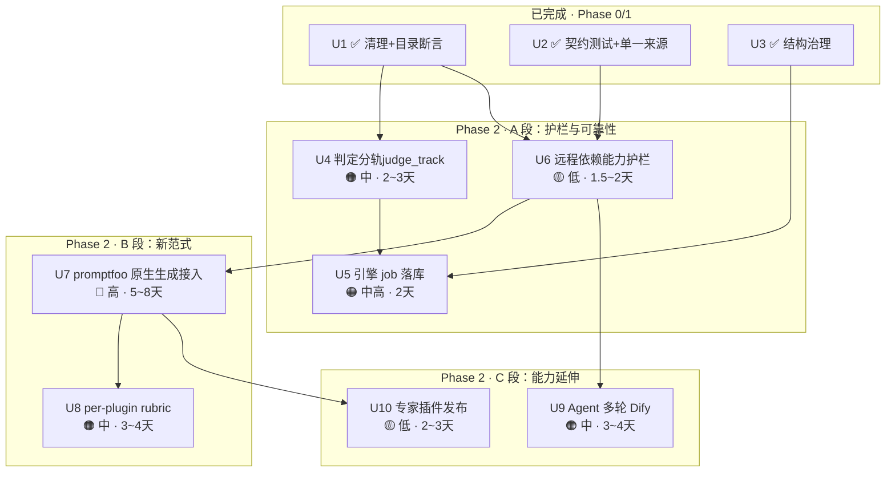

# 14 · Phase 2 实施计划（U4~U10 可执行批次）

> 项目：LLM / Agent 红队安全评测平台（evaluating_platform）
> 编制：软件架构师 高见远（Gao）｜日期：2026-10-10
> 性质：把 `03-重构与开发计划.md` 的 Phase 2（T2.1/T2.2/T2.3/T2.4）排成**可执行批次**，并把Phase 1 遗留的 U4/U5 一并纳入**同一条编号序列**，避免两套编号并存。
> 依据：`06-用户确认决策记录.md`（决策台账，**实施以该文件为准**）、`08-统一执行计划.md`（U1~U5，Phase 0/1 执行版）、`09-迭代进展与现状.md`（已完成状态）、`13-U3验收报告.md`（纪律与DoD 格式）、`04-关键技术与决策细节.md`（技术细节）。
> **本阶段只产出 Markdown，不改业务代码。**

---

## 0. 承接状态（Phase 0/1 已交付）

| 批次 | 主题 | 状态 |
|---|---|---|
| Phase 0（T0.1/T0.2/T0.3） | 治理与止血 | ✅ 完成 |
| **U1** | 零风险清理 + 目录一致性断言 + 死表登记 | ✅ 完成并合并 `main` |
| **U2** | 契约测试 + 引擎分类单一来源 + plugin_id 归一 + 前端 vitest | ✅ 完成并合并 `main` |
| **U3 / U3-b** | 结构治理（拆 `redteam` 子包 + `client.go` 分层） | ✅ Step 1~4 完成，Step 6 验收通过（`origin/main = a69eeea`） |
| **U4 / U5** | 判定分轨/ 引擎 job 落库 | ⬇️ **本文件纳入 Phase 2 序列，一并排期** |
| U6~U10 | Phase 2 能力建设 | ▶ 本文件排期对象 |

**基线事实（2026-10-10 实测，本计划全部以此为准）**：

| 事实 | 值 | 证据 |
|---|---|---|
| Go 工具链 | `/Users/huangqixu/sdk/go/bin/go`（go1.25.5 darwin/arm64） | `09` §6.1 |
| Docker | **本机无** → compose 验证以 CI 为准 | `09` §6.1 |
| 插件目录 | `internal/maclaw/promptfoo_plugin_catalog.go`：**119 插件**（L86-219）/ **30 策略**（L220-267），条目为 `p("id","名称","分类","摘要","严重度")` / `s("id","名称","摘要")` 构造器 | 实测 |
| 引擎现有生成 | `promptfoo_engine/src/runner/generateTests.ts` **仅 189 行**，头注释写明「Plan A：引擎自己合成攻击 prompt，promptfoo 只在 evaluate 模式消费；它自己的 redteam generation 从不参与」 | 实测 |
| 引擎主运行 | `src/runner/redteamRun.ts` 496 行 | 实测 |
| fail-closed 守卫 | `promptfoo_engine/src/env.ts:34-50` `assertSecuritySwitches()`，**4 个开关缺一即拒启动** | 实测 |
| 单一 rubric | `SAFETY_RUBRIC` 定义于 `redteamRun.ts:199`，挂载于 `:262`，**全插件共用一条** | 实测 |
| 引擎请求体 | `EngineRunRequest`（`internal/maclaw/promptfoo_engine_client.go:79`）：`purpose` / `num_tests` / `plugins` / `strategies` / `judge_mode` / `credentials` / `catalog` | 实测 |
| promptfoo | `0.123.0`，`runRedteam()` 由主入口导出（`dist/src/index.js:19058`） | 实测 |

---

## 1. 批次划分总表

**排序原则（硬性）**：**先补护栏与可见性（不依赖新功能）→ 再做可靠性→ 再接新范式（高风险）→ 最后生态**。
每批 = 一个可独立回滚的提交序列，遵循 `08` §5 迭代协议（实现 → 本地全绿 → 提交 → 推送 → CI 绿 → 下一批）。

| 批次 | 主题 | 前置| 风险 | 预估 | 来源 |
|---|---|---|---|---|---|
| **U4** | 判定分轨（`judge_track` 字段 + 报告脚注） | 无 | 🟠 中 | 2~3 天 | `04` DD-2=A / DD-5=A |
| **U5** | 引擎 job 落库（`pfj-` → PostgreSQL） | U3 | 🟠 中高 | 2 天 | `04` DD-6=A（已确认执行） |
| **U6** | **远程依赖能力护栏**（目录标记 + 前端可见 + 明确报错） | U1 | 🟡 低 | 1.5~2 天 | **本轮新发现** |
| **U7** | **promptfoo 原生生成接入（DD-1 = C 落地）** | U6 | 🔴 高 | 5~8 天 | `03` T2.1b / `06` D-12 |
| **U8** | 插件驱动判定（per-plugin rubric） | U7 | 🟠 中 | 3~4 天 | `03` T2.1c + T2.3 |
| **U9** | Agent 多轮（Dify + `conversation_id`） | 无（可并行） | 🟠 中 | 3~4 天 | `03` T2.2 / `06` D-04 |
| **U10** | 专家自定义插件发布链路 | U7 | 🟡 低 | 2~3 天 | `03` T2.4 / `06` D-03 |

### 1.1 为什么把 U6 排在 U7 之前（排序理由）

采纳主理人建议，理由三条：

1. **护栏先于功能，是本项目已沉淀的纪律**。U3 的验收报告明确写了「静默失败」是本项目最难防的失效模式（`13` §纪律 5）。`createRemotePlugin()` 在远程关闭时**只写一条 `logger.error` 然后 `return []`**——不抛错、不中断、不影响退出码。若 U7 先落地，那么"评测跑完、报告出来、某插件覆盖 0"会在**用户第一次用原生生成时**就发生，且**当时没有任何护栏**告诉他们。先做 U6，等于先装好仪表盘再开高速。
2. **U6 是 U7 的验收前提，不是并行项**。U7 的核心交付物之一就是"远程依赖项被屏蔽且**用户可见**"；如果目录层没有 `requires_remote_generation` 标记这个字段，U7 根本无处安放这个信息。U6 先做，U7 只需接上生成逻辑。
3. **成本极低、收益跨批次**。U6 是纯目录元数据 + 前端展示（不碰生成逻辑），🟡 低风险、1.5~2 天；而它同时**提前封堵**了"将来任何路径碰到 `createRemotePlugin` 就会中招"的隐患——包括不在本计划内的路径。

### 1.2 依赖图



> **U9 可与A 段并行**（Agent 多轮与promptfoo 原生生成无耦合，仅依赖 U6 的护栏以免多轮策略踩到远程依赖项）。

---

## 2. 各批次详细设计

### U4 · 判定分轨显式化（`judge_track`）

| 维度 | 内容 |
|---|---|
| **批次目标** | 报告按**本次实际链路**显示判定口径，加`judge_track` 字段 + 页脚注说明两套口径差异；安全分按所选模式计算。承接 `04` DD-2=A（分列 + 脚注）、DD-5=A（复用同一 schema + `engine` 字段）。 |
| **前置依赖** | 无（U1/U2 已让两侧 category/severity 同源，报告口径才可对齐） |
| **涉及文件** |改：`internal/maclaw/redteam_artifact_service.go`（报告 schema + `reportSections`）、`internal/maclaw/promptfoo_engine_bridge.go`（写入 `judge_track=engine`）、`internal/maclaw/redteam_bridge.go`（写入 `judge_track=platform`）；报告前端组件（报告卡 + PDF 页脚）；`evaluating_platform/docs/architecture/*` |
| **关键实现要点** | ① 报告 schema 增 `judge_track`（`platform` \| `engine`），**向后兼容**：旧报告该字段为空时按 `metadata.engine` 推断，不报错；② 报告卡与 PDF **页脚**加一句口径说明（不是正文，避免污染结论）；③ **不引入统一评分**（明确不做 DD-2 的 C 方案，避免过早收敛）；④ 与 U3-b 已做的 `artifact_service`/`llm_judge` 分层对齐，改动落在新分层位置。 |
| **验收标准** | ① 同一目标分别走两条链路，报告 `judge_track` 与分数口径**自洽**；② PDF 渲染正常（`redteam_report_pdf_layout_v2`）；③ 旧报告（字段为空）仍可渲染；④ 覆盖率不降（见 §4纪律） |
| **可执行验收** | ```bash<br>cd evaluating_platform && /Users/huangqixu/sdk/go/bin/go build ./... && /Users/huangqixu/sdk/go/bin/go test ./...<br>cd frontend && npm run build && npm test``` |
| **风险等级** | 🟠 中（触及报告渲染） |
| **预估工作量** | 2~3 天 |
| **回滚方式** | 单commit `feat(U4): ...`；`git revert` 即回滚；schema 字段为 `omitempty`，回滚后旧数据不受影响 |
| **DoD** | - [ ] `go build ./... && go test ./...` 全绿<br/>- [ ] `npm run build && npm test` 全绿<br/>- [ ] 两条链路各跑一次，报告 `judge_track` 正确<br/>- [ ] 旧报告（无该字段）可正常渲染（**实测**，非推断）<br/>- [ ] PDF 页脚口径说明已渲染<br/>- [ ] 覆盖率只升不降（`-coverpkg` 口径，被覆盖语句块数 ≥ U3 基线）<br/>- [ ] 护栏反证测试：手工把某报告的 `judge_track` 改成非法值 → 应报错而非静默通过<br/>- [ ] 一个语义化commit 已推送，CI 5 job 全绿 |

---

### U5 · 引擎 job 落库（`pfj-` → PostgreSQL）

| 维度 | 内容 |
|---|---|
| **批次目标** | confirm fast path 的 `pfj-` 内存 job 也写 PostgreSQL（`engine_runs`，加 `source=chat_confirm`），BFF 重启后前端进度可恢复。承接 `04` DD-6=A（`06` D-11 用户已确认"可以有"= 执行）。 |
| **前置依赖** | U3（结构就位）、U4（报告语义就位） |
| **涉及文件** | 改：`internal/maclaw/engine_job_store.go`、`engine_confirm.go`、`engine_run_service.go`；增：`migrations/027_*.sql`（如需新增字段，**顺延不得插队**） |
| **关键实现要点** | ① `engine_runs` 加 `source` 字段区分 `chat_confirm` 与自选评测；② 内存态与 PG 态的**写入顺序与幂等**（重启后恢复不能产生重复 run）；③ 恢复语义：前端轮询打到 PG，进程内缓存降级为"加速读"而非唯一真源；④ **不得**把payload / 原始 prompt / 响应写入 DB（沿用 `026_promptfoo_engine.sql` 头注释的安全契约）；⑤ 这是**可靠性改进，不是功能变更**——不做也不影响正常评测。 |
| **验收标准** | ① 确认执行中重启 BFF → 前端进度可恢复；② job 与 `engine_runs` 记录一致（无重复、无丢失）；③ `go test ./...` 全绿；④ **DB 与日志零payload/secret 泄漏**（安全抽查） |
| **可执行验收** | ```bash<br>cd evaluating_platform && /Users/huangqixu/sdk/go/bin/go build ./... && /Users/huangqixu/sdk/go/bin/go test ./...<br>grep -rn "DROP TABLE" migrations/ \|\| echo "无 DROP（符合 DD-8=B）"``` |
| **风险等级** | 🟠 中高（状态同步 + 恢复语义） |
| **预估工作量** | 2 天 |
| **回滚方式** | migration 顺延（无 down migration，回滚以反向 SQL 人工执行）；代码单 commit 可revert。**回滚前需确认已落库的 job 记录不丢**（保留列比重建安全） |
| **DoD** | - [ ] `go build ./... && go test ./...` 全绿<br/>- [ ] migration 编号 ≥ 027，未插队<br/>- [ ] 重启 BFF 后前端进度可恢复（**实测重启**）<br/>- [ ] job 与 `engine_runs` 一致性测试通过（幂等）<br/>- [ ] `engine_runs` / 日志零 payload / secret 泄漏<br/>- [ ] 覆盖率只升不降<br/>- [ ] 护栏反证测试：断开 PG 后内存 job 不得静默丢失，须有可观测错误<br/>- [ ] 一个语义化 commit 已推送，CI 5 job 全绿 |

---

### U6 · 远程依赖能力护栏（本轮新发现，建议优先）

| 维度 | 内容 |
|---|---|
| **批次目标** | 把"哪些插件/策略在fail-closed 下不可用"从**日志里的静默 `return []`**变成**目录里显式、前端可见、运行前明确报错**的护栏。**这是 U7 的验收前提。** |
| **前置依赖** | U1（目录单一来源断言已就位，作为护栏的回归网） |
| **涉及文件** | 改：`internal/maclaw/promptfoo_plugin_catalog.go`（目录条目增字段）、`promptfoo_plugin_catalog_test.go`、新增 `internal/maclaw/promptfoo_remote_dep.go`（远程依赖判定 + 映射表）、`frontend/src/services/engineEval.ts`（由后端生成，带出新字段）、报告/前端展示组件；改：`docs/architecture/*` |
| **关键实现要点** | ① **零行为变更**：本批**不改生成逻辑**，只加元数据 + 校验 + 展示；② 目录条目增字段 `requires_remote_generation: bool`（或等价标记），值由**一张映射表**驱动，映射表来源见 §3；③ **CI 断言**：目录里标了 `requires_remote_generation` 的条目，其 id 必须真实存在于 promptfoo 的远程依赖清单中（防止 promptfoo 升级后清单变化导致我们的标记漂移）；④ **前端可见**：插件选择器对被标记项**置灰 + 显示"需远程生成·当前环境已屏蔽"**，且**明确不隐藏**（用户要能看到"这个能力存在但此处不可用"，而不是以为平台没有）；⑤ **运行前明确报错**：若请求里出现被标记的 plugin/strategy，引擎侧**返回可读的 `error_code`**（如 `plugin_requires_remote_generation`）而非静默 `return []`。 |

**为什么必须有这批**：promptfoo 在远程关闭时的行为是

```js
if (neverGenerateRemote()) {
    logger.error(getRemoteGenerationExplicitlyDisabledError(`${key} plugin`));
    return [];              // 静默返回空：不抛错、不中断、退出码仍为 0
}
```

（`node_modules/promptfoo/dist/src/index.js:16099-16133`，`createRemotePlugin`）。这意味着**用户会看到"评测跑完了、报告出来了"，但该插件覆盖为 0，界面上一无所知**。`U3` 的验收报告已把"静默失败"列为本项目最难防的失效模式，本批是那条纪律在生成侧的直接落地。

| 维度 | 内容 |
|---|---|
| **验收标准** | ① 被标记插件在插件选择器**置灰 + 可见说明**；② 请求含被标记项 → 引擎返回 `error_code`，**不静默跑 0 条**；③ CI 断言可检出"标记与promptfoo 实际清单不一致"（改映射表一条 → CI红）；④ `go test ./...` + `npm test` 全绿；⑤ 本批**未改动任何生成/判定行为**（diff 自证） |
| **可执行验收** | ```bash<br>cd evaluating_platform && /Users/huangqixu/sdk/go/bin/go build ./... && /Users/huangqixu/sdk/go/bin/go test ./...<br>cd ../promptfoo_engine && npm run typecheck && npm test<br># 反证：在映射表里加一个不存在的 id → CI 必须红<br>cd ../frontend && npm run build && npm test``` |
| **风险等级** | 🟡 低（纯元数据 + 校验 + 展示，不碰生成逻辑） |
| **预估工作量** | 1.5~2 天 |
| **回滚方式** | 单 commit可 revert；因**零行为变更**，回滚无数据/兼容性影响 |
| **DoD** | - [ ] `go build ./... && go test ./...` 全绿<br/>- [ ] `npm run typecheck && npm test`（引擎）全绿<br/>- [ ] `npm run build && npm test`（前端）全绿<br/>- [ ] 插件选择器：被标记项置灰 **且显示屏蔽原因**（**截图/实测**，不能只看代码）<br/>- [ ] 请求含被标记项 → 引擎返回可读 `error_code`，**验证"不产生 0 条用例的静默成功"**<br/>- [ ] CI 断言：映射表与 promptfoo 实际清单一致性（反证测试已做过：改一条 → CI 红）<br/>- [ ] **diff 自证：生成/判定逻辑零改动**<br/>- [ ] 覆盖率只升不降<br/>- [ ] 文档已更新（`06` §3 数字、`14` §3 矩阵）<br/>- [ ] 一个语义化 commit 已推送，CI 5 job 全绿 |

---

### U7 · promptfoo 原生生成接入（DD-1 = C 的工程落地）

> **决策依据**：`06` §7.5 D-12。四个 fail-closed 开关**一个不动**；通过 `runRedteam()` 的 `provider` 插槽把 MaClaw LLM 作为生成模型；远程依赖项**直接屏蔽并明确报错，不回落云端**。

| 维度 | 内容 |
|---|---|
| **批次目标** | 攻击生成从"平台自己拼提示词"（`generateTests.ts` 189 行）切换为**promptfoo 自己掌握生成范式**（插件策略 / 攻击变体 / 多轮模板），平台只提供**模型端点**。这是用户明确要的能力（"不是把插件名当提示词传过去"）。 |
| **前置依赖** | **U6（硬前置）** —— 远程依赖护栏必须先就位，否则 U7 一上线就会产生静默 0 覆盖 |
| **涉及文件** | 改：`promptfoo_engine/src/runner/generateTests.ts`（新增 native 路径，与现有 Plan A 路径并存）、`src/runner/redteamRun.ts`（装配 `runRedteam`）、`src/routes/runs.ts`（请求体扩展）、`src/types.ts`、`src/env.ts`（**只加断言，不动开关**）、`tests/generateTests.test.ts`；改：`internal/maclaw/promptfoo_engine_client.go`（`EngineRunRequest` 扩字段）、`promptfoo_engine_bridge.go`、`engine_credential_materializer.go`（provider 物化）；改：`frontend/src/services/engineEval.ts` + 插件选择器 |
| **关键实现要点** | 见§4 详细设计 |
| **验收标准** | 见 §4.6 |
| **风险等级** | 🔴 **高**（切换生成范式；触及 `03` R-6 合规红线；promptfoo 为第三方库，行为随版本变化） |
| **预估工作量** | 5~8 天（含 Step 0 实测） |
| **回滚方式** | **必须双路径并存**（Plan A 保留为 fallback），由**一个开关**控制，默认关闭新路径；回滚 = 关开关，不需回滚代码 |
| **DoD** | 见 §4.7 |

---

### U8 · 插件驱动判定（per-plugin rubric）

| 维度 | 内容 |
|---|---|
| **批次目标** | 判定从"全插件共用一条 `SAFETY_RUBRIC`"（`redteamRun.ts:199`）升级为**每个插件族一条 rubric**，并支持 `judge_source` 标注。承接 `03` T2.1 第3 项 + T2.3。 |
| **前置依赖** | **U7**（判定对象由原生生成产出后才谈得上按插件区分） |
| **涉及文件** | 改：`internal/maclaw/promptfoo_plugin_catalog.go`（条目增 `judge_rubric` 字段）、`promptfoo_engine_bridge.go`（下发 rubric）、`promptfoo_engine/src/runner/redteamRun.ts`（rubric 装配，替换 `SAFETY_RUBRIC` 单一入口）、`tests/*`；改：报告前端（显示 `judge_source`） |
| **关键实现要点** | ① rubric 存**后端目录**（与 plugin 同一条记录，单一来源，延续 U1/U2 的口径）；② rubric **按插件族**而非按单个插件写（119 个插件逐条写 rubric 成本不现实，先按 `category` 分族 11~12 条，再对高危插件单独覆盖）；③ **保留 `SAFETY_RUBRIC` 作为兜底**（未知插件不报错，降级到族级 rubric → 兜底 rubric）；④ 与 U4 的 `judge_track` 协同：`judge_track=engine` 时用promptfoo rubric，`platform` 时用平台 `judge_profile`，两者都记录 `judge_source`。 |
| **验收标准** | ① 同一插件在不同 rubric 下判定结果可解释；② 未知插件走兜底不报错；③ `judge_source` 在报告中可见；④ 覆盖率只升不降；⑤ 护栏反证：把某插件 rubric 改成空 → 必须回落兜底而非产出空判定 |
| **可执行验收** | ```bash<br>cd evaluating_platform/promptfoo_engine && npm run typecheck && npm test<br>cd .. && /Users/huangqixu/sdk/go/bin/go test ./...``` |
| **风险等级** | 🟠 中（触及判定语义，但不改生成） |
| **预估工作量** | 3~4 天 |
| **回滚方式** | rubric 为数据而非代码，回滚 = 目录字段置空即回落 `SAFETY_RUBRIC` |
| **DoD** | - [ ] `go build ./... && go test ./...` 全绿<br/>- [ ] `npm run typecheck && npm test`（引擎）全绿<br/>- [ ] 每个 `category` 至少 1 条族级 rubric + 高危插件单独覆盖<br/>- [ ] 未知插件 → 兜底 rubric，**不报错、不产出空判定**（反证测试已做）<br/>- [ ] `judge_source` 在报告可见<br/>- [ ] 覆盖率只升不降<br/>- [ ] 一个语义化 commit 已推送，CI 5 job 全绿 |

---

### U9 · Agent 多轮（Dify + `conversation_id`）

| 维度 | 内容 |
|---|---|
| **批次目标** | 把 Agent v1（单轮纯文本 HTTP）扩展为**多轮**：`conversation_id` 提取 + 同一 attack session 后续轮次回传。承接 `06` D-04（**Dify 优先，不做完整协议矩阵**；MCP/Assistants 后置）。 |
| **前置依赖** | 无（可与 A 段并行）；建议 U6 完成后开工，避免多轮策略踩到远程依赖项 |
| **涉及文件** | 改：`internal/maclaw/agent_target.go`（目标配置 schema 扩 `conversation_id` 占位符）、`promptfoo_engine/src/runner/redteamRun.ts`（`buildTargetProvider` 会话映射）、`src/sanitize/redact.ts`（会话数据脱敏）、`tests/agentTarget.test.ts`；改：`frontend/src/pages/enterprise/ChatPage.tsx`（配置 Drawer）、`evaluating_platform/docs/architecture/agent-target-preparation-guide.md` |
| **关键实现要点** | ① `agent_body_template` 支持 `{{conversation_id}}` 占位符（与既有 `{{prompt}}` / `{{api_key}}` 同机制）；② **会话映射由引擎侧维护**（promptfoo http provider 无状态）：`session_id ↔ conversation_id ↔ 历史`；③ 与 `attack_session` 绑定（crescendo/goat/hydra 等天然多轮）；④ **副作用隔离**：文档与产品层要求用 mock/沙箱端点，**并**在引擎侧检测工具调用信号；⑤ 多模态仍**不支持**（`target_multimodal_not_supported` 不变）；⑥ 会话数据不得落库/落日志（安全契约）。 |
| **验收标准** | ① Dify `POST /v1/chat-messages` 端到端跑通多轮；② 第 2 轮请求确实回传了第 1 轮的 `conversation_id`（**抓包/日志实证**）；③ `crescendo` 策略在 Agent 目标上真正构成多轮；④ 副作用隔离指引已写入文档；⑤ 覆盖率只升不降 |
| **可执行验收** | ```bash<br>cd evaluating_platform/promptfoo_engine && npm run typecheck && npm test# 含 agentTarget 多轮用例<br>cd .. && /Users/huangqixu/sdk/go/bin/go test ./...``` |
| **风险等级** | 🟠 中（会话状态承载复杂度） |
| **预估工作量** | 3~4 天 |
| **回滚方式** | 新增配置项默认为空 → 不填即保持 v1 单轮行为，向后兼容；单 commit 可 revert |
| **DoD** | - [ ] `go build ./... && go test ./...` 全绿<br/>- [ ] `npm run typecheck && npm test`（引擎）全绿<br/>- [ ] Dify 多轮端到端跑通（**实测，非 mock**）<br/>- [ ] `conversation_id` 回传已抓包/日志实证<br/>- [ ] `crescendo` 在 Agent 目标上构成真实多轮<br/>- [ ] 会话数据零落库/零落日志（安全抽查）<br/>- [ ] 不填新配置时行为与 v1 完全一致（**反证测试**）<br/>- [ ] 副作用隔离指引已写入 `agent-target-preparation-guide.md`<br/>- [ ] 覆盖率只升不降<br/>- [ ] 一个语义化 commit 已推送，CI 5 job 全绿 |

---

### U10 · 专家自定义插件发布链路

| 维度 | 内容 |
|---|---|
| **批次目标** | 专家在**专家门户直接发布**插件/策略，管理员**事后治理**（启停/下架/归档/查看使用情况）。首期**仅 yaml 形态**。承接 `06` D-03（**取消"管理员审核"作为发布前置门**）。 |
| **前置依赖** | U7（原生生成就位，插件才有意义）、U1（单一来源） |
| **涉及文件** | 改：`internal/maclaw/maclaw_resource_*`（`resource_kind='pf_plugin'`）、`skill_projection.go`、引擎 Dockerfile（沙箱边界）；增：设计文档 |
| **关键实现要点** | ① 复用 `maclaw_resources`（加密）存插件包 + `maclaw_skill_publications`/`shadows` 分发；② **沙箱边界**（最重安全项，`03` R-3）：只读根文件系统、非 root、**无外网**；③ **首期仅 yaml**：JS/脚本形态 = 任意代码执行，即便内部原型也需受控容器，不在首期范围；④ 自定义插件必须过 U6 的远程依赖护栏（若其声明了需远程的插件 → 拒绝发布并明确原因）。 |
| **验收标准** | ① 专家可发布 yaml 插件并被引擎加载；② 管理员可启停/下架，**生效即时**；③ 沙箱边界已验证（尝试写文件/联网 → 均失败）；④ JS 形态被拒绝并有清晰提示；⑤ 覆盖率只升不降 |
| **可执行验收** | ```bash<br>cd evaluating_platform && /Users/huangqixu/sdk/go/bin/go build ./... && /Users/huangqixu/sdk/go/bin/go test ./...<br>cd promptfoo_engine && npm run typecheck && npm test``` |
| **风险等级** | 🟡 低（首期仅 yaml，风险主要是流程与存储） |
| **预估工作量** | 2~3 天 |
| **回滚方式** | 新增 `resource_kind`，不影响既有资源；单 commit 可 revert |
| **DoD** | - [ ] `go build ./... && go test ./...` 全绿<br/>- [ ] 专家发布 yaml 插件 → 引擎可加载（**端到端实测**）<br/>- [ ] 管理员停用 → 引擎立即不可用（**实测**）<br/>- [ ] 沙箱：写文件失败、联网失败（**反证测试，两项都要做**）<br/>- [ ] JS/脚本形态被拒绝并提示清晰<br/>- [ ] 声明远程依赖插件的发布请求被拒绝且原因可读<br/>- [ ] 覆盖率只升不降<br/>- [ ] 一个语义化 commit 已推送，CI 5 job 全绿 |

---

## 3. 远程依赖能力矩阵（U6 映射表的数据来源 / U7 Step 0 的基线）

> **口径声明**：以下为**运行时求值**的静态清单交集，**不是最终结论**。库已打包为 `.cjs`，**插件内部可能存在未登记的远程触发路径**（例：`memoryPoisoning-*.js` 的 `callApi` 直接调 `getRemoteGenerationUrl()`，**不经 `neverGenerateRemote()` 守卫**），静态无法穷尽。**最终以 U7 Step 0 真实环境实测为准。**

### 3.1 数字是怎么来的（三轮校正，供复核）

| 轮次 | 数字 | 误差来源 |
|---|---|---|
| 架构师初稿 | 88 / 31 | 静态正则展开，误把 `HARM_PLUGINS`（走 `REDTEAM_PROVIDER_HARM_PLUGINS`，**可用配置的 provider**）与 `REMOTE_ONLY_PLUGIN_IDS` 混为一谈 |
| 主理人复核 | 13 / 106 | 按**源码字面量行**统计，**漏掉 8 个 `...spread`**（运行时贡献 67 条） |
| **架构师二次实测（权威）** | **90 / 29** | 运行时 `import` 求值，去重合并三处来源 |

**权威求值命令**（`REMOTE_ONLY_PLUGIN_IDS` 以 `zt` 别名导出，**必须运行时读，不能 grep 源码**）：

```bash
cd evaluating_platform/promptfoo_engine/node_modules/promptfoo
node --input-type=module -e "
  const m = await import('./dist/src/tables-BboCJNxW.js');
  console.log('REMOTE_ONLY =', m.zt.length);              // 93（字面量 26 + spread 67）
  console.log('UNALIGNED   =', Object.keys(m.Ut).length);  // 22
  console.log('BIAS        =', m.St.length);              // 4
"
```

### 3.2 三处来源与命中数

| 来源 | 常量（运行时长度） | 命中平台 119 目录 |
|---|---|---|
| 远程专用插件 | `REMOTE_ONLY_PLUGIN_IDS`（93） | **65** |
| 非对齐有害生成 | `UNALIGNED_PROVIDER_HARM_PLUGINS`（22，扣除已计入的 1） | **21** |
| 偏见家族 | `BIAS_PLUGINS`（4） | **4** |
| **合计（去重）** | | **90 / 119** |

→ **仅 29 个插件可纯本地生成**：`beavertails` / `bias` / `contracts` / `cross-session-leak` / `cyberseceval` / `divergent-repetition` / `donotanswer` / `excessive-agency` / `hallucination` / `harmbench` / `harmful` / `harmful:intellectual-property` / `harmful:privacy` / `imitation` / `jailbreak` / `overreliance` / `pii` / `pii:api-db` / `pii:direct` / `pii:session` / `pii:social` / `pliny` / `policy` / `politics` / `prompt-extraction` / `prompt-injection` / `security-exploit` / `teen-safety:age-restricted-goods-and-services` / `xstest`

### 3.3 策略侧（原生生成不可用，7 个）

源码 `neverGenerateRemote()` 显式抛错（`dist/src/strategies-*.js`、`dist/src/bestOfN-*.js`）：

| 平台目录 id | promptfoo 原生 id | 源码位置 |
|---|---|---|
| `bestOfN` | `best-of-n` | `bestOfN-*.js:21` |
| `likert` | `jailbreak:likert` | `strategies-*.js:986` |
| `citation` | `citation` | `strategies-*.js:213` |
| `singleTurnComposite` | `jailbreak:composite` | `strategies-*.js:2090` |
| —（平台目录无） | `gcg` | `strategies-*.js:359`（另需 `promptfoo auth login`） |
| —（平台目录无） | `audio` | `strategies-*.js:1599`（`textToAudio`） |
| —（平台目录无） | `video` | `strategies-*.js:1914`（有 ffmpeg 本地回退路径） |

> ⚠️ **多轮策略（`crescendo` / `goat` / `hydra` / `iterative` / `iterative:tree` / `iterative:meta`）不在此列** —— 它们用 `shouldGenerateRemote()` **条件性**选择远程 provider（`crescendo-*.js:73`、`hydra-*.js:79`、`iterative-*.js:468`），在 C 方案下可走本地 provider。**这正是 U7 的主要收益来源。**

---

## 4. U7 详细设计（DD-1 = C 的工程落地）

### 4.1 技术路径

```
当前（Plan A）：平台合成攻击 prompt → promptfoo 只在 evaluate 模式消费
                          generateTests.ts (189 行)

目标（C 方案）：平台只提供模型端点 → promptfoo 自己生成攻击
                          runRedteam({ target, provider, ... })
                          provider = MaClaw LLM（一次性凭据，内存内）
```

`runRedteam(options)` 从 `promptfoo` 主入口导出（`dist/src/index.js:19058`），内部委托 `doRedteamRun`并置 `eventSource: "library"`。配置含**两个独立插槽**：

| 插槽 | 类型 | 平台填什么 |
|---|---|---|
| `target` | `ProviderOptions` | **被测目标**（沿用现有 http/agent provider 构建逻辑） |
| `provider` | `string \| ProviderOptions \| ApiProvider` | **生成模型** = MaClaw LLM 端点（`ApiProvider` 含 `callApi` / `callEmbeddingApi` / `callClassificationApi`） |

**四个 fail-closed 开关一个不动**（`env.ts:34-50` `assertSecuritySwitches` 保持原样，只允许**新增**断言，不允许放宽）。

### 4.2 需要补的输入

当前 `EngineRunRequest`（`promptfoo_engine_client.go:79`）只传 `purpose`（薄描述）+ `plugins` + `strategies`。原生生成还需要：

| 字段 | 内容 | 缺失后果 |
|---|---|---|
| `applicationDefinition` | `purpose` / `features` / `hasAccessTo` / `doesNotHaveAccessTo` / `userTypes` / `securityRequirements` |攻击 payload **泛化而无针对性**（不知道被测系统能做什么、不能做什么） |
| `testGenerationInstructions` | 额外生成约束（语言、领域、禁忌） | 无法按企业场景定制攻击风格 |
| `injectVar` | 攻击载荷注入的变量名 | 策略改写**找不到注入点**（多轮/编码类策略直接失效） |

→ 这三项应作为**新字段**加入 `EngineRunRequest`，由 BFF 从target config + 专家输入组装。

### 4.3 插件目录 id 对齐策略

平台目录（119）与 promptfoo 原生 id 体系**不完全一致**，需要显式映射：

| 差异类型 | 例 | 策略 |
|---|---|---|
| 平台深度嵌套 / 非 promptfoo 原生 | `harmful:weapons:ied`、`ecommerce:order-fraud` | 平台 id 已是 promptfoo 原生 id 的一种，直接透传 |
| 平台自造、promptfoo 无对应 | 平台 `direct` / `role-play` / `encoding` 等原生策略包装维度 | **保持平台自有生成提示路径**，不进原生 `runRedteam` 的 `strategies` |
| 命名不一致 | 平台 `likert` ↔ 原生 `jailbreak:likert`；`bestOfN` ↔ `best-of-n`；`singleTurnComposite` ↔ `jailbreak:composite` | **映射表**（与 U6 的远程依赖表同处一个映射模块，避免两处漂移） |
| 平台有、promptfoo 远程禁用 | §3.2 的 90 个 | 目录层标记 + 运行前报错（**U6 交付**） |

**建议**：把"平台 id → promptfoo 原生 id + 是否远程依赖 + 是否可原生生成"三件事**合并到一张映射表**，由 U6 交付、U7 消费。**单一来源，避免 U6/U7 各维护一份导致漂移。**

### 4.4 Step 0 = 远程依赖能力矩阵实测（不阻塞开工，但必须先做）

**背景**：§3 的数字是静态交集，**无法穷尽插件内部的远程触发路径**（库已打包为 `.cjs`）。必须在真实环境实测。

| 项 | 内容 |
|---|---|
| **目标** | 产出权威的"哪些插件能纯本地跑通"能力矩阵，**替换** §3 的静态估计 |
| **样本** | 挑 **10~15 个代表性插件**（建议：3~4 个 `harmful:*` 家族+ 2 个 `medical:*`/`financial:*` + `prompt-injection` + `pii:*` + `contracts` + `divergent-repetition` + `imitation` + `policy` + 2 个已知远程项作对照） |
| **环境** | 隔离环境 + 真实模型凭证（MaClaw 提供的 LLM） |
| **判据** | 该插件是否产出 ≥1 条用例；`logger.error` 中是否出现 `remote generation` 字样；**网络是否出网**（须同时验证，静态清单可能漏） |
| **产出** | 能力矩阵表（插件 → 本地/远程/未知），**回写** `06` §7.5 与本文件 §3，并把不确定项显式标为"未知"而非猜测 |
| **纪律** | 用户已明确「不必盯死数据，会在实际环境下测试」→ 本步**不阻塞开工**，但**必须在 U7 验收前完成** |

### 4.5 双路径并存与开关

| 路径 | 说明 | 默认 |
|---|---|---|
| **Plan A（现状）** | `generateTests.ts` 自己合成攻击 prompt | 保留 |
| **Plan C（原生）** | `runRedteam()` + `provider` 插槽 | **关闭** |

由**一个开关**控制（引擎环境变量，如 `PROMPTFOO_ENGINE_NATIVE_GENERATION=1`），**默认关闭**。
理由：**回滚成本最低** —— 出问题时关开关即回到已知状态，不需 revert 代码、不需数据迁移。
⚠️ 该开关**只控制"用哪条生成路径"**，与四个 fail-closed 开关**完全独立**，不得混淆。

### 4.6 验收标准

1. **红线未动**：四个 fail-closed 开关值不变；`assertSecuritySwitches` 反证测试通过（故意改一个 → 拒启动）。
2. **生成确实由 promptfoo 完成**：能展示 promptfoo 生成的攻击用例（非平台拼接的通用 systemPrompt 产物）。
3. **无出网**：抓包/网络断言确认生成过程**未访问** `api.promptfoo.app` 或任何非平台端点。
4. **远程依赖项明确报错**：请求 §3.2 的 90 个插件之一 → 返回可读 `error_code`，**不静默 0 条**（U6 护栏生效的端到端验证）。
5. **凭据零泄漏**：`provider` 物化的凭据不落日志/不落 DB/不回浏览器（沿用 `MaterializeEngineCredentialsWithGeneration` 契约）。
6. **Plan A 可回退**：关开关 → 行为与 U7 前完全一致（**反证测试**）。
7. **CI 全绿 + 覆盖率只升不降**。

### 4.7 U7 DoD

- [ ] **Step 0 能力矩阵已完成**，`06` §7.5 与本文件 §3 已回写，不确定项标为"未知"
- [ ] `go build ./... && go test ./...` 全绿
- [ ] `npm run typecheck && npm test`（引擎）全绿
- [ ] `npm run build && npm test`（前端）全绿
- [ ] 四个 fail-closed 开关**值未变**，且 `assertSecuritySwitches` 反证测试已做（改一个 → 拒启动）
- [ ] `runRedteam()` 的 `provider` 插槽已接MaClaw LLM；`target` 与 `provider` **两个插槽独立生效**（反证：只填其一时应明确失败）
- [ ] `applicationDefinition`（6 个子字段）/ `testGenerationInstructions` / `injectVar` 三项输入已补齐并有测试覆盖
- [ ] 插件 id 映射表**与 U6 的远程依赖表同源单份**（无第二份映射）
- [ ] **无出网实证**：生成过程网络断言已做并通过
- [ ] 远程依赖插件 → 可读 `error_code`，**验证不产生静默 0 条成功**
- [ ] 凭据零泄漏（`engine_runs` / 日志 / 浏览器三处抽查）
- [ ] **Plan A 回退可用**：关开关后行为与 U7 前一致（反证测试已做）
- [ ] MCP 工具清单快照一致（若本批触及 bridge）
- [ ] 覆盖率只升不降（`-coverpkg` 口径）
- [ ] 一个语义化 commit 已推送，CI 5 job 全绿

---

## 5. 跨批次纪律（继承 U3，全部批次适用）

> 来源：`13-U3验收报告.md` §纪律。以下每条在**每一批的 DoD 里都有对应勾选项**。

| # | 纪律 | 说明 |
|---|---|---|
| 1 | **覆盖率只升不降** | 用 `-coverpkg` 口径比**被覆盖语句块数**（整数、可精确比对、不受行号漂移影响），**不用百分比**（有舍入、跨包口径易混） |
| 2 | **MCP 工具清单快照一致** | 凡触及 bridge 的批次，拆分/改名前后工具名+ schema 快照必须一致 |
| 3 | **护栏必须做过反证测试** | 断言/守卫不只是"存在"，必须**证明它会红**：故意改坏 → CI/测试变红 → 撤销。**每批至少一条** |
| 4 | **覆盖率必须单独跑 `-cover` 路径** | U3 发现：`engine_run.go` 的 UTF-8 BOM 让 `go test -cover` 对整个 handler 包报 `build failed`，而 `go build`/`go vet`/`go test`（不带 `-cover`）**全绿** —— 常规 build/test **不能替代** `-cover` 验证 |
| 5 | **产物后缀用 `.txt` 不用 `.out`** | `.gitignore:4` 的 `*.out` 会**静默忽略**覆盖率 profile，易误判"文件没生成" |
| 6 | **静默失败是本项目最难防的失效模式** | 任何"只写日志不抛错"的路径都要显式处理（U6 直接针对此点） |
| 7 | **安全边界抽查** | `engine_runs` / 日志零 payload、零 secret |
| 8 | **每批独立可回滚** | 不跨批耦合；`git revert <commit>` 即可 |
| 9 | **CI 未绿不得进入下一批** | 不假装通过；本机无 Docker 时 compose 以 CI 为准并明确标注 |
| 10 | **Go 用绝对路径** | `/Users/huangqixu/sdk/go/bin/go`；**不要 `export PATH`**（触发沙箱 `connection refused: /dev/null`） |

---

## 6. 文档变更登记（本轮已改）

| 文档 | 变更 | 依据 |
|---|---|---|
| `03-重构与开发计划.md` | T1.1 标记**不做**（P-2 红线）；Phase 2 拆为 U4~U10；R-6 改为"已消除"并新增 R-6b；`maclaw_runtime.go` 路径更正为 `internal/api/handler/` | `06` D-10 / D-12；实测 |
| `04-关键技术与决策细节.md` | DD-1 = C（含实测代价）；DD-6 = A 已确认；§7 标题改「全部已裁定」；§2.3 / §4.4 / §1.3 按 C 方案重写 | `06` D-12 / D-11 |
| `06-用户确认决策记录.md` | 新增 §7.5 D-12（含三轮数字校正轨迹与权威求值命令） | 用户裁定 |
| `08-统一执行计划.md` | U4 移出（移交 Phase 2）；Backlog 清掉已完成的 `N-01 step3` 与已排期的 T2.x | `06` D-10；本文件 |
| `09-迭代进展与现状.md` | 批次状态表补U4~U10 与本文件指针 | 本文件 |
| `14-Phase2实施计划.md` | 新增（本文件） | — |

**已勘误的失效引用**（本轮核实）：

| 失效引用 | 实际 | 处理 |
|---|---|---|
| `internal/maclaw/maclaw_runtime.go`（`03`/`07`/`08` 称 1587 行，"文件不存在"） | **文件存在但在 `internal/api/handler/maclaw_runtime.go`**，确实 **1587 行** | 更正路径，保留行数 |
| `frontend/src/services/chatDisplay.ts`（`07`/`08` 的 `chatDisplay.ts:15`） | 实际在 **`frontend/src/pages/enterprise/chatDisplay.ts:15`**，`AGENT_WELCOME_CAPABILITIES` 位置无误 | 更正路径 |
| `client.go` 1595 行（`08`/`07`） | **1565 行**（U1 删 `ImportSkill`/`ExportSkill` 所致） | 以 1565 为准（`11` 已勘误，`08`/`07`/`02`/`00` 同步） |
| `redteam_tool_bridge.go` "105 个函数" | **115**（`07` 的 115 正确；`11` 初稿的 105 是加总笔误，已在 `11` 勘误） | 统一为 115 |
| `04` §7 DD-1 选项 B 写 `PROMPTFOO_DISABLE_REMOTE_GENERATION` | 实际相关开关是 **`PROMPTFOO_DISABLE_REDTEAM_REMOTE_GENERATION`** | 更正 |
| `REMOTE_ONLY_PLUGIN_IDS` 条目数（88 / 26 / 13 三版） | **运行时 93**（字面量 26 + spread 67） | 见 §3.1 |

---

## 7. Gate

**Gate G2（Phase 2 完成）**：U4~U10 全部交付；能力矩阵实测完成且数字回写；`judge_track` 分轨落地；原生生成在**红线未动**的前提下跑通；远程依赖项对用户**可见且可解释**；专家可发布 yaml 插件。

> **下一步（用户）**：确认批次划分与排序（§1），特别是 **U6 提前**这一判断。
> **下一步（工程师）**：从 **U4** 开始（它无前置依赖，可立即开工）；**U6 可与之并行**。
